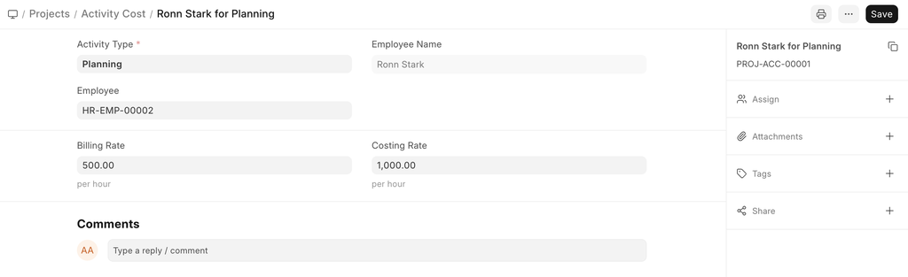
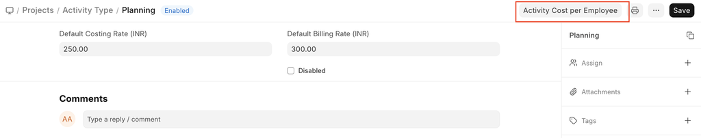

# Activity Cost

[ Edit ](https://docs.frappe.io/wiki/spaces/24hrpr6es9/page/0s2qb2b72n)

Open in ChatGPT  Ask ChatGPT about this page Open in Claude  Ask Claude about this page

# Activity Cost 

[ Edit ](https://docs.frappe.io/wiki/spaces/24hrpr6es9/page/0s2qb2b72n)

Open in ChatGPT  Ask ChatGPT about this page Open in Claude  Ask Claude about this page

**Activity Cost records the per-hour billing rate and costing rate of an Employee against a particular Activity Type.**

The system pulls this rate while making Timesheets. It is used to determine the Project Cost.

To access Activity Cost, go to,

> Home > Projects > Time Tracking > Activity Cost

## How to create Activity Cost

  1. Go to the Activity Cost list and click on New.
  2. Add the name of the Employee for whom you are configuring the Activity Cost.
  3. Add the Costing Rate and the Billing Rate for the Employee.
  4. Save.

Alternatively, an Activity Cost can also be created via the Activity List.

[ Previous Page Activity Type ](https://docs.frappe.io/erpnext/activity-type) [ Next Page Project  ](project.md)

Last updated 2 weeks ago 

Was this helpful?
