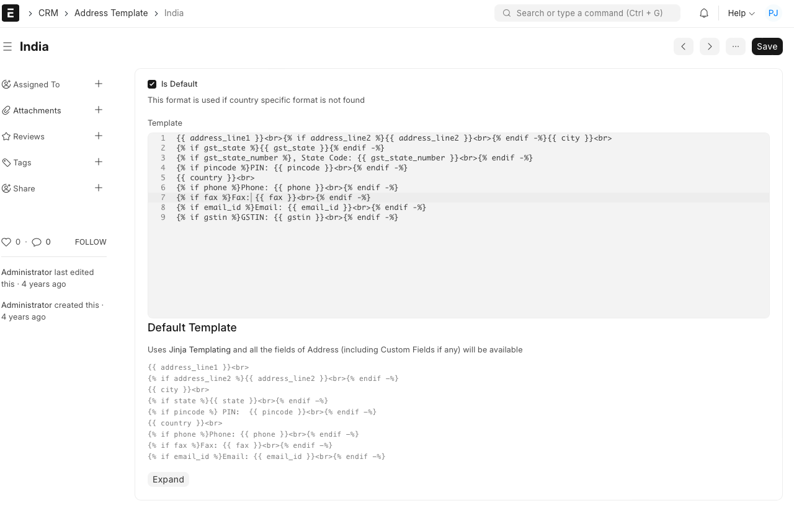

# Address Template

[ Edit ](https://docs.frappe.io/wiki/spaces/24hrpr6es9/page/0raacogdrk)

Open in ChatGPT  Ask ChatGPT about this page Open in Claude  Ask Claude about this page

# Address Template 

[ Edit ](https://docs.frappe.io/wiki/spaces/24hrpr6es9/page/0raacogdrk)

Open in ChatGPT  Ask ChatGPT about this page Open in Claude  Ask Claude about this page

**Address Template can store different formats of addresses based on the region.**

Each region has its way of defining addresses. To manage multiple address formats for your Documents (like Quotations, Purchase Invoices, etc.), you can create country-wise **Address Templates**.

To access address template, go to:

> CRM > Address Template

A default Address Template is created when you set up the system. You can either edit it or create a new template. This default template will apply to all countries not having a specific template.

Consider a customer from the United States where 'County' is a part of the address. If you set county in the address template for United States, then it'll show up in the address field and hence in the print preview. Fields like PIN code can be changed to be displayed as ZIP code and fields like county can be added by using Address Templates.

The Address Template checks the 'Country' field in the Address master to apply different address templates to transactions.

  1. How to create an Address Template

* * *

  1. Go to the Address Template list, click on Add Address Template.
  2. Select a country.
  3. Change the CSS and Jinja if required.
  4. Mark as default if it is going to be the default address template in the system
  5. Save.

Note: The template engine is based on HTML and the [Jinja](https://jinja.palletsprojects.com/) system. All the fields (including Custom Fields) will be available for creating the template.

### 2\. Related Topics

  1. [Terms and Conditions Template](terms-and-conditions.md)
  2. [Cheque Print Template](cheque-print-template.md)

[ Previous Page Address  ](address.md) [ Next Page Terms And Conditions  ](terms-and-conditions.md)

Last updated 1 week ago 

Was this helpful?
