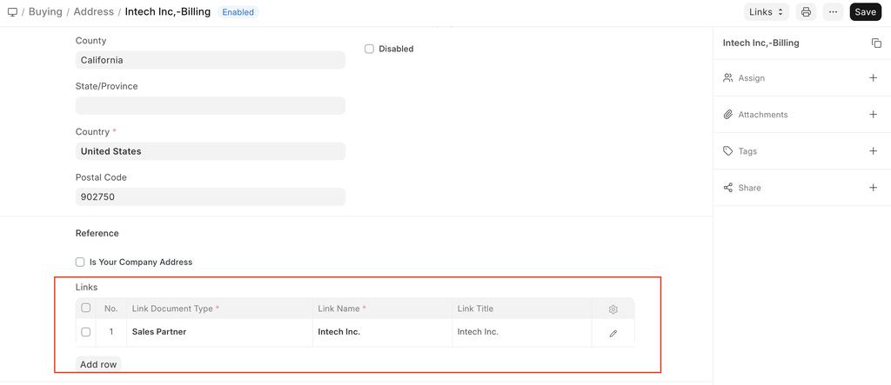
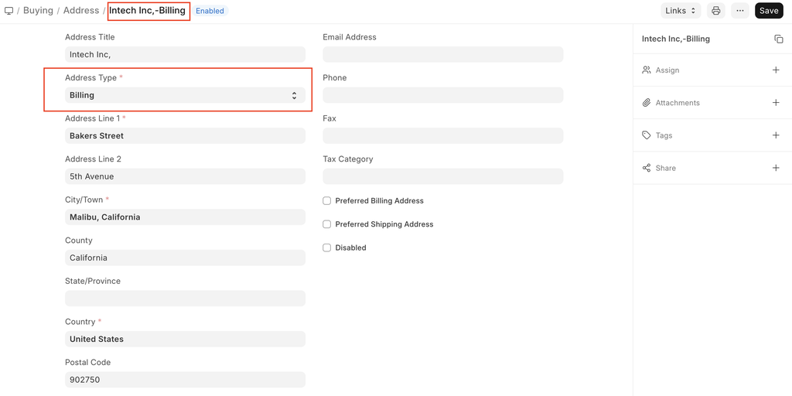
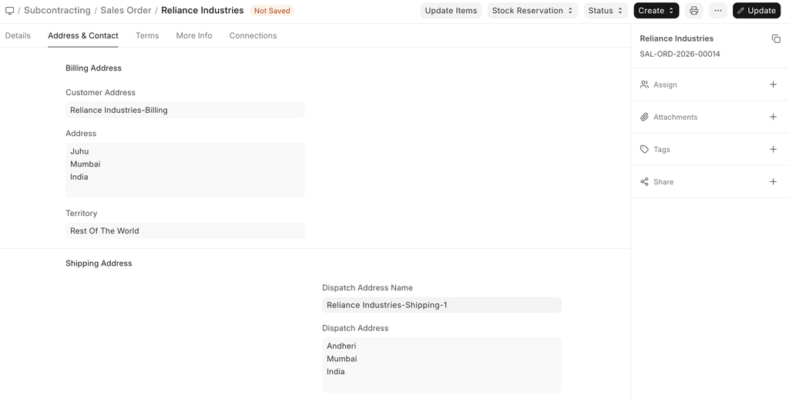
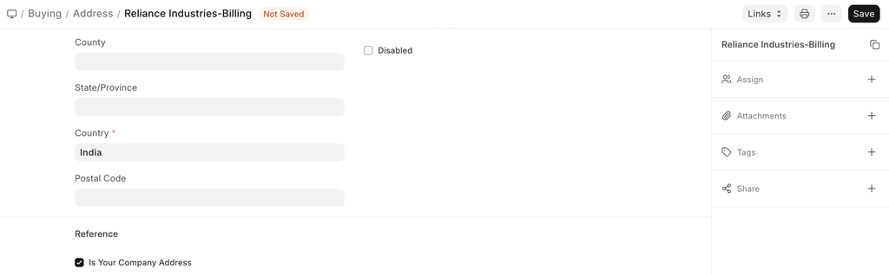

# Address

[ Edit ](https://docs.frappe.io/wiki/spaces/24hrpr6es9/page/0ri795o212)

Open in ChatGPT  Ask ChatGPT about this page Open in Claude  Ask Claude about this page

# Address 

[ Edit ](https://docs.frappe.io/wiki/spaces/24hrpr6es9/page/0ri795o212)

Open in ChatGPT  Ask ChatGPT about this page Open in Claude  Ask Claude about this page

You can record the addresses associated with a Lead, Customer, Supplier, Shareholder, Sales Partner or a Warehouse.

You can also add an Address as a standalone record without linking it to any of the entities listed above.

To access the Address list, go to:

> Home > CRM > Address

## How to create an Address

  1. Go to the Address list and click on New.
  2. Select Address Type.
  3. Enter details in Address Line 1, Address Line 2, City/Town, County, State, Country.
  4. Enter Email Address, Phone and Fax.
  5. Enter Link DocType and Link Name to link this address to customer, supplier etc.
  6. Save. Contact

You can also add an Address from the Customer or Supplier record by clicking on “New Address" button as shown below.

To Import multiple addresses from a spreadsheet, use the Data Import Tool.

* * *

## Features

### Link an Address to Multiple Entities

An address may be linked to multiple customers or multiple suppliers.

An address can also be linked to customers and suppliers at the same time.

### Address Title

If the address is not linked to any entity you need to manually add a title.

If the address is linked to an entity like a customer or supplier, the title is generated automatically in 'Entity Name-Address Type' format.

### Preferred Billing Address and Shipping Address

If you check 'Preferred Shipping Address', the address would be automatically added in the Shipping Address in Sales Order, Sales Invoice and Delivery Note transactions.

Similarly, if you check 'Preferred Billing Address', the address would be automatically added in the Billing Address in Sales Order, Sales Invoice and Delivery Note transactions.

### GST Localization for India

If the customer or supplier has registered under GST, you can enter GSTIN and GST State in Address. Make sure GSTIN entered is in valid format.

In sales transactions along with address, GSTIN is also fetched.

You can also add addresses of your own company's facilities. Check 'Is Your Company Address', select Company in Link DocType, and Company Name in Link Name for such addresses and you can select them in GST Sales Invoice to print your own address.

> GSTIN is to be added in Address and not in Customer/Supplier, as one Customer/Supplier may have multiple GSTIN (one for each state where he conducts his business).

### Related Topics

  1. Customer
  2. Supplier
  3. Sales Partner

[ Previous Page Contact  ](contact.md) [ Next Page Address Template  ](address-template.md)

Last updated 2 weeks ago 

Was this helpful?
