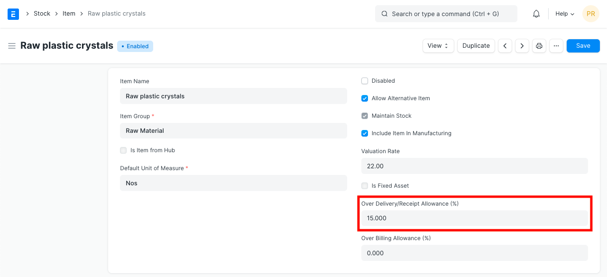
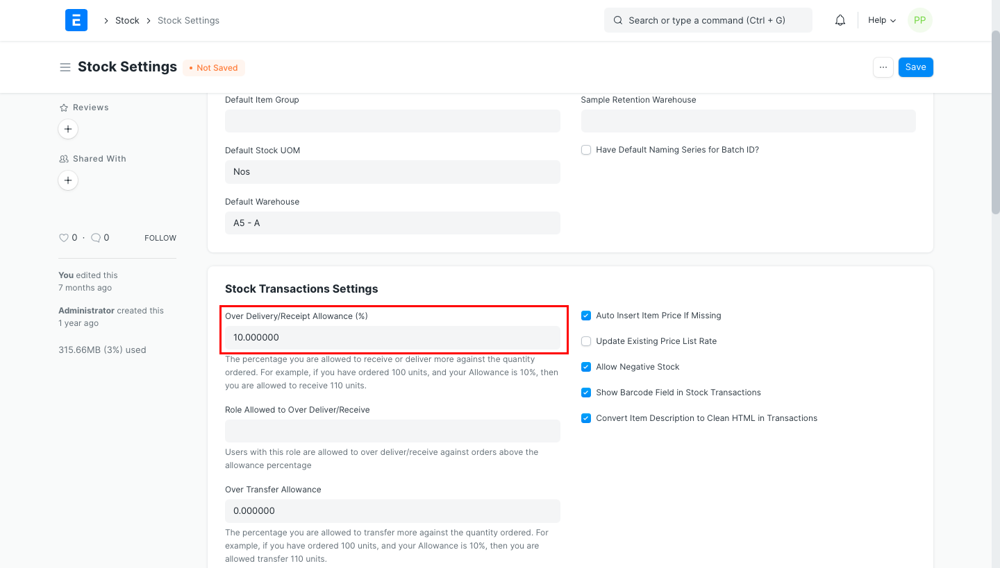

# Allow Over Delivery/Billing

[ Edit ](https://docs.frappe.io/wiki/spaces/24hrpr6es9/page/0sh9uilotb)

Open in ChatGPT  Ask ChatGPT about this page Open in Claude  Ask Claude about this page

# Allow Over Delivery/Billing 

[ Edit ](https://docs.frappe.io/wiki/spaces/24hrpr6es9/page/0sh9uilotb)

Open in ChatGPT  Ask ChatGPT about this page Open in Claude  Ask Claude about this page

When creating a Delivery Note, system validates if item's qty is same as in the Sales Order. If item's qty has been increased, you will get the validation message of over-delivery or receipt.

Considering the case fo sales, if you want to be able to deliver more items than mentioned in the Sales Order, you should update "Allow over delivery or receipt upto this percent" in the Item master.

When creating an invoice, item's rate is also validated based on the preceding transaction like Sales Order. This also applies when creating Purchase Receipt or Purchaes Invoice from Purchase Order. Updating "Allow over delivery or receipt upto this percent" will be affective in all sales and purchase transactions.

For example, if you have ordered 100 units of an item, and if item's over receipt percent is 50, then you are allowed to make Purchase Receipt for upto 150 units.

Update global value for "Allow over delivery or receipt upto this percent" from Stock Settings. Value updated here will be applicable for all the items.

  1. Go to `Stock > Setup > Stock Settings`
  2. Set `Limit Percentage`.
  3. Save Stock Settings.

[ Previous Page Linking stock warehouse and accounts ](warehouse-ledger-link.md) [ Next Page Item Codification  ](item-codification.md)

Last updated 1 week ago 

Was this helpful?
