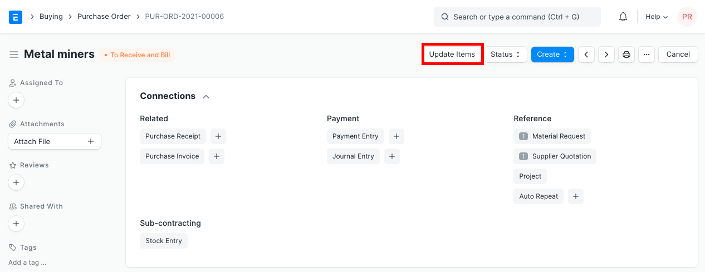
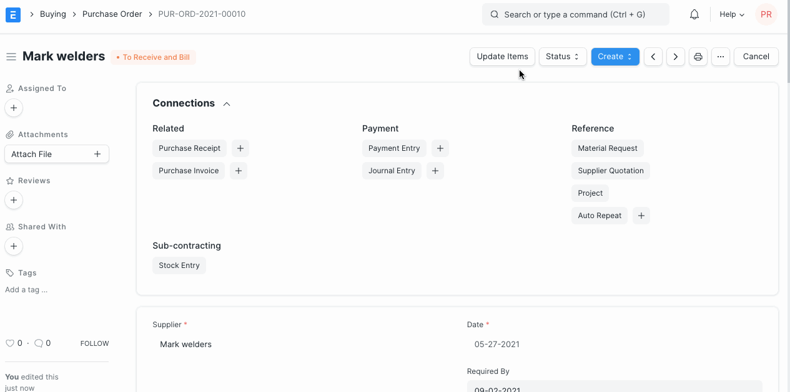

# Amending Purchase Order after Submit

[ Edit ](https://docs.frappe.io/wiki/spaces/24hrpr6es9/page/0shppt3ir4)

Open in ChatGPT  Ask ChatGPT about this page Open in Claude  Ask Claude about this page

# Amending Purchase Order after Submit 

[ Edit ](https://docs.frappe.io/wiki/spaces/24hrpr6es9/page/0shppt3ir4)

Open in ChatGPT  Ask ChatGPT about this page Open in Claude  Ask Claude about this page

Rate and Qty in Purchase Order can now be amended after Submit using the `Update Items` button.

To Update Rate and Qty in a Submitted Purchase Order, click on the `Update Items` button. A dialog will pop up to let you make the change.

Please Note the following validations and usecases:

  * Update Features checks if Purchase Order has Purchase Receipt and Purchase Invoice.
  * Qty can be updated for un-received and for partially-received Purchase Order. For Purchase Order with completed Purchase Receipt, it cannot be updated.
  * Rate can be updated for un-invoiced and partially-invoiced Purchase Order. For Purchase Order with submitted Purchase Invoice, it cannot be updated.

[ Previous Page Purchasing in Different UoM ](purchasing-in-different-unit.md) [ Next Page Calculating Freight in taxes in ERPNext ](calculatin-freight-in-taxes-in-erpnext.md)

Last updated 1 week ago 

Was this helpful?
