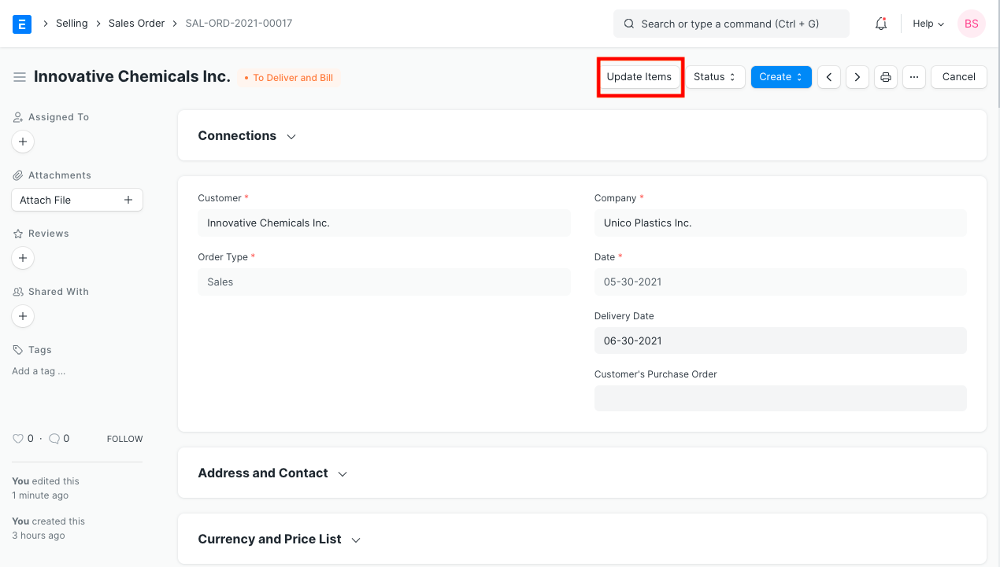
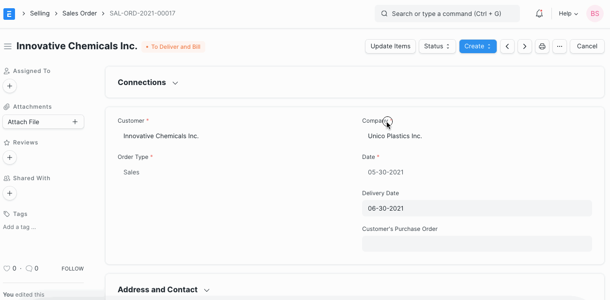

# Amending Sales Order after Submit

[ Edit ](https://docs.frappe.io/wiki/spaces/24hrpr6es9/page/0so1vfvcrk)

Open in ChatGPT  Ask ChatGPT about this page Open in Claude  Ask Claude about this page

# Amending Sales Order after Submit 

[ Edit ](https://docs.frappe.io/wiki/spaces/24hrpr6es9/page/0so1vfvcrk)

Open in ChatGPT  Ask ChatGPT about this page Open in Claude  Ask Claude about this page

Rate and Qty in Sales Order can now be amended after Submit using the `Update Items` button.

To Update Rate and Qty in a Submitted Sales Order, click on the `Update Items` button. A dialog will pop up to let you make the change.

Please Note the following validations and usecases:

  * Update Features checks if Sales Order has Delivery Note and Sales Invoice.
  * Qty can be updated for undelivered Sales Order and for Partial Delivery Note. For Sales Order with completed Delivery Notes, it cannot be updated.
  * Rate can be updated for un-invoiced and partially-invoiced Sales Order. For Sales Order with submitted Sales Invoice, it cannot be updated.

[ Previous Page Applying a Discount  ](applying-discount.md) [ Next Page Close Sales Order  ](close-sales-order.md)

Last updated 1 week ago 

Was this helpful?
