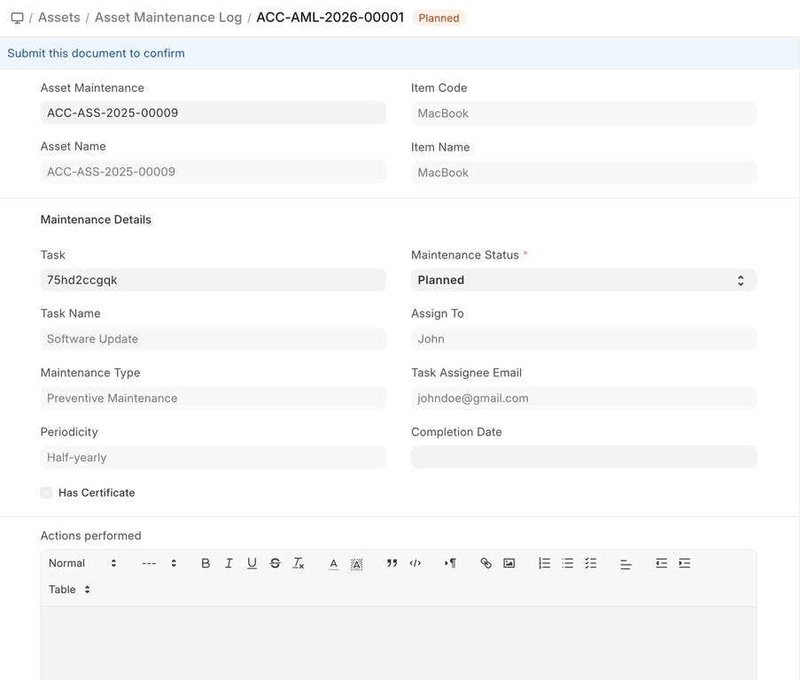

# Asset Maintenance Log

[ Edit ](https://docs.frappe.io/wiki/spaces/24hrpr6es9/page/0s3n6khfkq)

Open in ChatGPT  Ask ChatGPT about this page Open in Claude  Ask Claude about this page

# Asset Maintenance Log 

[ Edit ](https://docs.frappe.io/wiki/spaces/24hrpr6es9/page/0s3n6khfkq)

Open in ChatGPT  Ask ChatGPT about this page Open in Claude  Ask Claude about this page

**Asset Maintenance Log logs the tasks carried out in an Asset Maintenance.**

For each task in Asset Maintenance, Asset Maintenance Log is **auto created** to keep track of the upcoming maintenances. It will have a status, completion date and actions performed. Based on completion date here, next due date is calculated automatically and new Asset Maintenance Log is created.

To access the Asset Maintenance Log, go to:

> Home > Assets > Maintenance > Asset Maintenance Log

## 1\. Prerequisites

* * *

Before creating and using Asset Maintenance Log, it is advised to create the following first:

  * [Asset Maintenance](https://docs.frappe.io/erpnext/user/manual/en/asset-maintenance.md)

## 2\. Options in Asset Maintenance Log

* * *

A Draft of the Asset Maintenance Log is created as scheduled in the Asset Maintenance form.  
In order to submit an Asset Maintenance Log, the Asset Maintenance status has to either 'Completed' or 'Canceled'.

  * The status of the Asset Maintenance Log can be 'Planned', 'Completed', 'Canceled', or 'Overdue'.
  * Additional notes can be added in the Actions performed section to describe the activity in detail.

[ Previous Page Asset Maintenance Team  ](asset-maintenance-team.md) [ Next Page Asset Movement ](asset-movement.md)

Last updated 2 weeks ago 

Was this helpful?
