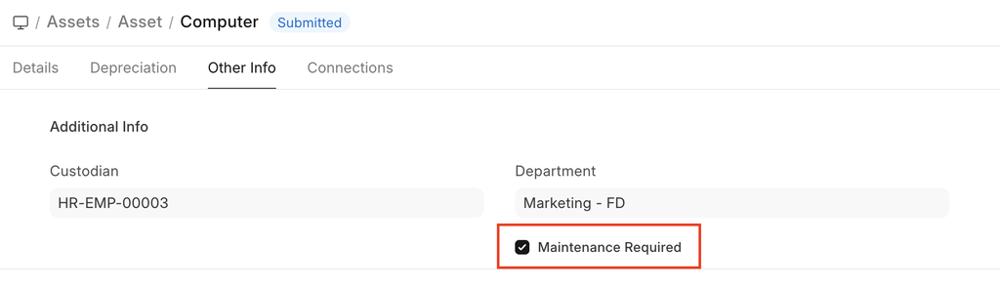
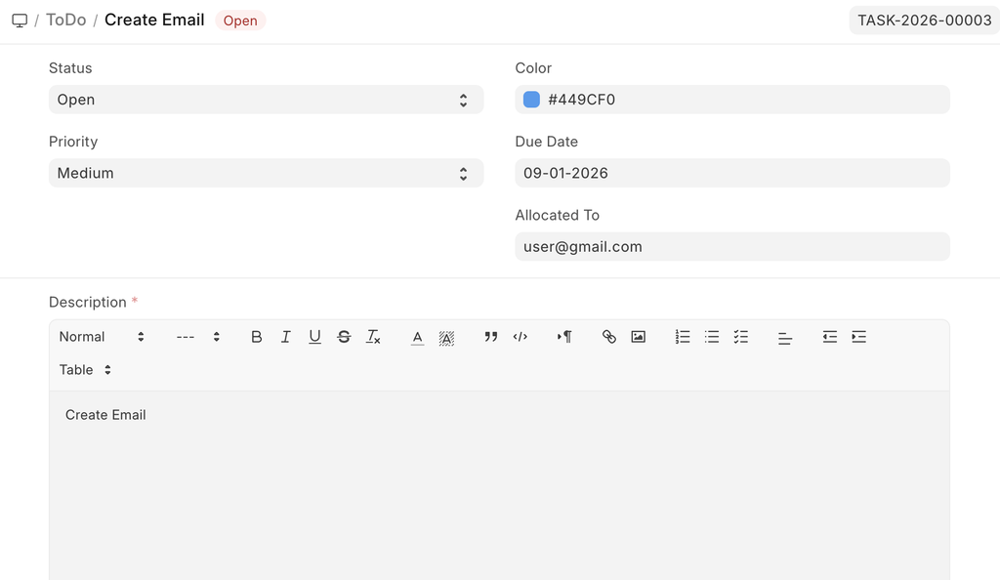

# Asset Maintenance

[ Edit ](https://docs.frappe.io/wiki/spaces/24hrpr6es9/page/0s36ideihg)

Open in ChatGPT  Ask ChatGPT about this page Open in Claude  Ask Claude about this page

# Asset Maintenance

[ Edit ](https://docs.frappe.io/wiki/spaces/24hrpr6es9/page/0s36ideihg)

Open in ChatGPT  Ask ChatGPT about this page Open in Claude  Ask Claude about this page

**Asset Maintenance refers to any activity done on Assets to maintain their performance or condition.**

ERPNext provides features to track the details of individual maintenance/calibration tasks for an asset by date, the person responsible for the maintenance, and future maintenance due date.

To access the Asset Maintenance list, go to:

> Home > Assets > Maintenance > Asset Maintenance

## 1\. Prerequisites

* * *

  * Create an [asset](asset.md)
  * Create an [Asset Maintenance Team](asset-maintenance-team.md).

## **2\. How to create an Asset Category**

* * *

Create an Asset Maintenance Record

  1. Go to **Asset Maintenance**.
  2. Click **New**.
  3. Fill in the required details:

  * Basic Details
    * **Asset** : Select the Asset requiring maintenance.
    * **Maintenance Team** : Select the responsible team.
    * **Maintenance Type** :
      * **Preventive** – Scheduled routine maintenance.
      * **Calibration** – Adjustment to restore measurement accuracy.
  * Schedule Details
    * **Start Date** : Date when maintenance is scheduled to begin.
    * **End Date** : Expected completion date.
    * **Last Completion Date** : Enter the actual completion date if maintenance was performed later than scheduled.

  4. Save and Submit the document.

> Asset Maintenance is a transaction and must be submitted to confirm the schedule.

## 3\. Features

* * *

### 3.1 Asset Maintenance Log

Once submitted:

  * An **Asset Maintenance Log** is created.
  * The log tracks the execution of the maintenance task.
  * Future maintenance due dates are calculated based on the schedule.

### 3.2 Maintenance in ToDo

When a maintenance task is assigned to a user:

  * It automatically appears in the assigned user’s **ToDo list**.
  * This ensures responsible personnel are notified and reminded.

[ Previous Page Asset Shift Allocation ](asset-shift-allocation.md) [ Next Page Asset Maintenance Team  ](asset-maintenance-team.md)

Last updated 1 week ago 

Was this helpful?
