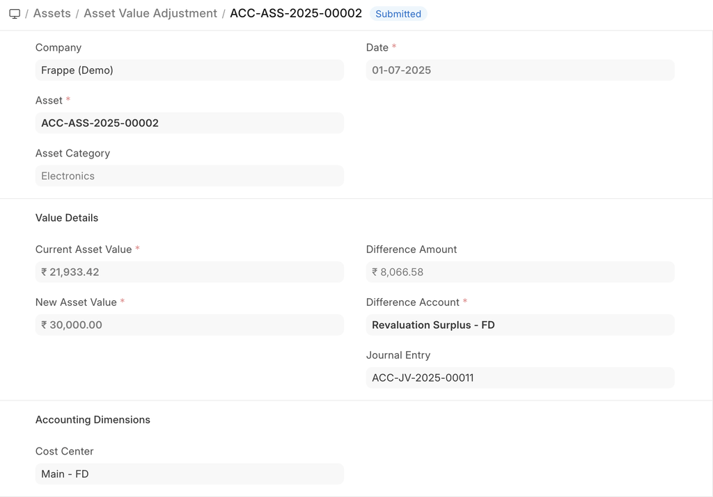

# Asset Value Adjustment

[ Edit ](https://docs.frappe.io/wiki/spaces/24hrpr6es9/page/0s3ukph8bn)

Open in ChatGPT  Ask ChatGPT about this page Open in Claude  Ask Claude about this page

# Asset Value Adjustment 

[ Edit ](https://docs.frappe.io/wiki/spaces/24hrpr6es9/page/0s3ukph8bn)

Open in ChatGPT  Ask ChatGPT about this page Open in Claude  Ask Claude about this page

**If the value of an Asset changed suddenly due to any damages, it can be recorded using Asset Value Adjustment.**

In case of fixed asset management, sometimes the value of an asset needs some adjustment. For example, if a laptop gets damaged for some reason, and its value will be dropped instantly. And in that case, we have to readjust the value of the asset.

To access the Asset Value Adjustment, go to:

> Home > Assets > Maintenance > Asset Value Adjustment

## 1\. Prerequisites

* * *

Before creating and using Asset Value Adjustment, it is advised to create the following first:

  1. [Asset](asset.md)

## 2\. How to create an Asset Value Adjustment

* * *

  1. Go to the Asset Value Adjustment list, click on New.
  2. Select an Asset whose value is to be adjusted.
  3. Select a date.
  4. Enter the current and new value of the asset.
  5. Select adjustment account
  6. Save and Submit.

On saving the system will book a "Gain/Loss on asset revaluation" and adjust the valuation of the asset.  
You can change the cost center and add a finance book.

On submitting, a Journal Entry is created under the 'Accumulated Depreciations' account.

[ Previous Page Asset Repair  ](asset-repair.md) [ Next Page Asset Capitalization ](https://docs.frappe.io/erpnext/asset-capitalization)

Last updated 1 week ago 

Was this helpful?
