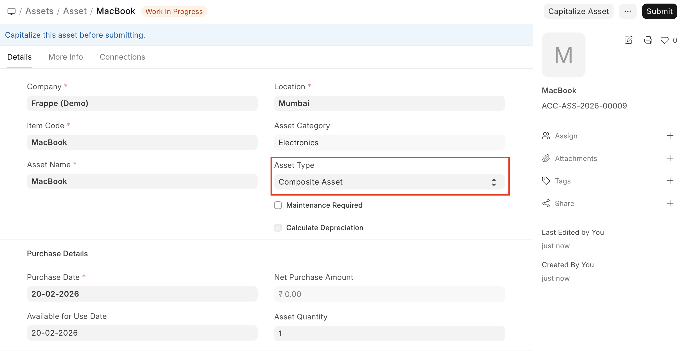
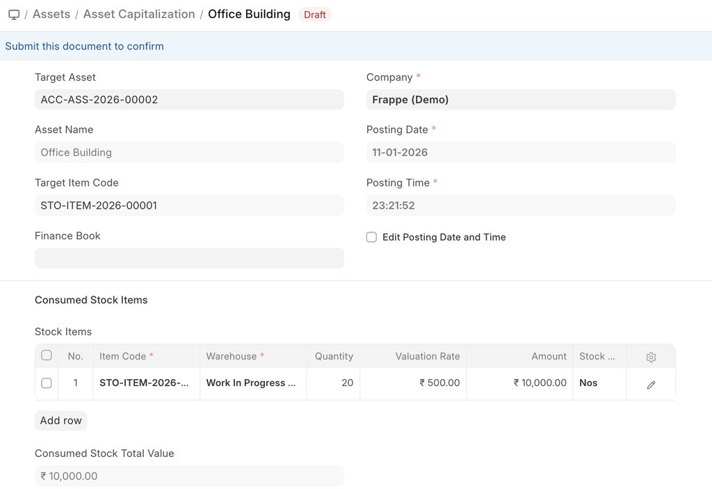
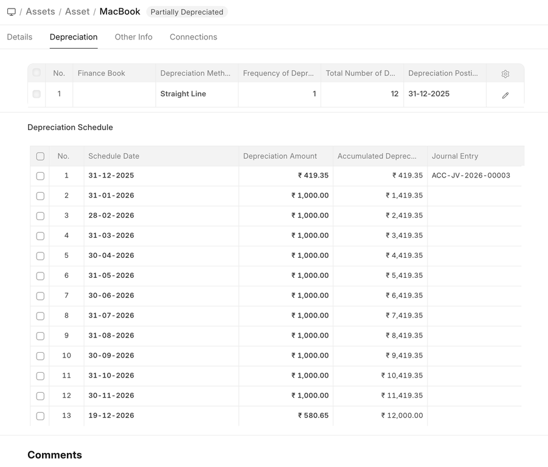
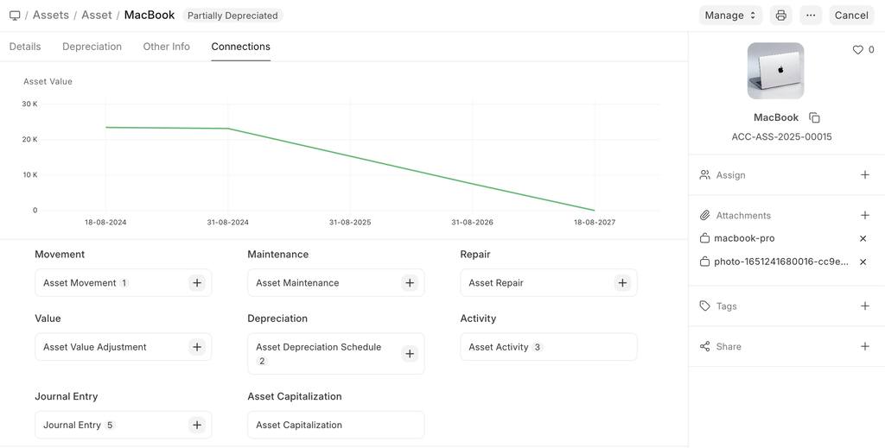

# Asset

[ Edit ](https://docs.frappe.io/wiki/spaces/24hrpr6es9/page/0s4682jm31)

Open in ChatGPT  Ask ChatGPT about this page Open in Claude  Ask Claude about this page

# Asset

[ Edit ](https://docs.frappe.io/wiki/spaces/24hrpr6es9/page/0s4682jm31)

Open in ChatGPT  Ask ChatGPT about this page Open in Claude  Ask Claude about this page

**An Asset is any valuable item owned by a company that is used in operations and has a useful life spanning multiple years.**

Examples include furniture, computers, mobile phones, printers, cars, and manufacturing equipment. Assets can be tangible (physical items located at company premises or with employees) or intangible.

An asset's useful life spans across multiple years and hence its economic value is spread over corresponding years from the accounting perspective. If you buy a printer for $300 and it is expected to be useful for three years, from the accounting perspective $100 is recorded as the expense for three years each instead of all the $300 in the first year. Most countries have rules for such calculations.

In ERPNext, the **Asset record** is the core of the Asset Management module. All transactions related to an asset — purchasing, depreciation, maintenance, movement, scrapping, and sales — are recorded against this record.

To access the Asset list, go to:

> Home > Assets > Assets > Asset

## 1\. Prerequisites

* * *

Before creating and using Asset, it is advised to create the following first:

  * [Item](https://docs.frappe.io/erpnext/user/manual/en/item.md) with 'Is Fixed Asset' enabled.
  * [Location](https://docs.frappe.io/erpnext/user/manual/en/asset-location.md)
  * [Asset Category](https://docs.frappe.io/erpnext/user/manual/en/asset-category.md)
  * [Purchase Receipt](https://docs.frappe.io/erpnext/user/manual/en/purchase-receipt.md) / [Purchase Invoice](https://docs.frappe.io/erpnext/user/manual/en/purchase-invoice.md)

## 2\. How to create an Asset

* * *

### 2.1 Prepare the Item

  * Create an **Item** representing the asset.
  * **‘Maintain Stock’** should be unchecked.
  * **‘Is Fixed Asset’** must be checked.

### 2.2 Auto Creation of Assets (Optional)

  * Enable **‘Auto Create Assets on Purchase’** in the Item if you want assets to be created automatically upon submission of a **Purchase Receipt**.
  * Provide **Asset Location** in the Purchase Receipt item table.
  * On submission, ERPNext displays a message confirming that assets have been created.

### 2.3 Manual Creation of Assets

If auto asset creation is not enabled:

  1. Go to the Asset list and click New.
  2. Enter a Name for the Asset.
  3. Select the Item Code.
  4. Link the Purchase Receipt/Purchase Invoice (Purchase Date and Gross Purchase Amount auto-filled).
  5. Select a Location (e.g., Mumbai).
  6. Set Available-for-Use Date — depreciation will start from this date.
  7. Click Save and Submit.

> **Note:** One asset record is needed for each individual asset. For example, if you purchased 5 computers in one Purchase Receipt, create 5 separate asset records.

### 2.4 Creating Composite Assets

  * A **Composite Asset** can be created from multiple items (e.g., Computer made of Monitor, Keyboard, etc.).
  * Select asset type as **‘Composite Asset’** in the Asset form.
  * Tag this asset in the **WIP Composite Asset** field of items in Purchase Receipts/Invoices.
  * Once all items are received, use **Asset Capitalization** to capitalize the composite asset.

### 2.5 Importing Existing Assets

When migrating from a legacy system:

  1. Select asset type as **‘Existing Asset’**.
  2. Provide:

  * Gross Purchase Amount
  * Purchase Date
  * Available-for-Use Date
  * Opening Accumulated Depreciation
  * Number of Depreciations Booked
  * Is Fully Depreciated (if applicable)

ERPNext will calculate the remaining depreciation schedule automatically.

## 3\. Additional Options

* * *

  * **Custodian:** Employee responsible for the asset
  * **Department:** Department of the custodian
  * **Calculate Depreciation:** Enable to calculate depreciation automatically

* * *

## 4\. Features

* * *

### 4.1 Depreciation

  * **Frequency of Depreciation (Months):** Time between depreciation entries
  * **Total Number of Depreciations:** Total entries over useful life (pending depreciations for existing assets)
  * **Depreciation Method:** Straight Line, Written Down Value, Double Declining Balance, Manual
  * **Depreciation Posting Date:** Start date for depreciation
  * **Expected Value After Useful Life:** Salvage or residual value
  * **Salvage Value Percentage:** Auto-calculate based on gross purchase amount
  * **Rate of Depreciation:** Calculated based on expected value
  * **Finance Book:** Book against which depreciation entries are recorded
  * **Daily Pro-Rata / Shift-Based Depreciation:** Options to adjust depreciation based on actual usage

### 4.2 Depreciation Schedule

  * View schedule in the **Depreciation tab**
  * Columns: Schedule Date, Depreciation Amount, Amount Depreciated, Journal Entry

### 4.3 Insurance Details

  * Policy Number
  * Insurer
  * Insured Value
  * Insurance Start/End Dates
  * Comprehensive Insurance (if applicable)

### 4.4 Accounting Entries

  * On submission: CWIP account credited, asset account debited
  * Submission requires Available-for-Use Date
  * If future date, accounting entry is posted automatically via scheduler

### 4.5 Maintenance

  * Enable Maintenance Required to record Asset Maintenance entries
  * Refer to **[Asset Maintenance](https://docs.frappe.io/erpnext/user/manual/en/asset-maintenance.md)** page for details

## 5\. After Submitting

* * *

Once an asset is created and submitted, you can:

  * Transfer the asset
  * Scrap the asset
  * Sell the asset
  * Adjust value or record depreciation entries using the action buttons

## 6\. Related Topics

* * *

  1. [Asset Maintenance](https://docs.frappe.io/erpnext/user/manual/en/asset-maintenance.md)
  2. [Asset Movement](https://docs.frappe.io/erpnext/user/manual/en/asset-movement.md)
  3. [Purchase Receipt](https://docs.frappe.io/erpnext/user/manual/en/purchase-receipt.md)
  4. [Purchase Invoice](https://docs.frappe.io/erpnext/user/manual/en/purchase-invoice.md)

[ Previous Page Purchasing an Asset ](purchasing-an-asset.md) [ Next Page Depreciation ](asset-depreciation.md)

Last updated 2 weeks ago 

Was this helpful?
