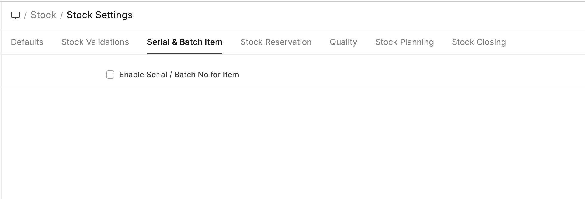

# Batch

[ Edit ](https://docs.frappe.io/wiki/spaces/24hrpr6es9/page/0rt5c4t454)

Open in ChatGPT  Ask ChatGPT about this page Open in Claude  Ask Claude about this page

# Batch

[ Edit ](https://docs.frappe.io/wiki/spaces/24hrpr6es9/page/0rt5c4t454)

Open in ChatGPT  Ask ChatGPT about this page Open in Claude  Ask Claude about this page

> Allow Negative Stock has removed for Serial / Batch Items from version 15. So from version 15 users won't be able to make negative stock transactions for serial /batch items even though Allow Negative Stock has enabled in the Stock Settings.

To enable serial / batch feature for the item, first check the 'Enable Serial and Batch No for Item' checkbox in the 'Stock Settings'.

**Batch feature in ERPNext allows you to group multiple units of an Item and assign them a unique value/number/tag called Batch No.**

This is done based on the Item. If the Item is batched, then a Batch number must be mentioned in every stock transaction. Batch numbers can be maintained manually or automatically. This feature is useful to set the expiry date of multiple Items or move them together to different Warehouses.

To access the Batch No list, go to: > Home > Stock > Serial No and Batch > Batch

  1. Prerequisites

* * *

Before creating and using a Batch, it is advised that you create the following first:

  * [Item](item.md)
  * Enable 'Has Batch No' in the Item master 

  2. How to create a new Batch

* * *

To set item as a batch item, "Has Batch No" field should be checked in the Item master. If you have not selected "Automatically Create New Batch" when creating an Item, you will have to make Batches Manually as you go along.

To create new Batch No. master for an item, go to:

  1. Go to the Batch list, click on New.
  2. Set the Batch ID.
  3. Select the Item.
  4. If any transaction is done with an item, the batch cannot be set or unset.
  5. Save.

When Batches are enabled for an Item, the option to [retain sample stock](retain-sample-stock.md) also becomes available.

### 2.1 Batch Auto Creation

If you want automatic batch creation at the time of Purchase Receipt, you must tick 'Automatically Create New Batch' in the Item master:

  3. Features

* * *

### 3.1 Splitting and Moving Batches

When you open a batch, you will see all the quantities that belong to that batch on the page.

  * To move the batch from one Warehouse to another, you can click on the **Move** button.
  * You can also split the batch into smaller one by clicking on the **Split** button. This will create a new Batch based on this Batch and the quantities will be split between the batches.

  * If you set expiry date, the Batch will show 'Not Expired' until the expiry date, after which it'll show 'Expired'. If a date is not set, the Batch will show 'Not Set'.

### 3.2 Transacting Items with Batches

A Batch master should be created before the creation of Purchase Receipt. Hence, every time a Purchase Receipt or Work Order is being made for a batch item, you will first create its Batch No, and then select it in the Purchase order or Stock Entry.

On every stock transaction (Purchase Receipt, Delivery Note, Invoice) with a batch item, you should provide the Item's Batch No.

> Note: In stock transactions, Batch IDs will be filtered based on Item Code, Warehouse, Batch Expiry Date (compared with a Posting date of a transaction) and Actual Qty in Warehouse. While searching for Batch ID without value in the Warehouse field, Actual Qty filter won't be applied.

### 4\. Related Topics

  1. [Serial Number](serial-no.md)
  2. [Opening Stock Balance Entry For Serialized And Batch Item](opening-stock-balance-entry-for-serialized-and-batch-item.md)
  3. [Managing Batch Wise Inventory](managing-batch-wise-inventory.md)

[ Previous Page Stock Inspection ](stock-inspection.md) [ Next Page Serial Number ](serial-no.md)

Last updated 1 week ago 

Was this helpful?
