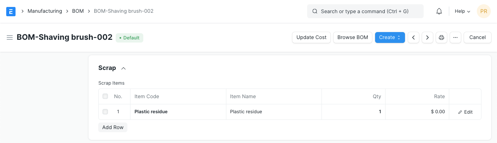

# Bill Of Materials

[ Edit ](https://docs.frappe.io/wiki/spaces/24hrpr6es9/page/0s0q2lpk51)

Open in ChatGPT  Ask ChatGPT about this page Open in Claude  Ask Claude about this page

# Bill Of Materials

[ Edit ](https://docs.frappe.io/wiki/spaces/24hrpr6es9/page/0s0q2lpk51)

Open in ChatGPT  Ask ChatGPT about this page Open in Claude  Ask Claude about this page

**A Bill of Materials is a list of items and sub-assemblies with quantities required to manufacture an Item.**

A BOM may also contain the manufacturing operations required to manufacture the Item.

A **Bill of Materials** (BOM) is at the heart of the Manufacturing system and the most important document that will help to create other document types like Work Orders and Job Cards. ERPNext supports multi-level BOM. To know more, visit [this page](managing-multi-level-bom.md).

The **BOM** is a list of all materials (either bought or made) and operations  
that go into manufacturing a finished product or sub-assembly. In ERPNext, each item (sub-assembly) could  
have its own BOM hence forming a tree of Items with multiple levels.

To make accurate Purchase Requests, you must always maintain correct BOMs.

To access the BOM list, go to:

> Home > Manufacturing > Bill of Materials > Bill of Materials

> Note that once a BOM is submitted, it cannot be edited. You can only cancel the existing, duplicate it and submit another one. A BOM is also linked to multiple places in the Manufacturing module, so making changes to it can be time-consuming and tedious. Hence it is a good practice to carefully think and fill out the BOMs before submitting.

## 1\. Prerequisites

Before creating and using a BOM, it is advised that you create the following first:

  * [Item](item.md)
  * [Operation](operation.md)
  * [Workstation](workstation.md)
  * [Routing](routing.md)

## 2\. How to create a Bill of Materials

  1. Go to the Bill of Materials list, click on New.
  2. Select the Item to be manufactured. The Item name, UoM, company, and currency will be fetched automatically.
  3. Enter the quantity of the Item that will be manufactured from this Bill of Materials.
  4. Under the Items table, select the raw materials (Items) required to manufacture the Item. Then proceed to:
  5. Select the quantity of Raw Material used.
  6. Set an Item operation here to be fetched in Work Orders later.
  7. If this Item is a sub-assembly, the default BOM for it will be fetched.
  8. Select the Source Warehouse to track inventory.
  9. Enter the scrap percentage that will remain after this raw material is used. BOM Materials](/files/bom-materials.png)
  10. Under the Scrap section, select the scrap Item that will be created when manufacturing and its quantity. The scrap Item can also have a Rate if it is a by-product and not waste. Skip this section if 100% of raw materials are completely utilized. If the scrap Item is the same as the Item to be manufactured, it is set as a Process Loss Item and its quantity is subtracted from the manufactured Item quantity. 

  6. Save and Submit.

In the Items table, you'll see an option 'Include Item in Manufacturing'. Raw Materials need to have this checkbox ticked. In case there are Operations or services you need to include in the BOM that are not necessarily an Item used for manufacturing, uncheck this checkbox. For example, treating the plastic with a chemical involves some cost but it is not an Item and the cost needs to be tracked.

### 2.1 Bill of Materials with Operations

To add [Operations](operation.md) tick the 'With Operations' checkbox. Now, an Operations table can be seen. This option is useful for tracking the costing of various Operations performed to manufacture the [Item](item.md). Operations can be added easily by setting a template with the [Routing](routing.md) master.

  1. In the “Operations” table, add the operations that need to be performed to manufacture this particular Item.
  2. For each operation, you will be asked to enter a [Workstation](workstation.md) where the Operation will be performed. A default Workstation can be set from the [Operation](operation.md) document.
  3. Enter the Operating Hourly Rate, Operation Time in minutes, and the Batch Size created with the Operation. The Operating Cost will be calculated based on these values.

> Note: Workstations are defined only for product costing and Work Order Operations scheduling purposes not tracking inventory. Inventory is tracked in [Warehouses](warehouse.md) set in the Items table of the BOM.

Transfer Material Against needs to be set for a BOM With Operations. Materials can be transferred against a [Work Order](work-order.md) in bulk or individual [Job Cards](job-card.md). Changing this affects whether the 'Material Transfer for Manufacture' is done against the Work Order at once or multiple times against the individual Job Cards. Setting this option depends on factors like time taken to manufacture the item, value of the items manufactured, number of parts used in manufacturing, the skill of your labor involved, etc.

### 2.2 Additional options when creating a Bill of Materials

  * **Is Active** : An Item could also be manufactured using an alternate set of materials/operations. In that case, uncheck this checkbox to disable this BOM and use another one.
  * **Is Default** : This BOM will be selected by default in Work Orders etc. when the Item selected.
  * **Inspection Required** : This will make 'Quality Inspection' mandatory for raw materials and the finished goods. Select the Quality Inspection Template after ticking this checkbox.
  * **Allow Alternative Item** : Sometimes when manufacturing a finished good, specific materials may not be available. If you tick this, you can create and select an alternative item from the Item Alternative list. For example, using plastic beads instead of plastic crystals. For more details visit [this page](item-alternative.md).
  * **Allow Same Item Multiple Times** : In some manufacturing cases, the same item needs to be added twice. For example, two metal pipes of length 0.5m each to form another shape. Here the quantity cannot be simply set to 2 and be done since the UoM will show 1m as total but we need 0.5m + 0.5m in the form of two pipes for production. Ticking this checkbox allows you to select the same item multiple times.
  * **Set rate of sub-assembly item based on BOM** : Enabling this checkbox will set the rate of sub-assembly items based on their BOMs. If unchecked, the rate will be fetched from the Valuation Rate of the sub-assembly Item. Incase of Phantom Item, this setting is ignored and valuation rate of the phantom item will always be based on the contents of its BOM.
  * **Is Phantom BOM** : If this is checked, it means that this BOM does not produce any item. Instead, it is only a logical grouping of raw materials. The Production Item in this BOM should be a non-stock item. If this non-stock item is added as a "raw material" in any other BOM, the BOM will be exploded automatically regardless if explosion or multi-level BOM is enabled or not.
  * **Rate Of Materials Based On** : The Rate of raw materials used can be calculated based on different parameters.
  * **Valuation Rate** : The Valuation Rate set in the [Item master](item.md).
  * **Last Purchase Rate** : The Rate is fetched from the last Sales [Order](sales-order.md)/[Invoice](sales-invoice.md).
  * **Price List** : The Rate will be fetched from the [Item Price](item-price.md).  
For more details, visit [this page](valuation-based-on-field-in-bom.md).

## 3\. Features

### 3.1 BOM Costing

The Costing section in a BOM gives an approximate cost of manufacturing the Item.

The costing is calculated from the Valuation Rate of the raw materials/sub-assemblies involved and the Operation costs.

In case the BOM was submitted when the costs for Items/Operations were not updated, you can update the costs using the **Update Cost** button. This will fetch the latest price/costs.

The BOM cost can also be set to be updated automatically via Manufacturing Settings, 'Update BOM Cost Automatically' option.

### 3.2 Materials Required (Exploded)

This table lists down all the raw materials required to manufacture an Item. It also fetches raw materials for the sub-assemblies/phantom items along with the quantities. The non-exploded table will not list the raw materials required for producing the sub-assemblies.

For example, to manufacture a plastic shaving brush you need some raw materials and the bristles as a sub-assembly. For the handle, you manufacture your own plastic, but for the bristles, you use raw plastic crystals.

#### 3.2.1 Do Not Explode

If user wants to exclude the exploded items then they have to enable the checkbox "Do Not Explode" in the BOM Item table. This option is made read only and is unchecked by default if Item is a Phantom Item.

##### Use Case:

  * Laptop
  * Motherboard (Kept in stock)
  * Keyboard

A company manufacture the Laptop which required two sub-assembly items as Motherboard and Keyboard. The company does the manufacturing once they received the order from the customer. The Manufacturing Time required for the Motherboard is more than the Keyboard, therefore the company does the manufacturing of the Motherboard individually irrespective of the sales orders and kept in the stock. As the item Motherboard is already in stock it helps to reduce the overall Manufacturing Time of the main item Laptop.  
Now while preparing the BOM for the Laptop in the ERPNext, they don't want to Explode the BOM of the item Motherboard but they want to Explode the BOM of the item Keyboard. Therefore we have added the checkbox "Do Not Explode" for the BOM Item. With this user will enable the checkbox "Do Not Explode" for the item Motherboard and not for the item Keyboard.

### 3.3 Project and Website

The BOM can be linked to a [Project](project.md) to track progress, Project costing, etc. In case of engineer to order, every order could be a [Project](project.md) and the sub-assemblies would be [Tasks](tasks.md). The completion can be tracked by linking to a Project in that case.

The BOM can also be shown in the [Website](website.md) for Open-source hardware products. Open-source hardware is similar to open-source where the product specifications are listed publicly.

### 3.4 BOM Template

With BOM template you can create BOMs for template items (against which you create variant items). These BOMs can be used as the default BOM while making Work Orders against the template Item's variants. You can also add the template items as raw materials in the template BOM. While making Work Order from the BOM Template, ERPNext gives provision to select the Item Variant against the template Item, for more details check following screenshot.

The user can also make the BOM for the variant item using the template BOM. To make the variant BOM:

  * Go to the BOM Template.
  * Click on **Create** button.
  * Click on Variant BOM.
  * Select the Variant Item for which you want to make the BOM.
  * If the raw materials in the BOM is a template Item, then system gives provision to select the Item Variant.

### 3.5 After Submitting

Once the BOM is submitted, the following document types can be created against the BOM from the Dashboard:

## 4\. Video

### 5\. Related Topics

  1. [Scrap Management](scrap-management.md)
  2. [Material Consumption](material_consumption.md)
  3. [Nested BOM Structure](managing-multi-level-bom.md)

[ Previous Page Manufacturing Dashboard  ](manufacturing-dashboard.md) [ Next Page Workstation Type ](workstation_type.md)

Last updated 1 day ago 

Was this helpful?
