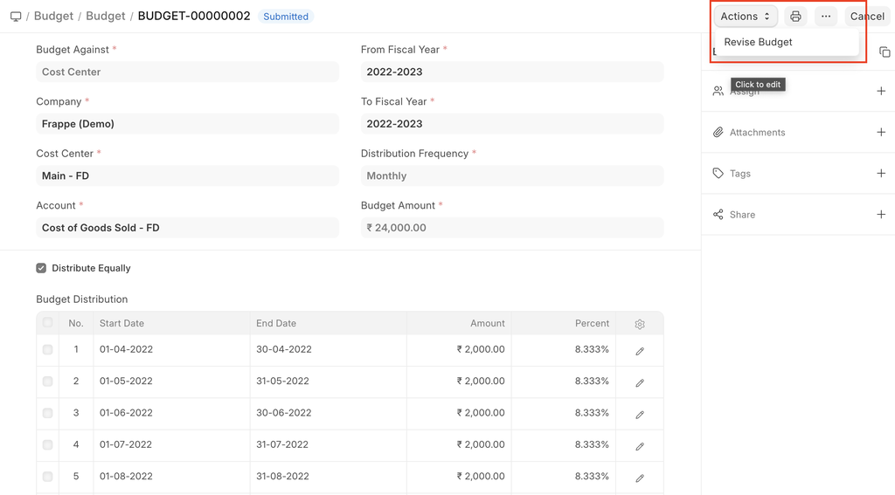
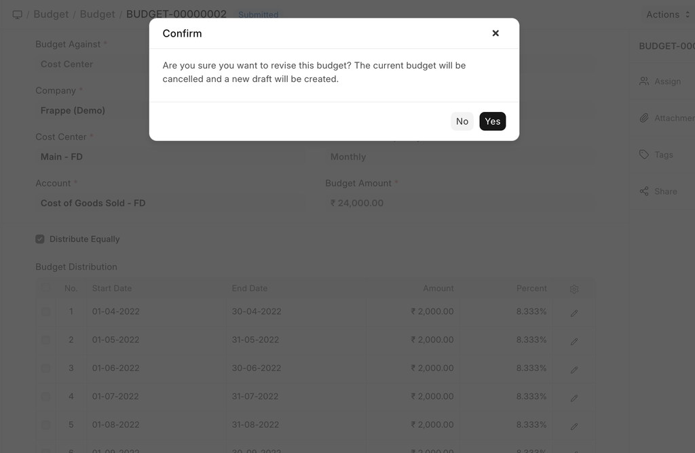

# Budget Revision

[ Edit ](https://docs.frappe.io/wiki/spaces/24hrpr6es9/page/dpdbrrj79t)

Open in ChatGPT  Ask ChatGPT about this page Open in Claude  Ask Claude about this page

# Budget Revision

[ Edit ](https://docs.frappe.io/wiki/spaces/24hrpr6es9/page/dpdbrrj79t)

Open in ChatGPT  Ask ChatGPT about this page Open in Claude  Ask Claude about this page

A Budget Revision allows you to update an existing budget when plans change during the fiscal year.

Instead of editing a submitted Budget, revisions help maintain:

  * Audit history
  * Clear tracking of changes
  * Accurate budget vs actual analysis

* * *

## 1\. How can you revise an existing budget

  * Open the Budget you want to revise.
  * Click Revise Budget from the Actions menu.

  * A confirmation message is shown: click Yes to continue.

  * A new Budget draft is created automatically.
  * Update the Budget Amount and modify the Budget Distribution as required.
  * Save and Submit the revised Budget.

The previous Budget is cancelled, The revised Budget becomes active.

* * *

## 2\. When to Use a Budget Revision

Use a Budget Revision when:

  * Budget amounts need to be increased or reduced
  * Budget distribution needs to be adjusted
  * Business priorities change mid-year
  * Additional funds are approved for an account or dimension

[ Previous Page Budget ](budget.md) [ Next Page Budget Variance Report ](https://docs.frappe.io/erpnext/budget-variance-report)

Last updated 2 weeks ago 

Was this helpful?
