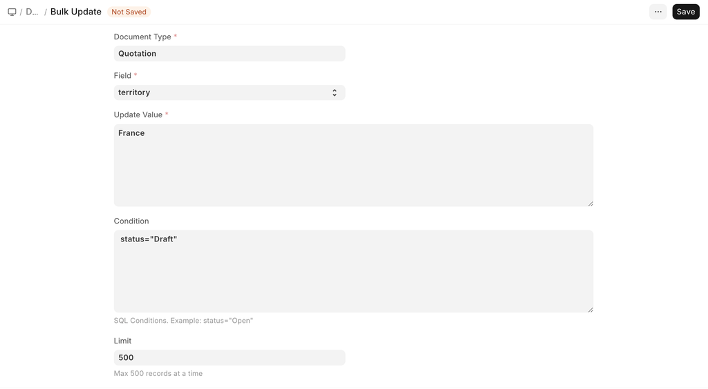

# Bulk Update

[ Edit ](https://docs.frappe.io/wiki/spaces/24hrpr6es9/page/0rdi9mc1ee)

Open in ChatGPT  Ask ChatGPT about this page Open in Claude  Ask Claude about this page

# Bulk Update 

[ Edit ](https://docs.frappe.io/wiki/spaces/24hrpr6es9/page/0rdi9mc1ee)

Open in ChatGPT  Ask ChatGPT about this page Open in Claude  Ask Claude about this page

**Bulk Update allows you to update a particular field of a DocType for all documents.**

To access Bulk Update, go to:

> Home > Bulk Update

Consider that you have 20 quotations in which you had selected 'All Territories' and now you want to change the Territory to France. Instead of updating the individual quotations manually, you can use Bulk Update to update all 20 Quotations at once.

To do this,

  1. Go to Bulk Update.
  2. Select the Document Type, like Quotation.
  3. Select the field to update, like territory.
  4. Enter a **valid** new value to be updated.
  5. Enter any conditions that apply, for example, status="Draft" will only affect documents in the Draft stage.
  6. Select the limit, i.e. number of documents (Quotations) to be updated.
  7. Click on Save 

[ Previous Page Downloading Backups ](download-backup.md) [ Next Page Bulk Rename ](bulk-rename.md)

Last updated 2 weeks ago 

Was this helpful?
