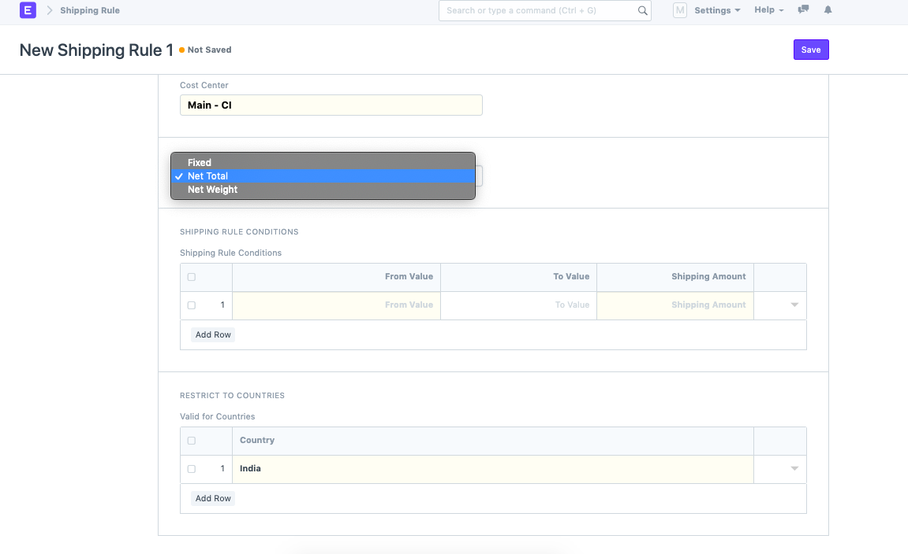

# Fetch shipping charges based item's value or weight

[ Edit ](https://docs.frappe.io/wiki/spaces/24hrpr6es9/page/0sose2rtr8)

Open in ChatGPT  Ask ChatGPT about this page Open in Claude  Ask Claude about this page

# Fetch shipping charges based item's value or weight 

[ Edit ](https://docs.frappe.io/wiki/spaces/24hrpr6es9/page/0sose2rtr8)

Open in ChatGPT  Ask ChatGPT about this page Open in Claude  Ask Claude about this page

In a Purchase order, we can fetch the **Shipping Charges** of an item based on its Value or weight.  
Go to **Shipping Rule list** \--> **Calculate based on : Net Total or Net Weight** \--> Select Shipping rule conditions --> Fill table  
  
This way, while creating a PO, shipping charges will be fetched for the item based on item's weight or Value.

[ Previous Page Calculating Freight in taxes in ERPNext ](calculatin-freight-in-taxes-in-erpnext.md) [ Next Page Purchase invoice for Services ](https://docs.frappe.io/erpnext/item-creation-not-required-in-purchase-invoice)

Last updated 1 week ago 

Was this helpful?
