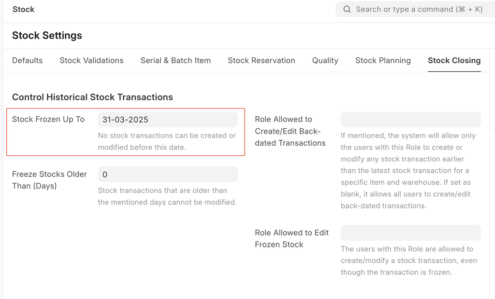

# Change Valuation Method

[ Edit ](https://docs.frappe.io/wiki/spaces/24hrpr6es9/page/0rrpndbe59)

Open in ChatGPT  Ask ChatGPT about this page Open in Claude  Ask Claude about this page

# Change Valuation Method

[ Edit ](https://docs.frappe.io/wiki/spaces/24hrpr6es9/page/0rrpndbe59)

Open in ChatGPT  Ask ChatGPT about this page Open in Claude  Ask Claude about this page

In the ERPNext, users can change the valuation method from FIFO to Moving Average, but not from Moving Average to FIFO, for items with existing stock transactions.

If a user changes the valuation method from FIFO to Moving Average for any item, the system will use the Moving Average method for new outward transactions. Additionally, if the user creates backdated transactions, all transactions created after that backdated entry will be reposted using the Moving Average method. This may result in changes to the closing balance value of earlier transactions.

To prevent this, users can freeze stock transactions before a specific date by setting the "Stock Frozen Up To" date in the stock settings.

[ Previous Page Negative Batch Report ](stock/reports/negative-batch-report.md) [ Next Page Managing Fractions in UOM  ](managing-fractions-in-uom.md)

Last updated 3 weeks ago 

Was this helpful?
