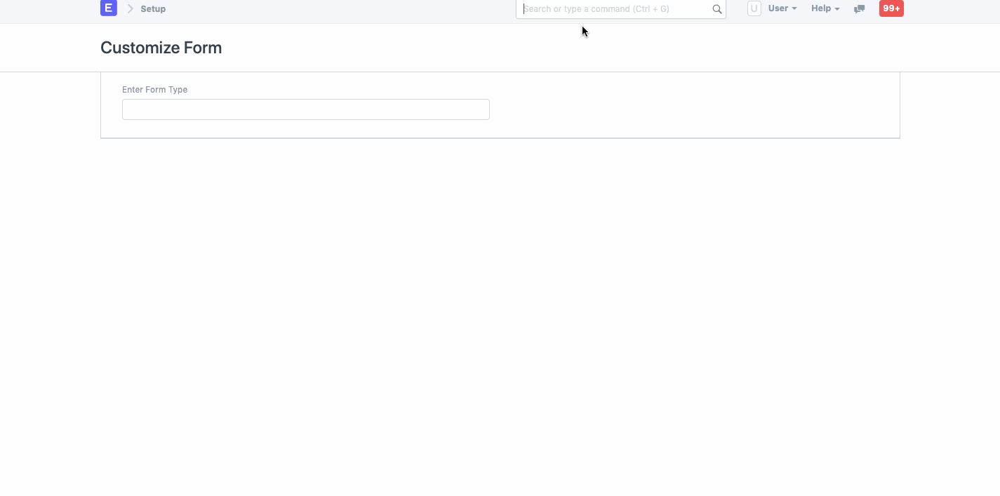
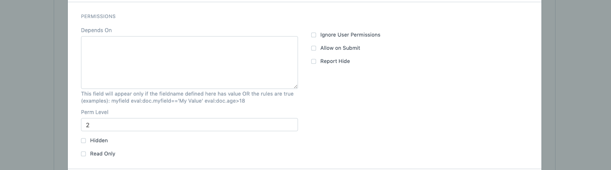
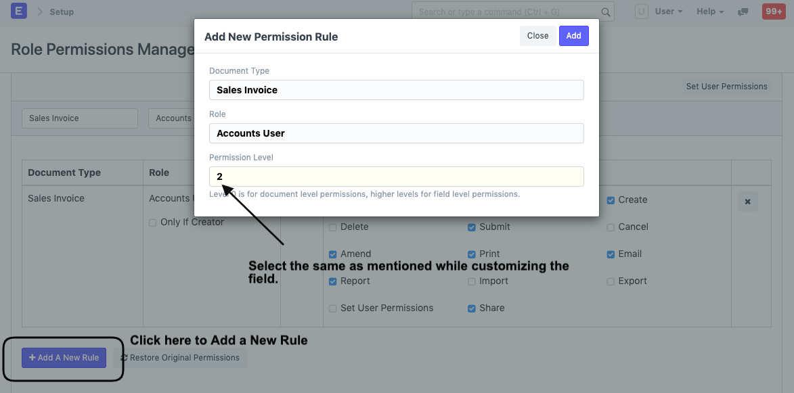
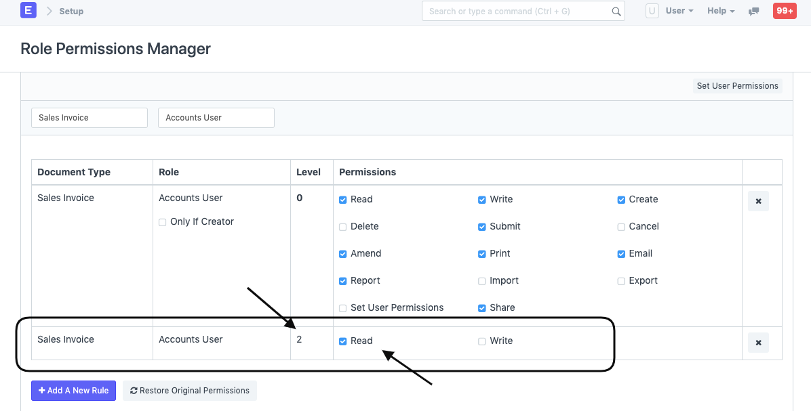
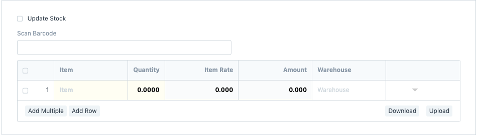

# Field Level Permission Management

[ Edit ](https://docs.frappe.io/wiki/spaces/24hrpr6es9/page/0sdplu9961)

Open in ChatGPT  Ask ChatGPT about this page Open in Claude  Ask Claude about this page

# Field Level Permission Management

[ Edit ](https://docs.frappe.io/wiki/spaces/24hrpr6es9/page/0sdplu9961)

Open in ChatGPT  Ask ChatGPT about this page Open in Claude  Ask Claude about this page

Restricting a field based on Roles can be easily configured using Perm Level, which is required by most organizations. To define a **Perm Level** , you can go to the respective form and Customize it.

Let's take a scenario where the organization doesn't want its Employee (Accounts User) to edit the Rate of the item while creating a **Sales** **Invoice**. To do that, we can simply make the **Item Rate** field a read-only.

#### Step 1: Customize Form

To achieve this, go to **Customize Form** , select DocType as **Sales Invoice** **Item** , scroll to the **Item Rate** field and expand it.

#### Step 2: Perm Level

Search for the **Perm Level** , enter the number (0, 1, 2, 3, etc), and Save it.

#### Step 3: Permission Rule

Once saved, click on **Add a New Rule** in Role Permission Manager and select the Document Type and the Role, in our case, Accounts User, set the Perm Level as 2 and grant the Employee Read access.

This is how the Role Permissions Manager will display the newly created Rule with Perm Level as 2:

#### Step 4: Validate View

Now, as you can see in the Sales Invoice the User can only read the Item Rate field which will be fetched automatically from the Price List.

[ Previous Page Role Permission for Page and Report  ](https://docs.frappe.io/erpnext/role-permission-for-page-and-report) [ Next Page Access Log  ](https://docs.frappe.io/erpnext/access-log)

Last updated 1 week ago 

Was this helpful?
