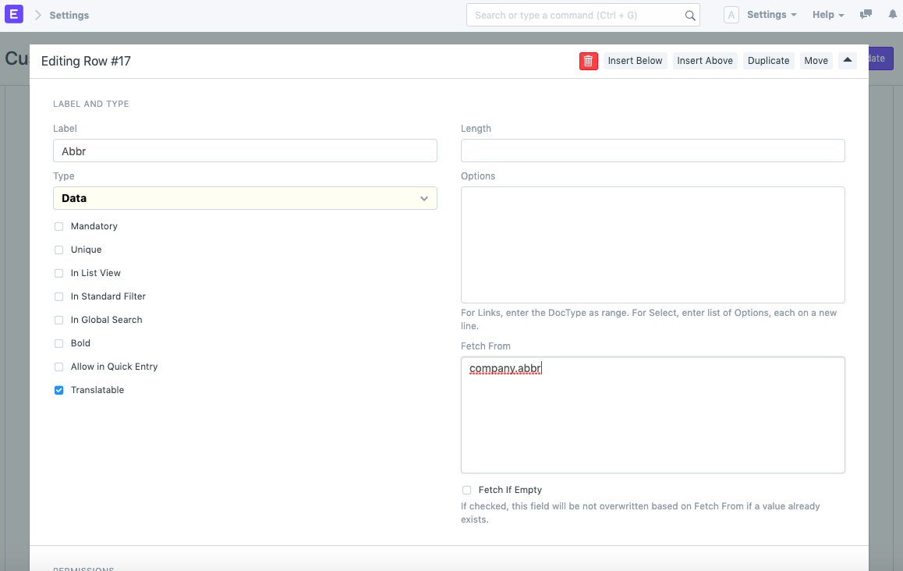
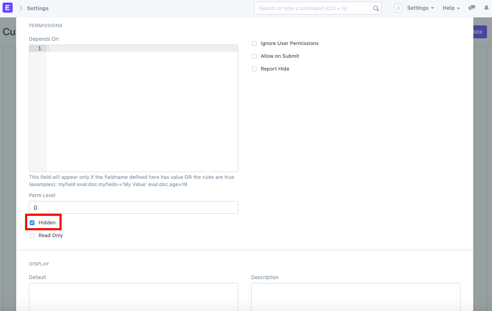
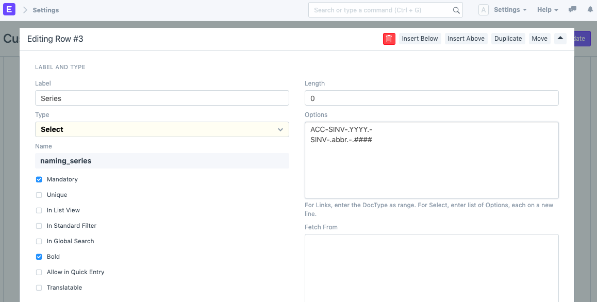
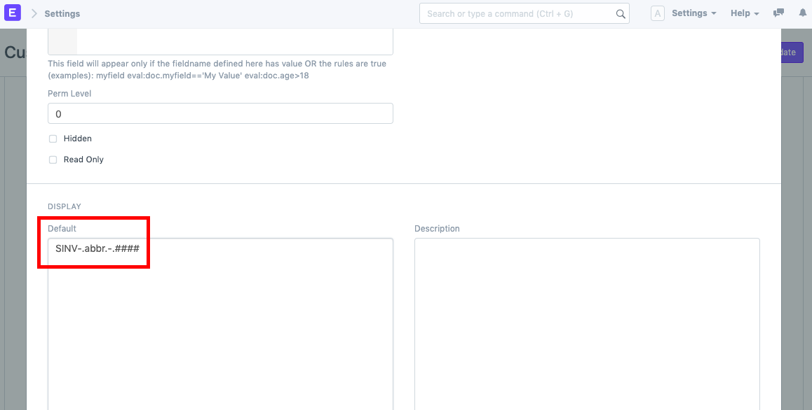
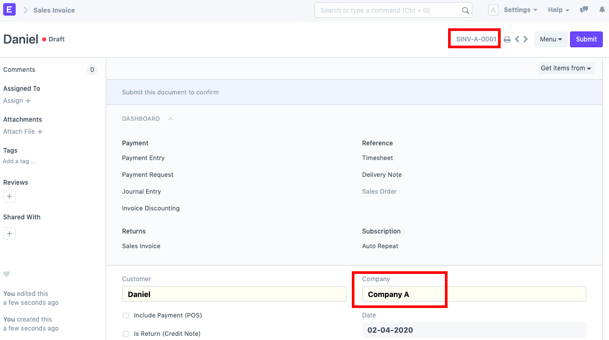

# Company-wise Naming Series

[ Edit ](https://docs.frappe.io/wiki/spaces/24hrpr6es9/page/0sjnjmpieb)

Open in ChatGPT  Ask ChatGPT about this page Open in Claude  Ask Claude about this page

# Company-wise Naming Series

[ Edit ](https://docs.frappe.io/wiki/spaces/24hrpr6es9/page/0sjnjmpieb)

Open in ChatGPT  Ask ChatGPT about this page Open in Claude  Ask Claude about this page

Suppose you have a multi-company setup, and you need to create different naming series for documents belonging to different companies. For example, you have three companies:

  * Company A
  * Company B
  * Company C

The need is to create naming series which is company-specific for documents such as Sales Invoice, Purchase Order, etc. For example, in case of Sales Invoice, for Company A, the naming series will be SINV-A-0001 and for Company B, the naming series will be SINV-B-0001. This can be easily achieved via customisation by following the steps given below:

  1. First, go to the DocType for which you want different series based on company and open its Customize Form. In this case, we will Select From Type as Sales Invoice.

  2. Next, below the field of Company, add another field and name it 'Abbr'. Add `company.abbr` in its Fetch From input.

Also, keep this field hidden (if needed).

  3. Now, in the Customize Form itself, go to the Naming Series row and expand it. In the Options box, add another entry in new line (taking Sales Invoice as example) `SINV-.abbr.-.####` and set this as default.

Once this is done, click on Update.

Now, go to Sales Invoice and create one. Select the Company and the Naming Series will be updated automatically based on the company's abbreviation.

**Comments**

[ Previous Page Set Current Value for Naming Series ](naming-series-current-value.md) [ Next Page Custom Field ](custom-field.md)

Last updated 1 week ago 

Was this helpful?
