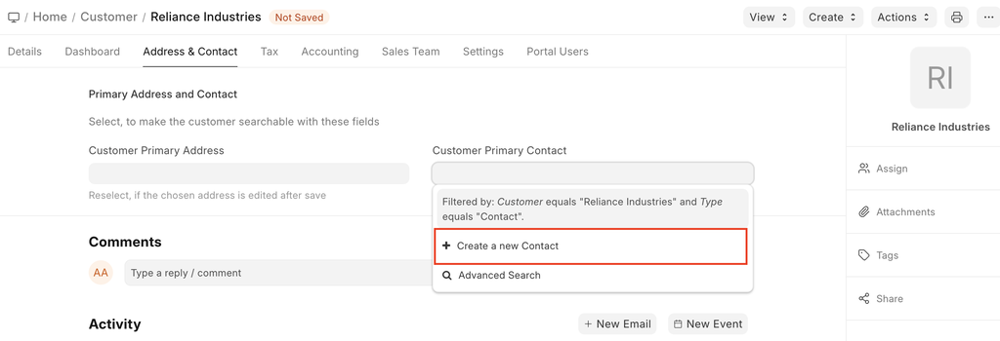
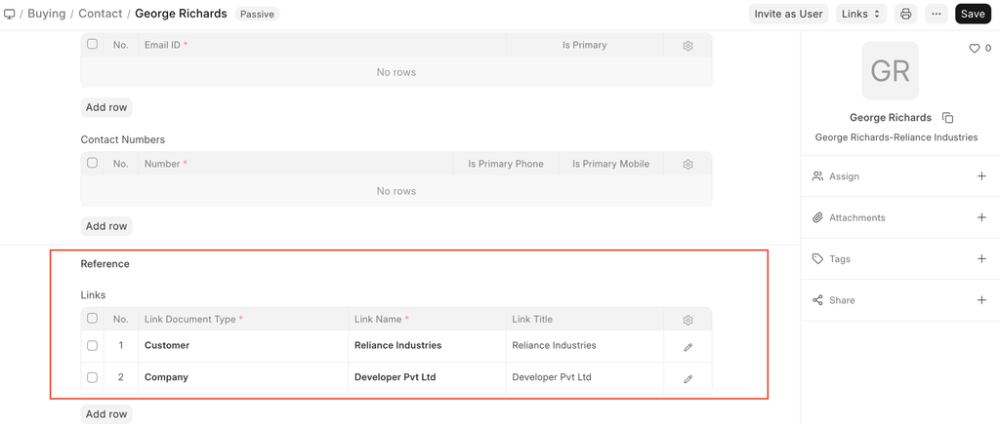
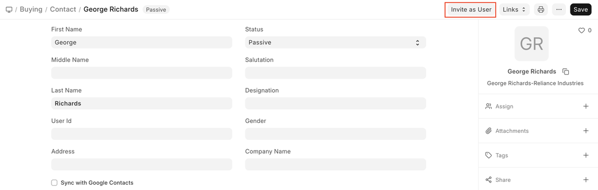

# Contact

[ Edit ](https://docs.frappe.io/wiki/spaces/24hrpr6es9/page/0rirjqmtk3)

Open in ChatGPT  Ask ChatGPT about this page Open in Claude  Ask Claude about this page

# Contact 

[ Edit ](https://docs.frappe.io/wiki/spaces/24hrpr6es9/page/0rirjqmtk3)

Open in ChatGPT  Ask ChatGPT about this page Open in Claude  Ask Claude about this page

**Contact represents a person.**

A contact may be associated with a Lead, Customer, Supplier, Shareholder, Sales Partner or a User.

You can also add contact as a standalone record without linking it to any of the entities listed above.

To access the Contact list, go to:

> Home > CRM > Sales Pipeline > Contact

## How to create a Contact

  1. Go to the Contact list and click on New.
  2. Enter First Name and Last Name.
  3. Choose the status if the contact is passive, is open to contact or has replied.
  4. Enter contact details like email, phone, etc.
  5. Save. Contact

You can also add a Contact from the Customer or Supplier record by clicking on “New Contact” button as shown below.

When you have multiple contacts against an entity like customer/supplier, you can check 'Is Primary Contact' to indicate the preferred contact. The primary contact will be chosen automatically in transactions like sales order and sales invoice.

To Import multiple contacts from a spreadsheet, use the Data Import Tool.

* * *

## Features

### Link a Contact to Multiple Entities

A contact may be linked to multiple customers or multiple suppliers.

A contact can also be linked to customers and suppliers at the same time.

### Invite the Contact as a User

You can allow contacts of your customers and suppliers to log into your ERPNext system and view data relevant to them. Check Customer Portal for more details on this. You can send an email invitation to a contact by clicking on 'Invite as User' button.

### Related Topics

  1. Customer
  2. Supplier
  3. Sales Partner

[ Previous Page Territory  ](territory.md) [ Next Page Address  ](address.md)

Last updated 2 weeks ago 

Was this helpful?
