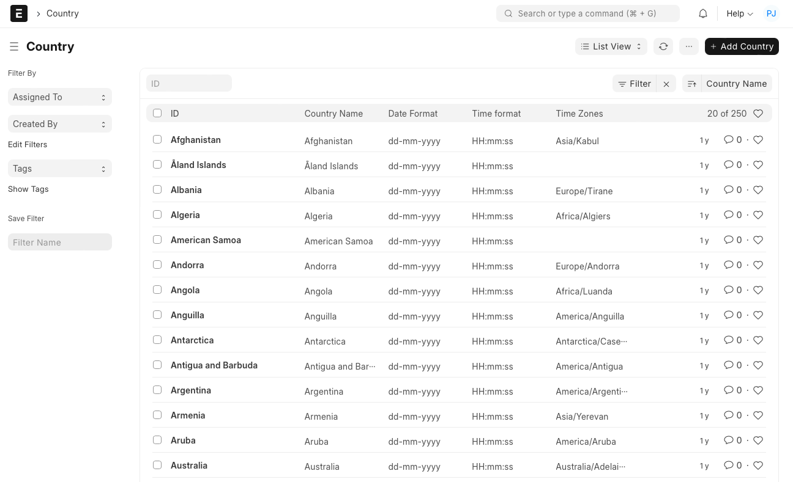
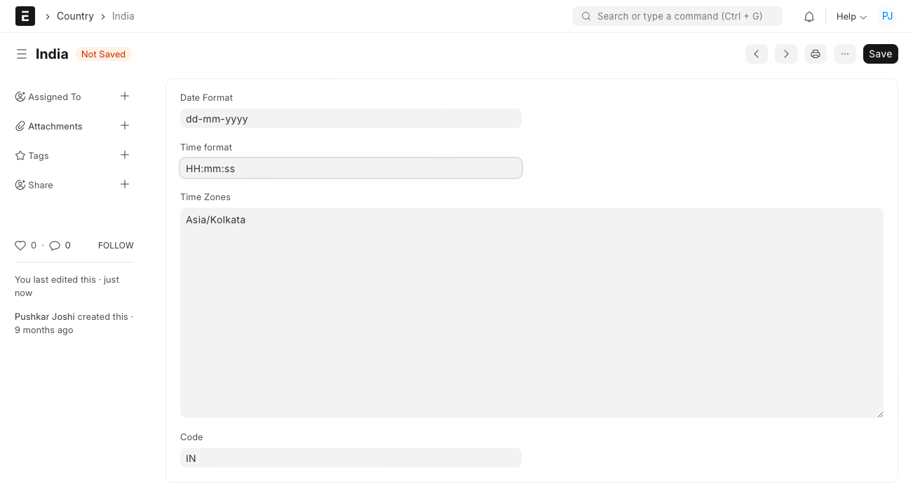

# Country

[ Edit ](https://docs.frappe.io/wiki/spaces/24hrpr6es9/page/0rl83h5o36)

Open in ChatGPT  Ask ChatGPT about this page Open in Claude  Ask Claude about this page

# Country

[ Edit ](https://docs.frappe.io/wiki/spaces/24hrpr6es9/page/0rl83h5o36)

Open in ChatGPT  Ask ChatGPT about this page Open in Claude  Ask Claude about this page

**A Country list can be maintained in the system and an appropriate country can be tagged to different entities and transactions as per the need.**

## **How to add a Country?**

  1. Go to the Country list and click on 'Add Country'.
  2. Enter the name of the country which is to be added.
  3. Specify the standard date format used in the country .
  4. Specify the standard time format used in the country.
  5. List down all the time zones.
  6. Mention the official abbreviation of the country.
  7. Save to get the country added to the list.

[ Previous Page Company ](company-setup.md) [ Next Page System Settings ](system-settings.md)

Last updated 2 weeks ago 

Was this helpful?
