# Customise Cash Flow Report

[ Edit ](https://docs.frappe.io/wiki/spaces/24hrpr6es9/page/0skdrd6fo3)

Open in ChatGPT  Ask ChatGPT about this page Open in Claude  Ask Claude about this page

# Customise Cash Flow Report

[ Edit ](https://docs.frappe.io/wiki/spaces/24hrpr6es9/page/0skdrd6fo3)

Open in ChatGPT  Ask ChatGPT about this page Open in Claude  Ask Claude about this page

As your chart of accounts begins to get more complex and reporting standards change and evolve, the default cash flow report might no longer suffice. This is because ERPNext might not be able to accurately guess the classification and purpose of all accounts in the charts of accounts. Another gripe you might have is the inability to adjust the report format to fit your needs.

This will no longer be a problem because ERPNext now allows users to customise the cash flow report.

## Technical Overview

Customisation is made possible by the introduction of two new doctypes - Cash Flow Mapper and Cash Flow Mapping. Both doctypes contain the information required to generate a cash flow report.

Cash Flow Mapping shows how accounts in your charts of accounts map to a line item in your cash flow report while Cash Flow Mapper gets all the Cash Flow Mappings that relate to the three sections of a cash flow statement.

With this, you generate detailed cash flow reports to your requirements. This might not make a lot of sense but it will after we go through an example.

## Example

### Background information

Let's assume we have a fictitious company for which we want to generate a cash flow report. This is what the cash flow report looks like at the moment:

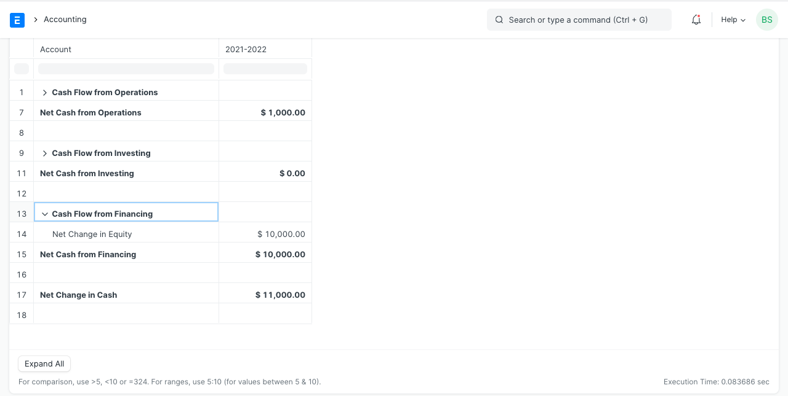

We don't like the report for the following reasons:

  * The reporting format is too scant.
  * The 'Net Cash From Operations' figure is wrong

### Customisation Process

We wants the Cash Flow Report to look something similar to the format in the images below:

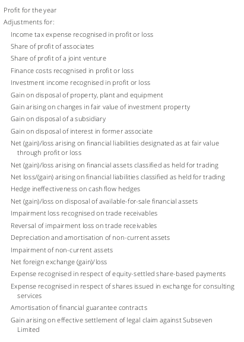

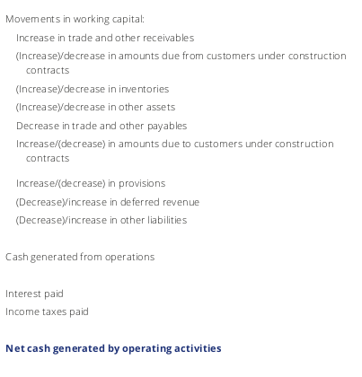

#### Activate Customised Cash Flow Report

Do this in Accounts Settings by checking the 'Use Custom Cash Flow Format' checkbox. This will cause ERPNext to only use your custom format for cash flow reports.

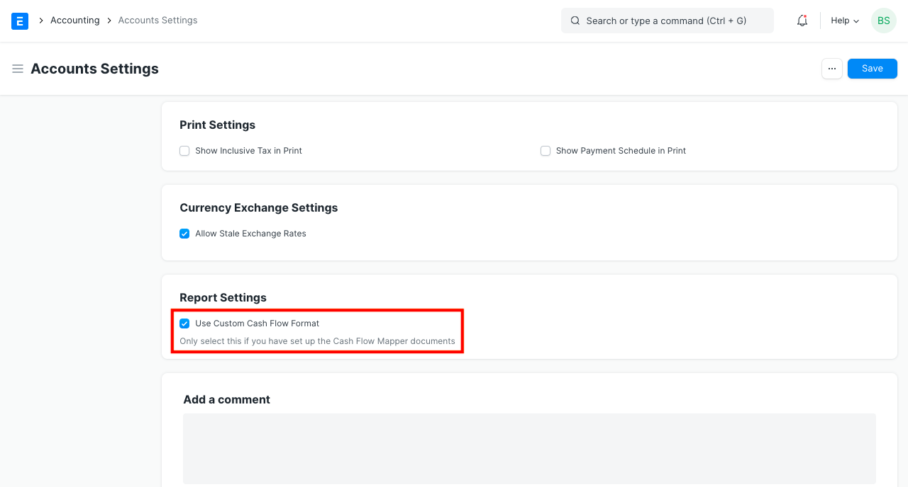

Move to the next section to build the report.

#### Create Cash Flow Mappings

For each line, we need to create a Cash Flow Mapping document to represent it.

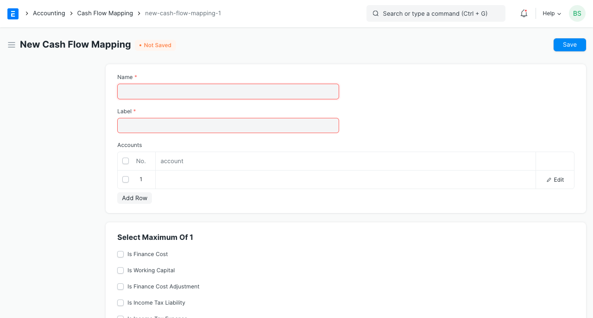

You can think of the Cash Flow Mapping as a representation of each line in the cash flow report. A Cash Flow Mapping is a child of a Cash Flow Mapper which will be explained later.

Let's start by creating Cash Flow Mappings that will represent the add back of non cash expenses already recodgnised in the Profit or Loss statement. We want them to appear on the cash statement as:

  * Income taxes recognised in profit or loss
  * Finance costs recognised in profit or loss
  * Depreciation of non-current assets

Start by opening a new Cash Flow Mapping form.

The fields in the Cash Flow Mapping doctype are:

  * **Name** : This something to identify this document. Name it something related to the label
  * **Label** : This is what will show in the cash flow statement
  * **Accounts** : This table contains all the accounts which this line relates to.

With this information, let's go ahead and create the Cash Flow Mapping Document for the line 'Income taxes recognised in profit or loss'

I have named it 'Income Tax Charge' and given it a label 'Income taxes recognised in profit or loss'. We want this line to reflect income tax charges from our profit or loss statement. The account where this happens in our chart of account is named 'Income Taxes' (an expense) so I have added 'Income Taxes' into the accounts table. If you have more accounts representing income tax expenses, you should add all of them here.

Because Income Tax expense needs to be adjusted further in the cash flow statement, check the 'Is Income Tax Expense' checkbox. This is what will help ERPNext properly calculate the adjustments to be made.

_For best results, let parent accounts have child accounts that have the same treatment for cash flow reporting purposes because ERPNext will calculate net change of all children accounts in a situation where the selected account is a parent account._

In the same way, I have created for the remaining two mappings.

Finance costs also need to be adjusted so make sure to check the 'Is Finance Cost' checkbox.

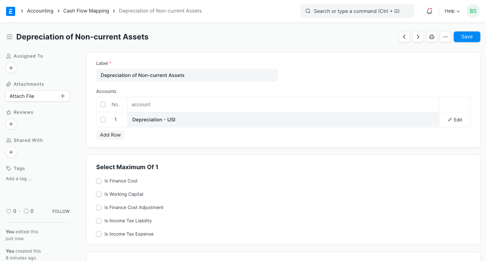

Next let's add Cash Flow Mapping for items that show changes in working capital:

  * Increase/(decrease) in other liabilities
  * (Increase)/decrease in trade and other receivables
  * Increase/(decrease) in trade and other payables
  * VAT payable
  * (Increase)/decrease in inventory

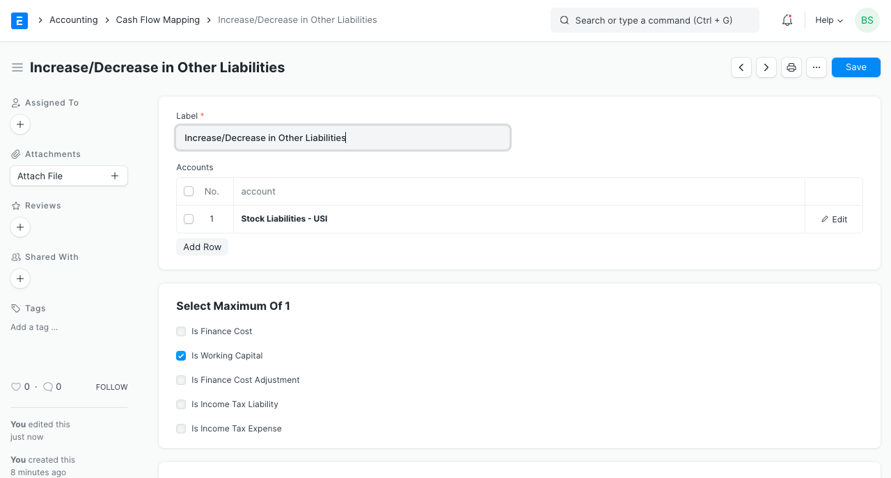

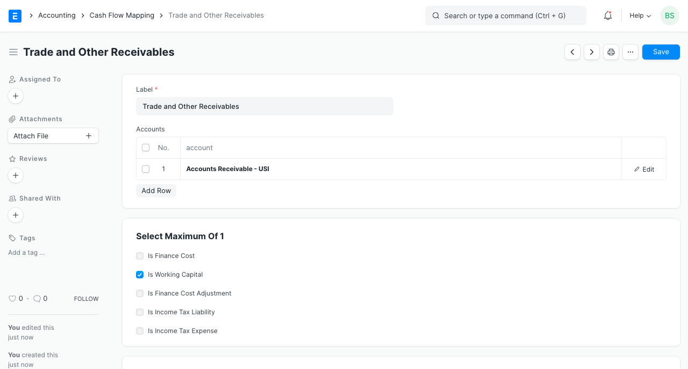

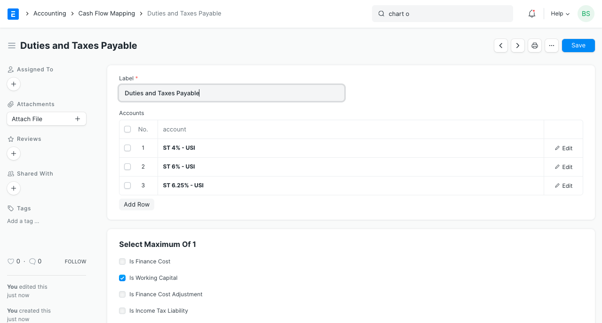

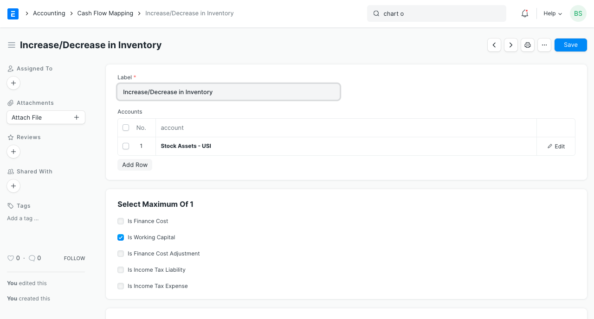

Don't forget to tell ERPNext that these mappings represent changes in working capital by checking the 'Is Working Capital' checkbox.

At this point we have created all the mappings necessary for the Operating Activities section of our cash flow statement. However, ERPNext doesn't know that yet until we create Cash Flow Mapper documents. We'll create Cash Flow Mapper documents next.

#### Create Cash Flow Mappers

Cash Flow Mappers represents the sections of the cash flow statement. A standard cash flow statement has only three sections so when you view the Cash Flow Mapper list, you will that three have been created for you named:

  * Operating Activities
  * Financing Activities
  * Investing Activities

You will not be able to add or remove any of them but they are editable and can be renamed.

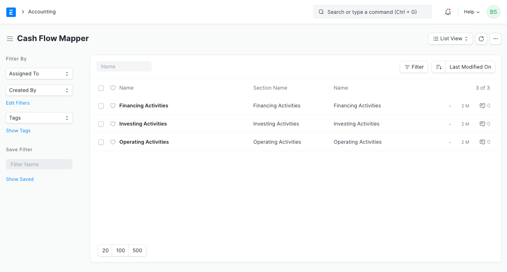

Open the Operating Activities Cash Flow Mapper so we can add the Cash Flow Mappings we have created.

  * **Section Name** : This is the heading of the section.
  * **Section Leader** : This is the first sub-header immediately after the profit figure. Relates only to Operating Activities Cash Flow Mapper
  * **Section Subtotal** : This is the label for subtotal in the cash flow statement section. Relates only to Operating Activities Cash Flow Mapper
  * **Section Footer** : This is the label for the total in the cash flow statement section.
  * **Mapping** : This table contains all the Cash Flow Mappings related to the Cash Flow Mapper.

Now add all the Cash Flow Mappings you have created and Save. You should have something like this:

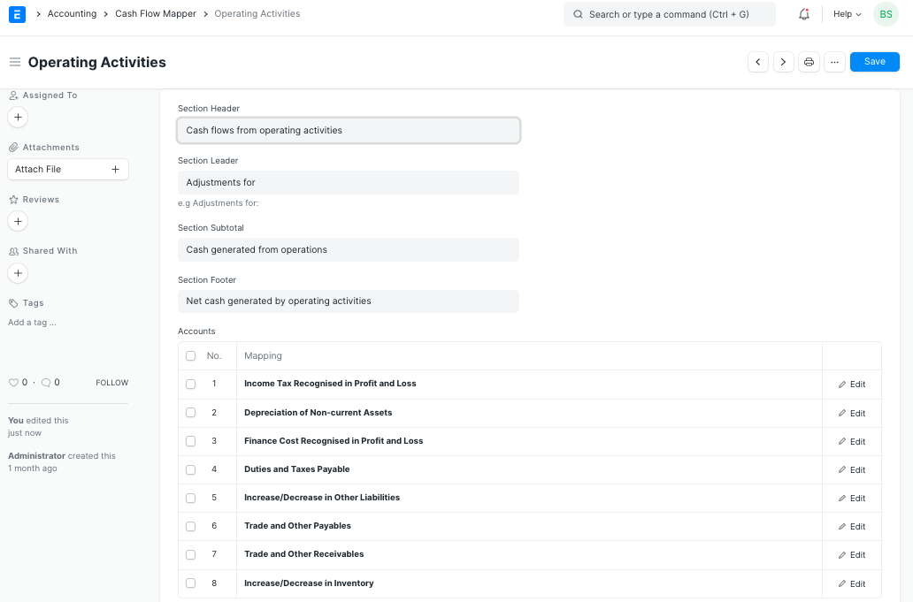

Refresh the cash flow statement and view the changes. 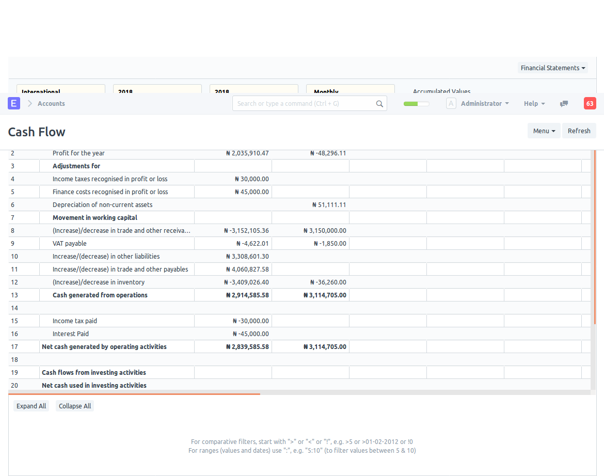

Looks close to our requirements but we are not done yet. Create new mappings for 'Investing Activities' and 'Financing Activities' sections of the cash flow statement.

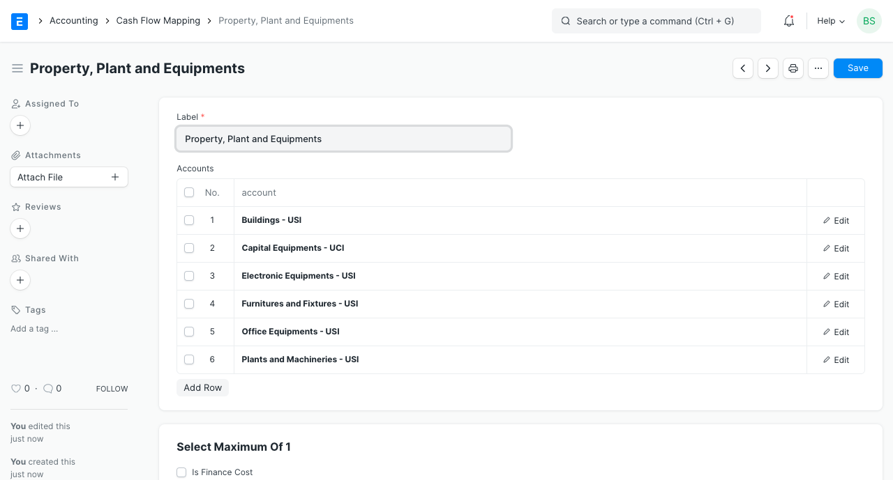

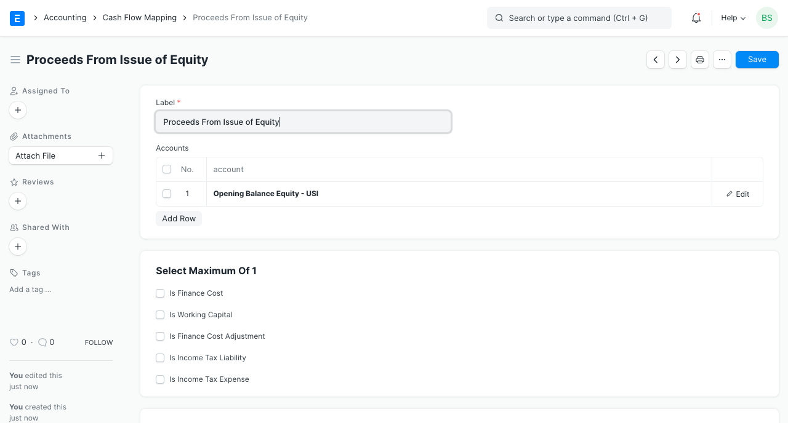

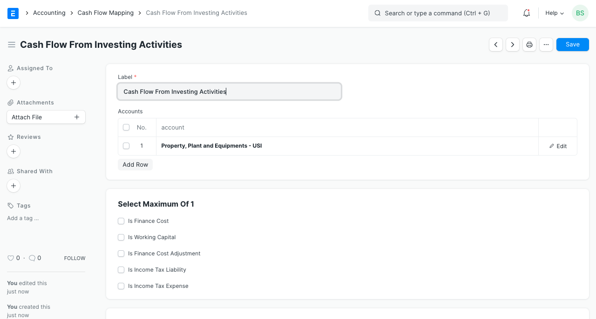

Here's what our cash flow statement now looks like:

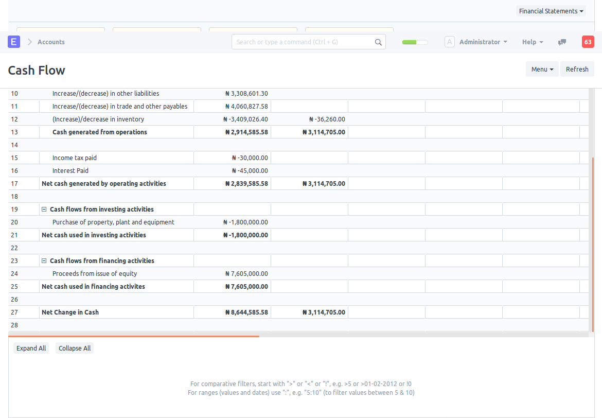

[ Previous Page Invoice rounding issue ](invoice-rounding-issue.md) [ Next Page Difference Entry  ](difference-entry-button.md)

Last updated 1 week ago 

Was this helpful?
