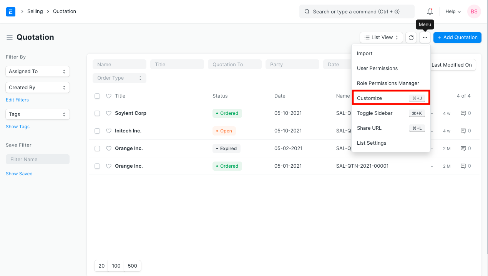
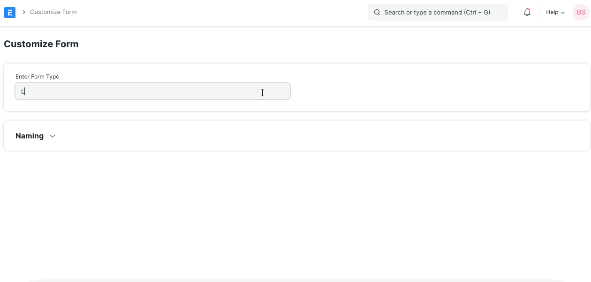
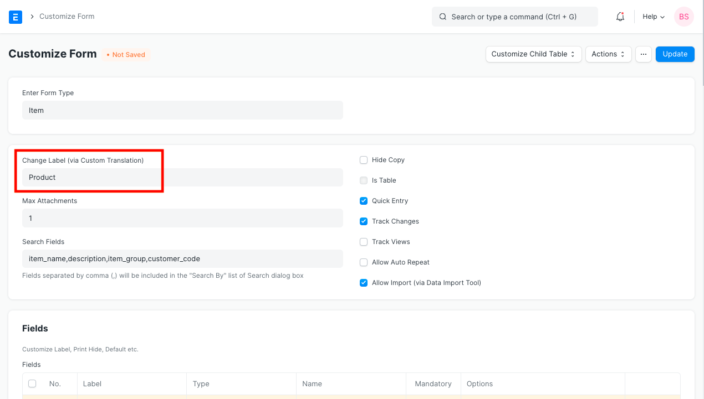
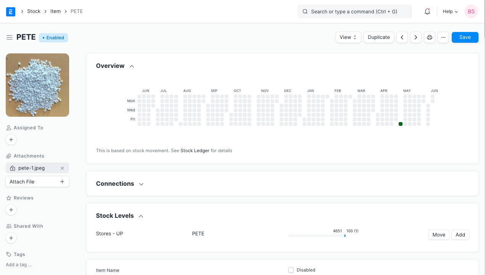
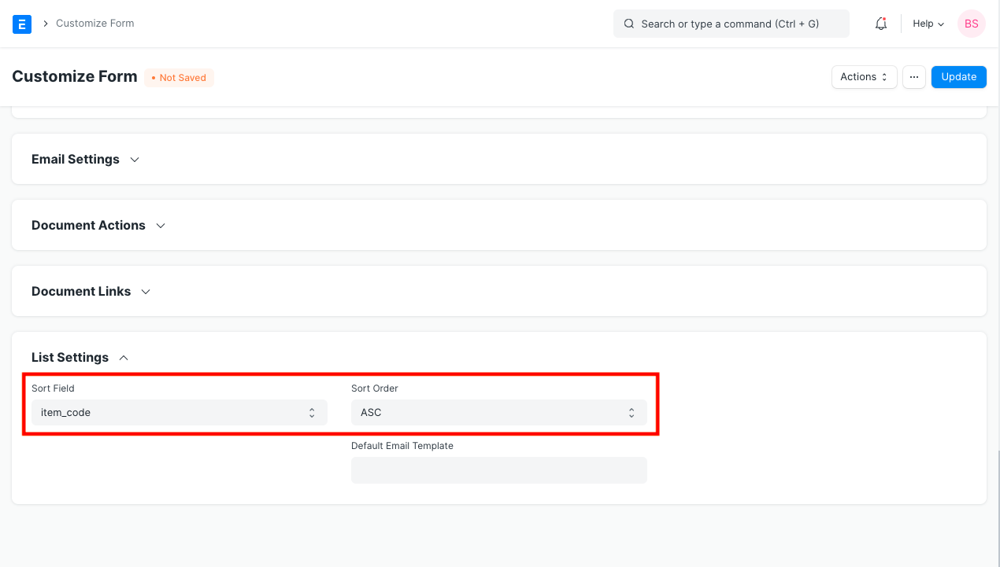
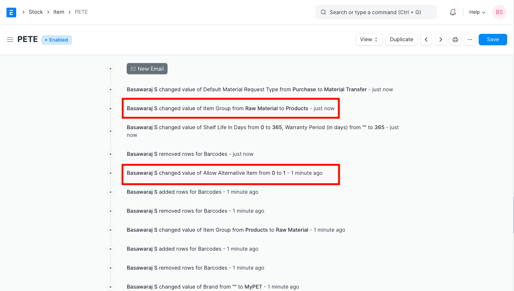
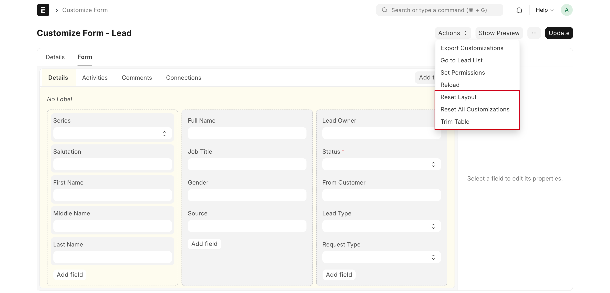

# Customize Form

[ Edit ](https://docs.frappe.io/wiki/spaces/24hrpr6es9/page/0t72qd9dmp)

Open in ChatGPT  Ask ChatGPT about this page Open in Claude  Ask Claude about this page

# Customize Form

[ Edit ](https://docs.frappe.io/wiki/spaces/24hrpr6es9/page/0t72qd9dmp)

Open in ChatGPT  Ask ChatGPT about this page Open in Claude  Ask Claude about this page

**Customize Form is a tool which enables you to make changes to a Form Type or a Document Type (DocType) on the front-end.**

It allows you to insert [Custom Fields](custom-field.md) as per your requirement or customize the properties of standard fields.

Before we venture to learn the Form Customization tool, [click here](doctype.md) to understand the architecture of forms in ERPNext. It will help you in using the Customize Form tool more efficiently.

To access Customize Form, go to:

> Home > Customization > Form Customization > Customize Form

You can also go to the list view of any DocType and select Customize from the Menu options.

  1. How to Customize a Form

* * *

  1. Click on Customize Form.
  2. You will be redirected to a page wherein you will be asked to Enter Form Type.
  3. Once you enter the Form Type in this field, the page further expands and you will be able to see multiple features.

### 1.1. Options While Customizing a Form

  1. **Change Label** : This field gets fetched via Custom Translation. You can change the name of the field to suit your industry/language. E.g., if you are a services business and you want to change the Label from 'Customer' to 'Consumer', the same can be done via [Custom Translation](custom-translations.md) and the same shall be reflected here.

  2. **Title Field** : This field can be used to generate the title while viewing the lists. Any "Data" type field can be set as the Title Field while viewing the forms in the list view. E.g., if you wish to view the list of all your employees with the Title field as the 'Employee Code' instead of Employee Name, the same can be configured here. Check our article on [Document title](document-title.md) for more information.

_Learn more about field types_ [_here_](field-types.md) _._

  3. **Default Print Format** : For a single DocType, there could be multiple Print Formats. Here you can select the default Print Format for the selected DocType. For e.g., a company may have different Letter Heads for different purposes which can be configured through Print Formats. However, you can select two different Default Print Formats for a Sales Order and an Appointment Letter. Check [Custom Print Formats](print-format.md) for more information.

  4. **Image Field** : You can select an "Attach Image" Field for your Image Field. This becomes the Image representing that particular DocType. E.g., the 'Image Field' for an Employee could be their photograph or a snapshot of their ID cards; the same can be configured here.

  5. **Max Attachments** : You can enter the maximum number of attachments that could be added to this DocType.

  6. **Search Fields** : While creating any DocType, you may want to link a particular field to another DocType. For ease in selection, you can also ensure that you are able to see the value of another field of the latter DocType in the search result. For more information [click here](search-record-by-specific-field.md).

  7. **Sort Field** : Records in any DocType List are generated based on the Field that you set at the Sort Field over here. E.g., for Items, if you want your list to be generated as per Item Name, you can configure the same here.

  8. **Sort Order** : You can select whether you want the Sorting to be done in Ascending Order or Descending Order. To get more understanding on Sort Field and Sort Order, check out [Customizing Sorting Order in the List View](customizing-sorting-order-in-the-list-view.md).

  9. **Default Email Template** : For a single DocType, there could be multiple [Email Templates](email-template.md). Here you can set the default Email Template for the selected DocType. For example, you can set a different Default Email Template for a Sales Order and an Appointment Letter.

### 1.2. More Properties

  * **Hide Copy** : This box, when checked, restricts a User to create a 'Copy' of a particular Form.

  * **Is Table** : This option is available only while customizing the Forms which are present in table forms in the system. For e.g., if you are creating an Item Table to be added into a Custom Form, you can enable this option. Check out [Child Table](customizing-data-visibility-in-child-table.md) for more information.

  * **Quick Entry** : Checking this box will allow you to create a 'Quick Entry' using a particular form. This means that whenever a user is creating this Form from another existing Form, a box will Pop Up which will allow the user to create the DocType by entering only the basic details. For example, check Quick Entry in [Journal Entry](journal-entry.md).

  * **Track Changes** : Checking this box will ensure that any changes made by any of the users to this DocType will be tracked and displayed.

  * **Track Views** : This option will give you a trail of all the views towards this particular DocType.

  * **Allow Auto-Repeat** : This option, if checked, will allow you to enable Auto Repetition of a DocType periodically. E.g., if there is a Sales Order which has to be made multiple number of times, you can enable this option and then [Set Up Auto Repeat](auto-repeat.md) for any particular Sales Order.

  * **Allow Import** : This option will allow the user to Import data from any files. Check out [Data Import Tool](data-import.md) for more information.

  * **Show Preview Popup** : This option was introduced in Version 12. If checked, a small popup will appear on hover of links of this document type (in list view and other link fields). This popup will contain the mandatory fields of the document and the fields for which `in_preview` is checked. Check out [Link Preview](https://erpnext.com/version-12/release-notes/features) for more information.

Once you click Update, your Customizations will be updated to the Form.

### 1.3. Customizing the Fields

Every form in ERPNext has a standard set of fields. If you need to capture some information, but there is no standard field available for it, you can insert Custom Field in a form as per your requirement. Adding, editing or deleting of Fields can also be done here. You can also place the fields as per your requirement in the form by adding it below or above any other already present fields. [Click here](custom-field.md) for more information on Custom Fields.

### 1.4. Trim Table, Reset Layout, and Reset All Customizations

  * **Trim Table** : To remove unused database columns (fields) that are no longer needed by a doctype. It checks for fields that have been deleted from the form but still exist in the database. If such fields are found, it allows you to permanently delete these columns. This helps keep the database clean and improves performance by removing unnecessary data.
  * **Reset Layout:** To revert the form layout to its original, default state. It removes any layout customizations you have made, such as rearranging fields or changing sections, and restores the layout to how it was initially defined by the system. It is useful if your custom layout becomes too complicated or problematic, and you want to start fresh with the standard layout.
  * **Reset All Customizations** : To remove all customizations made to a form, including added fields, changes to existing fields, and layout modifications. It completely removes all the custom changes you have applied to the form, resetting it to its default configuration as defined by the system. This is a drastic measure but helpful if you need to return to the system’s default form setup, perhaps because your customizations have caused issues or you want to reconfigure the form from scratch.

  2. Videos

* * *

[ Previous Page Custom Field ](custom-field.md) [ Next Page Document Title  ](document-title.md)

Last updated 2 weeks ago 

Was this helpful?
