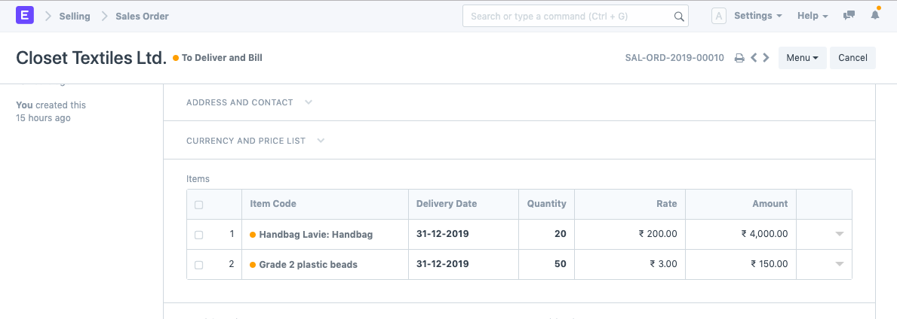
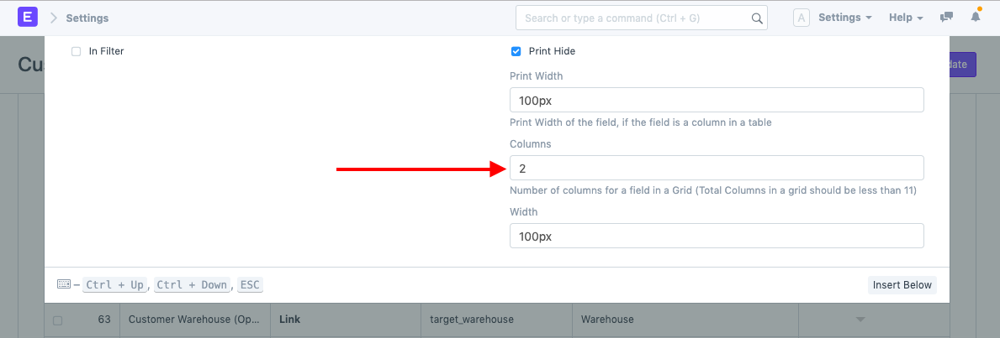
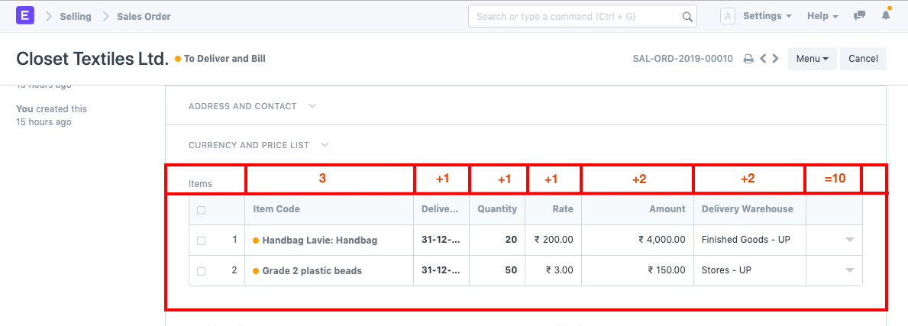
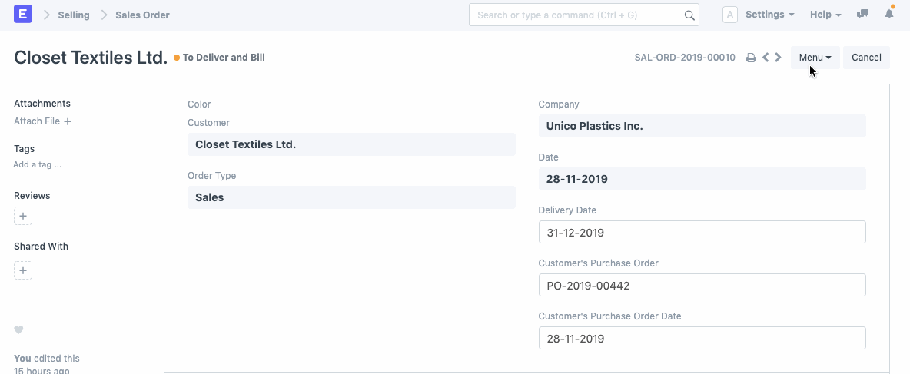
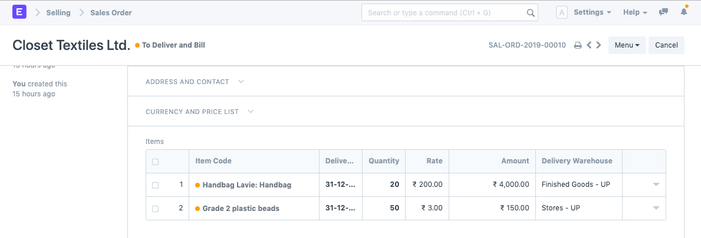
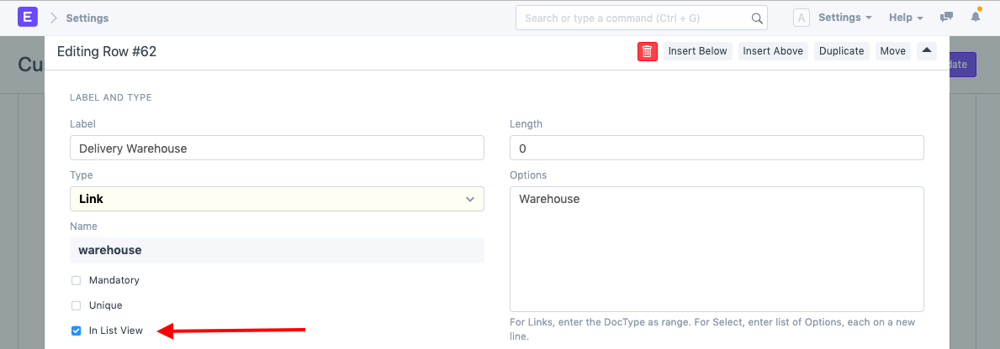

# Data Visibility in Child Tables

[ Edit ](https://docs.frappe.io/wiki/spaces/24hrpr6es9/page/0t8co76lf9)

Open in ChatGPT  Ask ChatGPT about this page Open in Claude  Ask Claude about this page

# Data Visibility in Child Tables

[ Edit ](https://docs.frappe.io/wiki/spaces/24hrpr6es9/page/0t8co76lf9)

Open in ChatGPT  Ask ChatGPT about this page Open in Claude  Ask Claude about this page

In ERPNext, there is a feature called the editable grid. This allows the user to add values in the child table without opening a dialog box/form for each row.

This is how the Quotation Item table renders value when the Editable Grid is enabled. It will have a maximum of four columns in the table.

As per the default setting, only four columns are listed in the child table. Following is how you can add more columns in the Editable Grid itself.

For the field to be added as a column in the table, enter a value in the Column field. Also, ensure that the "Is List View" property is checked for that field.

Based on the value in the Column field, columns will be added to the child table. Ensure that the total value added in the Column field doesn't exceed 10. Based on the Column value, the width for that column will be set.

**Switch to Un-editable Grid**

To have more values shown in the preview of the Quotation Item table, you can disable Editable Grid for the Quotation Item DocType. Steps below.

Once Editable Grid is disabled for the Quotation Item, the values will be rendered in a preview of the Quotation Item table in the following way:

To have a specific field's value shown in the preview, ensure that for that field, in the Customize Form tool, "In List View" property is checked.

[ Previous Page Fetching data from a linked master ](how-to-add-master-link-and-fetch-data-from-the-same.md) [ Next Page Sorting Order in List View ](customizing-sorting-order-in-the-list-view.md)

Last updated 1 week ago 

Was this helpful?
