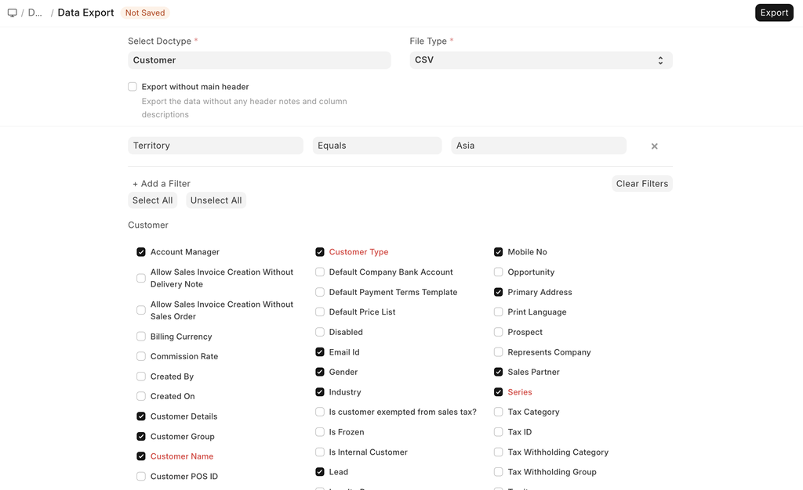

# Data Export

[ Edit ](https://docs.frappe.io/wiki/spaces/24hrpr6es9/page/0rdj89ubme)

Open in ChatGPT  Ask ChatGPT about this page Open in Claude  Ask Claude about this page

# Data Export

[ Edit ](https://docs.frappe.io/wiki/spaces/24hrpr6es9/page/0rdj89ubme)

Open in ChatGPT  Ask ChatGPT about this page Open in Claude  Ask Claude about this page

**'Data Export' helps you extract data from any DocTypes to a CSV or an Excel format.**

To access Data Export, go here.

> Home > Data Export

### How to Use Data Export

  1. Go to the 'Data Export' DocType.
  2. Select the DocType from which the data is to be extracted.
  3. Select the file format whether CSV or Excel.
  4. Tick the checkbox if you want to export the data without any header notes and column descriptions.
  5. Select the fields to export; the red ones are mandatory.
  6. You can also add filters to select only specific data. For example, 'Territory = Asia' will export all Customers whose Territory is set as 'Asia'.
  7. Click on Export to download the file.

After exporting data, you can use the same file to import data using [Data Import](data-import.md).

[ Previous Page Chart Of Accounts Importer  ](chart-of-accounts-importer.md) [ Next Page Downloading Backups ](download-backup.md)

Last updated 1 week ago 

Was this helpful?
