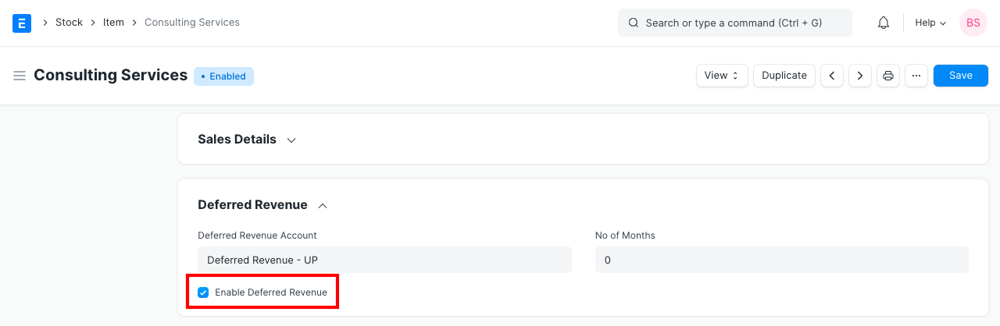
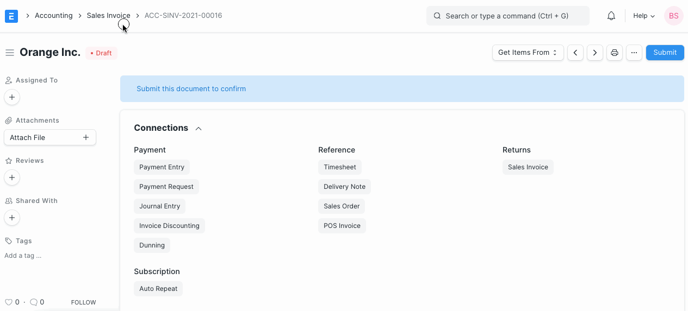
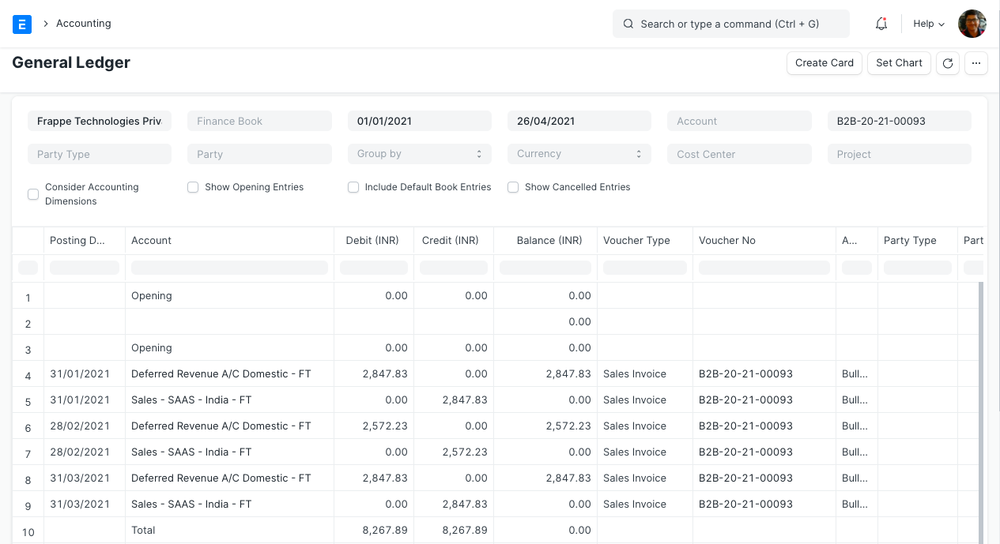

# Deferred Revenue

[ Edit ](https://docs.frappe.io/wiki/spaces/24hrpr6es9/page/0rovdcl293)

Open in ChatGPT  Ask ChatGPT about this page Open in Claude  Ask Claude about this page

# Deferred Revenue 

[ Edit ](https://docs.frappe.io/wiki/spaces/24hrpr6es9/page/0rovdcl293)

Open in ChatGPT  Ask ChatGPT about this page Open in Claude  Ask Claude about this page

**Deferred revenue refers to advance payments a Company receives for products or services that are to be delivered or performed in the future.**

It is also known as unearned revenue.

The company that receives the prepayment records the amount as Deferred Revenue on their balance sheet as a liability. Deferred revenue is a liability because it refers to revenue that has not been earned and represents products or services that are owed to a Customer. As the product or service is delivered over time, it is recognized as revenue on the income statement.

## 1\. Configuring Deferred Accounting

> Introduced in Version 13

Before you start using deferred accounting you should be aware of the below settings which will give you more control over how you manage your deferred accounting

  1. **Automatically Process Deferred Accounting Entry:** This setting is enabled by default. In case you don't want the deferred accounting entries to be posted automatically you can disable this setting. If this setting is disabled deferred accounting will have to be processed manually using [Process Deferred Accounting](process-deferred-accounting.md)
  2. **Book Deferred Entries Based On:** Deferred revenue amount can be booked based on two criteria. The default option here is "Days". If "Days" is selected, the deferred revenue amount will be booked based on the number of days in each month and if "Months" is selected, then it will be booked based on number of months. **For Eg:** If "Days" is selected and $12000 revenue has to be deferred over a period of 12 months, then $986.30 will be for the month having 30 days and $1019.17 will be booked for the month having 31 days. If "Months" is selected, $1000 deferred revenue will booked each month irrespective of the number of days in a month.
  3. **Book Deferred Entries Via Journal Entry:** By default Ledger Entries are posted directly to book deferred revenue against an invoice. In order to book this deferred amount posting via Journal Entry, this option can be enabled.
  4. **Submit Journal Entries:** This option is applicable only if deferred accounting entries are posted via Journal Entry. By default, the Journal Entries for deferred posting are kept in Draft state and a user has to verify those entries and submit them manually. If this option is enabled, Journal Entries will be automatically submitted without any user intervention.

## 2\. How to use Deferred Revenue

Internet and broadcasting service providers offer subscription plans on quarterly or yearly basis. They take complete payment in advance from the Customer for couple of months, but book income on monthly basis in their book of accounts. This is Deferred Revenue for the Supplier and [Deferred Expense](deferred-expense.md) for the Customer. Following is how they should configure Deferred Revenue accounting in ERPNext to automate the process.

### 2.1 Item

In the Item master created for the subscription plan, under Deferred Revenue section, check field **Enable Deferred Revenue**. You can also select a Deferred Revenue account for this particular item and number of months.

### 2.2 Sales Invoice

On creation of Sales Invoice for the Deferred Revenue Item, instead of posting in the Income Account, Deferred Revenue account is Credited by the sale amount. If you had set the account and period in Item, then the account and service start, end dates will be fetched automatically.

### 2.3 Journal Entry

Based on the From Date and To Date set in the Sales Invoice Item table, Journal Entries are created automatically at the end of each month. It debits the value from Deferred Revenue account and credits Income Account selected for an Item in the Sales Invoice.

Following is an example of Income for the Deferred Revenue Item booked via multiple Journal Entries.

## 3\. Video

### 4\. Related Topics

  1. [Sales Invoice](sales-invoice.md)
  2. [Journal Entry](journal-entry.md)
  3. [Chart Of Accounts](chart-of-accounts.md)

[ Previous Page Inter Company Journal Entry  ](inter-company-journal-entry.md) [ Next Page Deferred Expense  ](deferred-expense.md)

Last updated 2 weeks ago 

Was this helpful?
