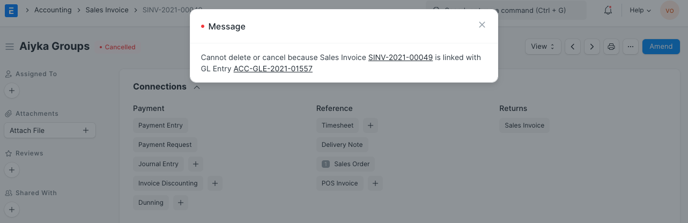
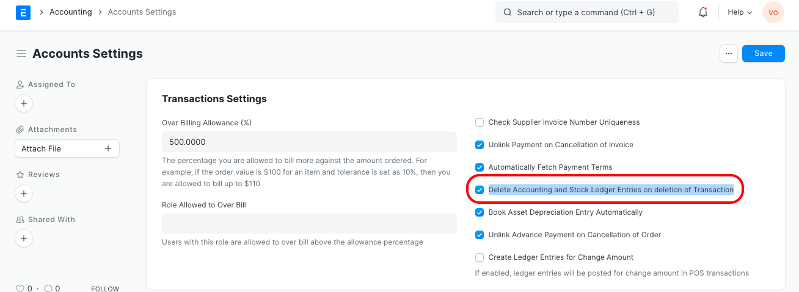

# Delete entries linked with GL entries

[ Edit ](https://docs.frappe.io/wiki/spaces/24hrpr6es9/page/0skn5j1kvg)

Open in ChatGPT  Ask ChatGPT about this page Open in Claude  Ask Claude about this page

# Delete entries linked with GL entries

[ Edit ](https://docs.frappe.io/wiki/spaces/24hrpr6es9/page/0skn5j1kvg)

Open in ChatGPT  Ask ChatGPT about this page Open in Claude  Ask Claude about this page

While deleting the transactional entries like Purchase Receipt, Purchase Invoice, Sales Invoice, Delivery note and Stock ledger entries the following message pops up:

To delete all the transactional entries, follow the steps given below:

  1. Go to Accounts Settings
  2. Enable a checkbox Delete Accounting and Stock Ledger Entries on the deletion of Transaction
  3. Save and Refresh

[ Previous Page Round off Account Validation Message ](round-off-account-validation.md) [ Next Page Invoice rounding issue ](invoice-rounding-issue.md)

Last updated 1 week ago 

Was this helpful?
