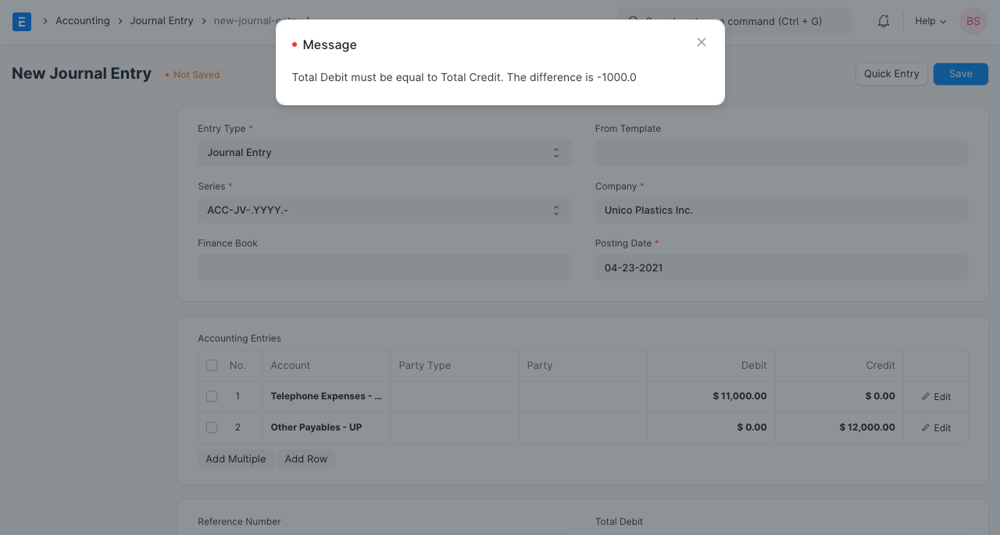
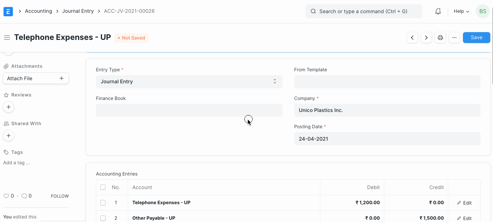

# Difference Entry

[ Edit ](https://docs.frappe.io/wiki/spaces/24hrpr6es9/page/0sn96m0ves)

Open in ChatGPT  Ask ChatGPT about this page Open in Claude  Ask Claude about this page

# Difference Entry 

[ Edit ](https://docs.frappe.io/wiki/spaces/24hrpr6es9/page/0sn96m0ves)

Open in ChatGPT  Ask ChatGPT about this page Open in Claude  Ask Claude about this page

As per accounting standards, debit in a accounting entry must be equal to credit. If not, system does allow submission of accounting transaction, thereby stops ledger posting. In ERPNext, on saving accounting entry, system validates if debit and credit is tallying.

To have entry balanced, you should one more row, select another account, and update different amount in it. Or you can add difference amount in one of the Account's row itself.

On clicking 'Make Difference Entry' button, new Row will be added under Journal Entry Accounts table, with difference amount. You can edit that row to select appropriate Account.

On selecting account under new row, debit and credit an entry will be tallying, and you should be able to submit Journal Entri correctly.

[ Previous Page Customise Cash Flow Report ](customise-cash-flow-report.md) [ Next Page Post Dated Cheque Entry ](post-dated-cheque-entry.md)

Last updated 1 week ago 

Was this helpful?
