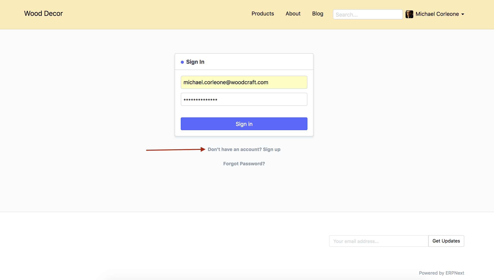
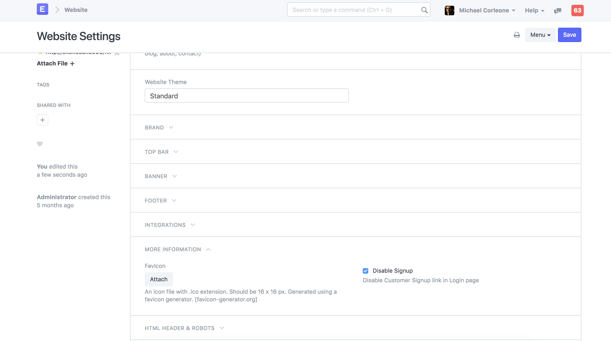

# Disable Signup on ERPNext Website

[ Edit ](https://docs.frappe.io/wiki/spaces/24hrpr6es9/page/0secjol4c0)

Open in ChatGPT  Ask ChatGPT about this page Open in Claude  Ask Claude about this page

# Disable Signup on ERPNext Website 

[ Edit ](https://docs.frappe.io/wiki/spaces/24hrpr6es9/page/0secjol4c0)

Open in ChatGPT  Ask ChatGPT about this page Open in Claude  Ask Claude about this page

ERPNext has portal feature available which allows third parties like Customers and Suppliers sign, place new orders and track updates on the previous orders.

To allow new Customer and Supplier to Signup, the login page of your ERPNext account has Signup link avaiable. However, if you wish to disbale this feature, you can achieve it by following the steps given below.

### Steps

  1. Go To

> Website > Setup > Website Settings `

  2. In the Website Settings page, scroll down upto `More Information` section.

  3. Check fied `Disable Signup`.

  4. Save Website Settings.

[ Previous Page Portal Login ](https://docs.frappe.io/erpnext/portal-login) [ Next Page Website Home Page ](website-home-page.md)

Last updated 2 weeks ago 

Was this helpful?
