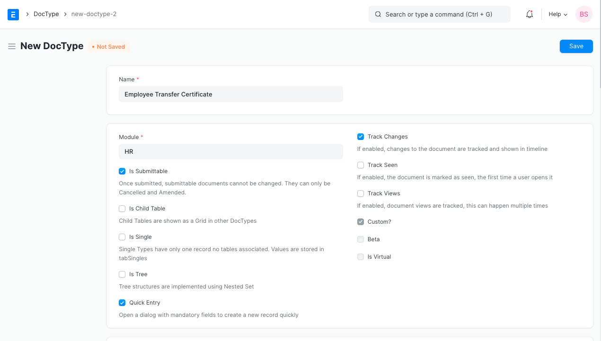
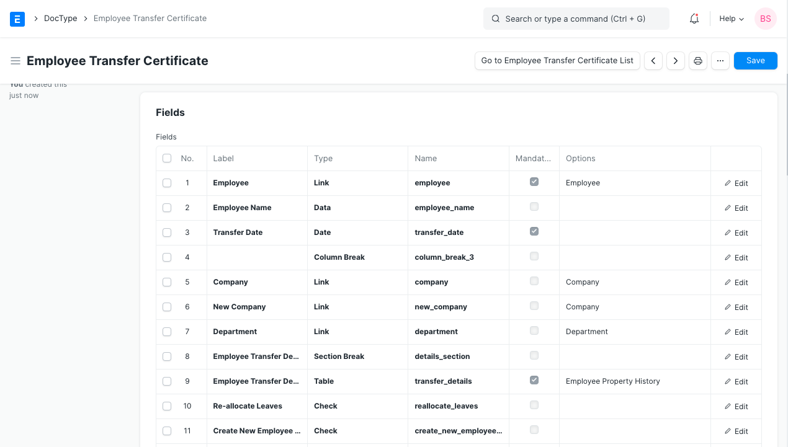
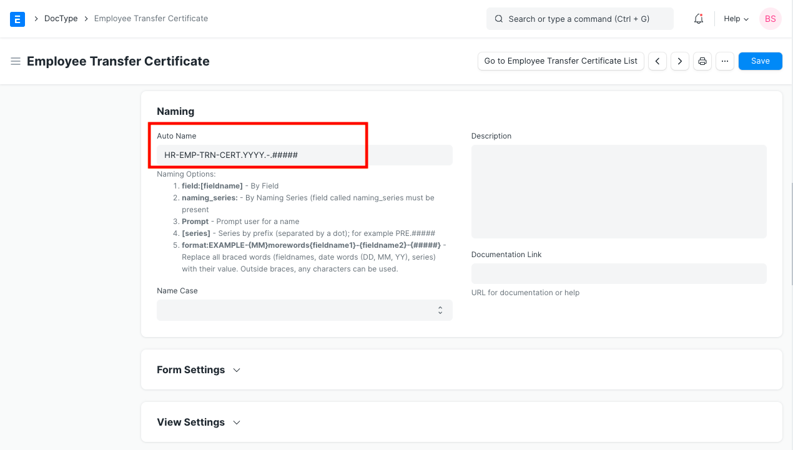
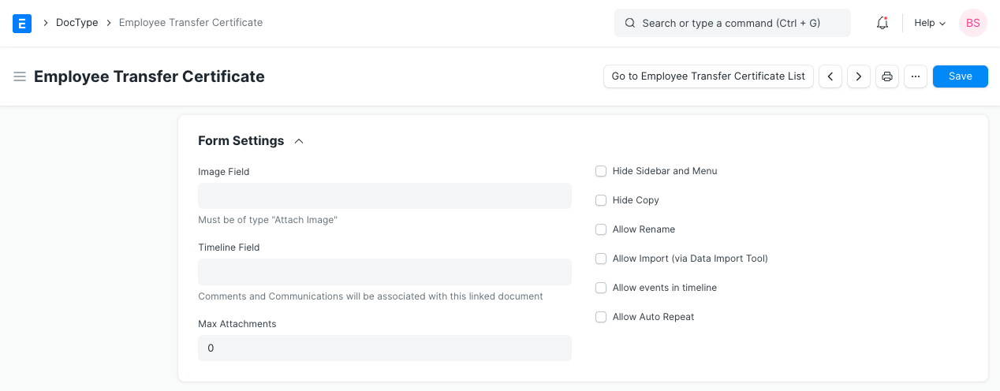
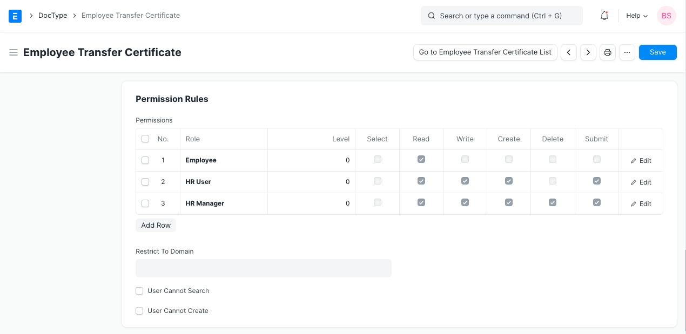
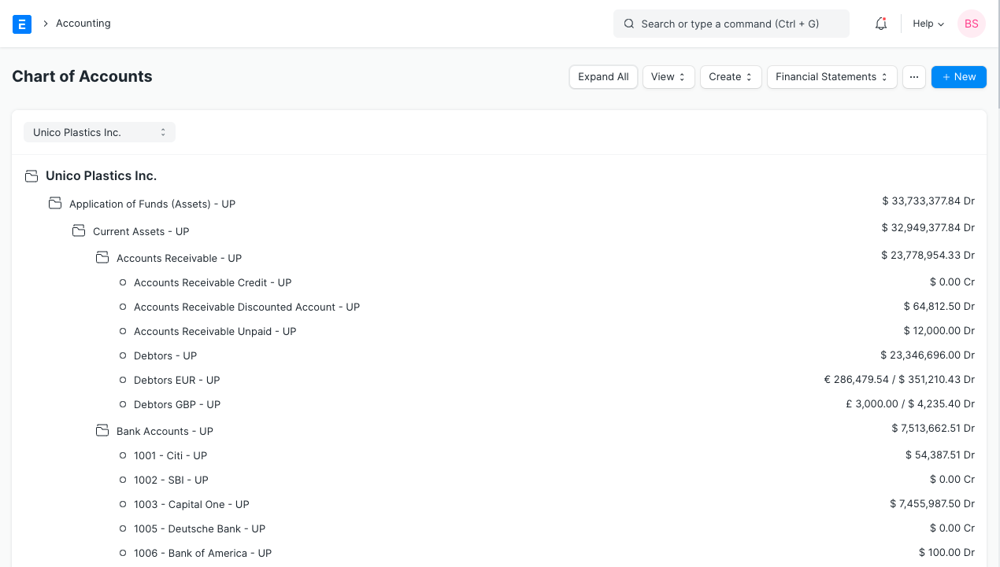
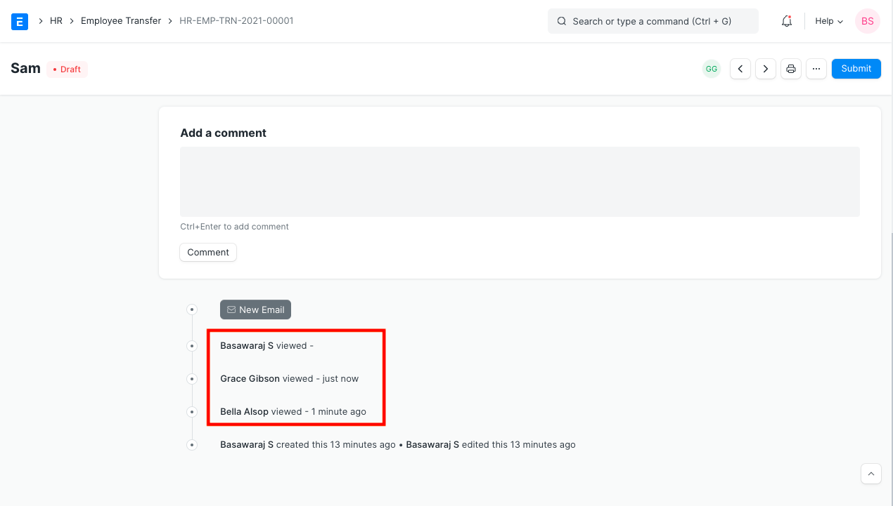

# DocType

[ Edit ](https://docs.frappe.io/wiki/spaces/24hrpr6es9/page/0t7foadl14)

Open in ChatGPT  Ask ChatGPT about this page Open in Claude  Ask Claude about this page

# DocType 

[ Edit ](https://docs.frappe.io/wiki/spaces/24hrpr6es9/page/0t7foadl14)

Open in ChatGPT  Ask ChatGPT about this page Open in Claude  Ask Claude about this page

**A DocType is the core building block of any application based on the Frappe Framework.**

It describes the Model and the View of your data. It contains what fields are stored for your data, and how they behave with each other. It contains information about how your data is named. The forms like Sales Order, Sales Invoices, Work Order are added as DocTypes in the backend.

DocType allows you to insert custom forms in ERPNext as per your requirement.

To create a new DocType, go to:

> Setup > Customize > Doctype > New

## 1\. How to create a New DocType:

  1. **Name** : Enter the name of the new DocType.
  2. **Module** : Enter which module would you like the new DocType to be added to.
  3. Save.

### 1.1. Additional Details

  1. **Fields**

You can choose to add as many fields as you want. The Label, Field Type, Mandatory Fields and other associated Options can also be added here. Learn more about field types [here](field-types.md).

  1. **Naming**

Here you can choose if you would want each of your forms within this DocType to be named automatically. As given in the description, you can select the pattern for naming of the forms. The same can be a Field within the DocType, Naming Series, Prompt, A defined Naming Series, or a Format based Name. For Naming, you can also add a Description and the Name Case (as a Title Case or UPPER CASE)for your convenience.

  1. **Form Settings**

Additional Settings for the Form, Image Fields, Attachments, Timeline etc. can be configured here. To know more about Form, visit [Customize Form](customize-form.md).

  1. **View Settings**

Here, you can define the View settings for the DocType, like, Search Fields, Default Sort Field, Default Sort Order etc.

  1. **Permission Rules**

You can define the Permission Rules for the DocType here, and configure which users would be able to use or make changes to this DocType. Learn more about [Users and Permissions](users-and-permissions.md) here.

  1. **Web View**

You can select whether you would want a Web View of this DocType or no. Having a Web View for a DocType will allow your website users to have access to the Forms. Feel free to learn more about [Website Users](difference-between-system-user-and-website-user.md).

### 1.2. More Properties

  1. **Is Submittable** : You can select if you want this DocType to only be 'Saved' or to also be 'Submitted' by checking and un-checking this box.
  2. **Is Child Table** : You can define if you want the New DocType to be a Child Table within another DocType. Checkout [Child Table](customizing-data-visibility-in-child-table.md) for more information.
  3. **Is Single** : If checked, this Doctype will become a single form, like Sales Order, which user will not be able to re-produce. For e.g., Selling Settings in Sales Module is a Single DocType.
  4. **Is Tree** : A few DocTypes in ERPNext are structured as Trees, wherein there are some Parent DocTypes and some Children DocTypes. E.g., Doctype Company is structured as Tree, there are Parent Companies as well as Child Companies, which we call subsidiaries. If you want your DocTypes to be structured similarly, you can enable this option.

  1. **Quick Entry** : You can select if you want a Quick Entry to be made for this DocType. This will allow you to enter only a few mandatory details and save the DocType, so that a Quick Entry is made. For example, check Quick Entry in [Journal Entry](journal-entry.md).
  2. **Track Changes** : You can select this option if you want to maintain a log of the changes made to each Form. Check Out [Document Versioning](document-versioning.md) for more understanding on this.
  3. **Track Seen** : You can select this option if you want to maintain a log of all the Users who have seen this Form.
  4. **Track Views** : You can select this option if you want to maintain a log of all the times each User has Viewed this Form.

  1. **Custom?** : This field will be checked by default when adding Custom Doctype. Similarly, if you are customizing a DocType which already exists in the system, this field by default would be unchecked.

## 2\. Videos

[ Previous Page Automating Issue Assignments in ERPNext ](automating-issue-assignments-to-support-team-in-erpnext.md) [ Next Page Naming Series  ](naming-series.md)

Last updated 1 week ago 

Was this helpful?
