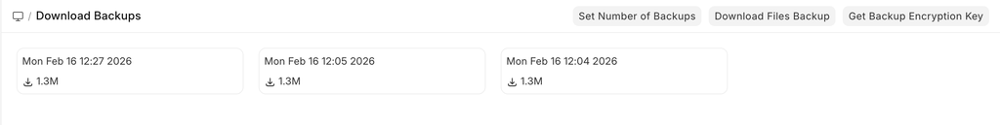
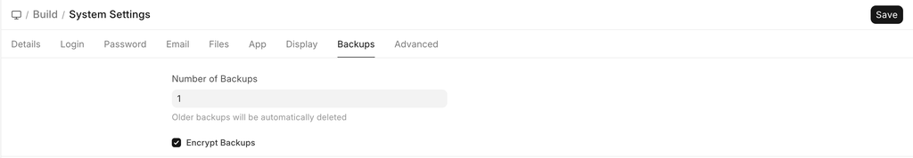
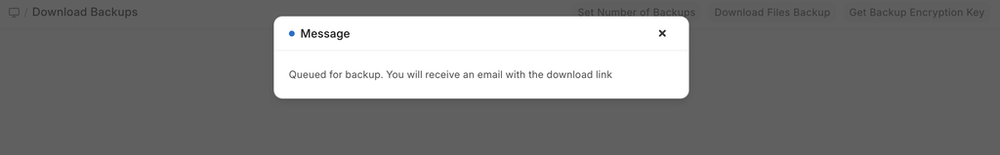
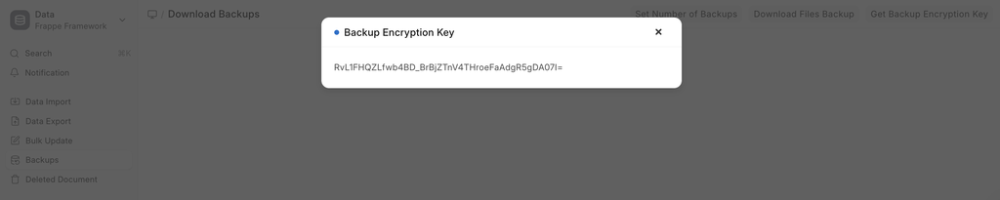

# Downloading Backups

[ Edit ](https://docs.frappe.io/wiki/spaces/24hrpr6es9/page/0rdp09rt08)

Open in ChatGPT  Ask ChatGPT about this page Open in Claude  Ask Claude about this page

# Downloading Backups

[ Edit ](https://docs.frappe.io/wiki/spaces/24hrpr6es9/page/0rdp09rt08)

Open in ChatGPT  Ask ChatGPT about this page Open in Claude  Ask Claude about this page

In ERPNext, you can manually download a database backup.

To get the latest database backup, go to:

> Home > Download Backups

Backup available for the download is updated every eight hours. Click on the link to download the backup at a given time.

If you want to set the number of Backups available for download at a time, then click on 'Set Number of Backups', which will navigate you to 'System Settings', where you can set the number.

 _Download backup post backup taken_

## Downloading Files Backup

Clicking on Download Files Backup will send an email with links to the backup for both private and public files. Email must be configured for this to work.

## Getting Backup Encryption Key

In order to get the backup encryption key, click on the designated button. Upon getting your system password validated, the system will provide you with the encryption key.

## Automating Backups to Cloud Storage

You can also automate your backups to be uploaded directly to a cloud storage platform. Currently, ERPNext supports:

  1. Amazon S3
  2. Dropbox
  3. Google Drive

[ Previous Page Data Export ](data-export.md) [ Next Page Bulk Update  ](bulk-update.md)

Last updated 2 weeks ago 

Was this helpful?
