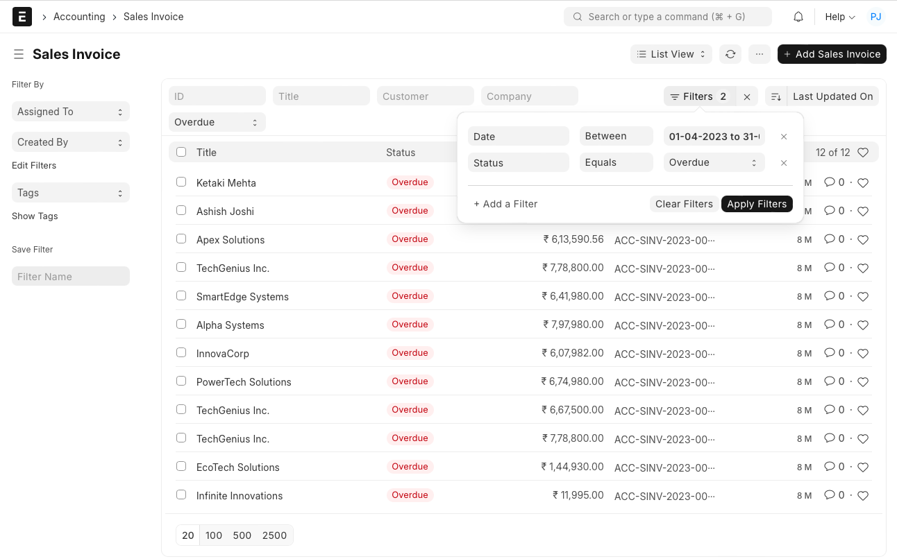
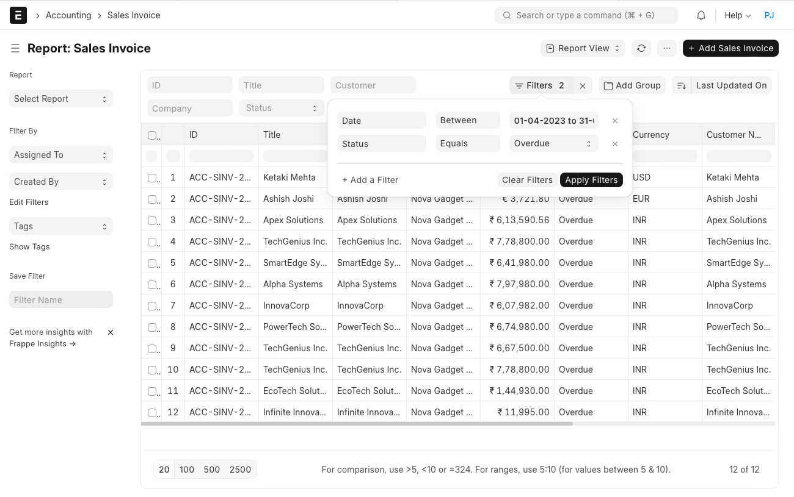

# Export Data for Specific Year or Filter

[ Edit ](https://docs.frappe.io/wiki/spaces/24hrpr6es9/page/0slfmgqq4u)

Open in ChatGPT  Ask ChatGPT about this page Open in Claude  Ask Claude about this page

# Export Data for Specific Year or Filter

[ Edit ](https://docs.frappe.io/wiki/spaces/24hrpr6es9/page/0slfmgqq4u)

Open in ChatGPT  Ask ChatGPT about this page Open in Claude  Ask Claude about this page

**Question:** I need to export Sales Invoices for Particular Fiscal Year only.

**Answer:**

The system allows you to use any combination of filters including a Date Range to extract the data wither from the List view or from the Report View.

**List View**

**Report View**

[ Previous Page Personal Data Deletion  ](https://docs.frappe.io/erpnext/personal-data-deletion) [ Next Page Adding Users ](adding-users.md)

Last updated 1 week ago 

Was this helpful?
