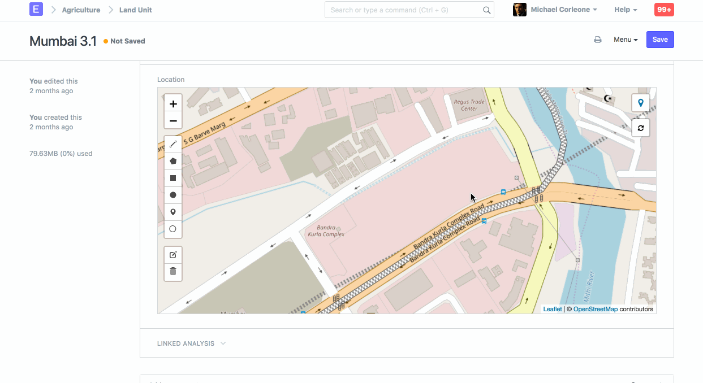

# Geolocation Field

[ Edit ](https://docs.frappe.io/wiki/spaces/24hrpr6es9/page/0t7vlq0ddj)

Open in ChatGPT  Ask ChatGPT about this page Open in Claude  Ask Claude about this page

# Geolocation Field

[ Edit ](https://docs.frappe.io/wiki/spaces/24hrpr6es9/page/0t7vlq0ddj)

Open in ChatGPT  Ask ChatGPT about this page Open in Claude  Ask Claude about this page

**The "Geolocation" field is used to capture and store geographical coordinates, such as latitude and longitude.**

This can be useful for various purposes, such as tracking the location of assets, employees, or events. The geolocation data can help in mapping and visualizing the geographical distribution of various entities within the ERP system.

Here are a few key points about the Geolocation field in ERPNext:

  1. **Storing Coordinates** : The Geolocation field typically stores latitude and longitude values, which represent a specific point on the earth's surface.
  2. **Usage in Modules** : This field can be used in different modules where location information is relevant. For example, it can be used in the Assets module to track the physical location of assets or in the Employee module to log the locations of employees.
  3. **Integration with Maps** : The geolocation data can be integrated with map services (like Google Maps) to provide visual representations of locations. This can be helpful for route planning, site visits, and logistics management.
  4. **Automated Capture** : Some implementations allow for automated capture of geolocation data using GPS-enabled devices, ensuring accurate and real-time location tracking.
  5. **Customization** : ERPNext allows customization, so the Geolocation field can be added to custom forms and doctypes as per the specific needs of the organization.

[ Previous Page Field Types ](field-types.md) [ Next Page Table MultiSelect Field ](table-multiselect-field.md)

Last updated 1 week ago 

Was this helpful?
