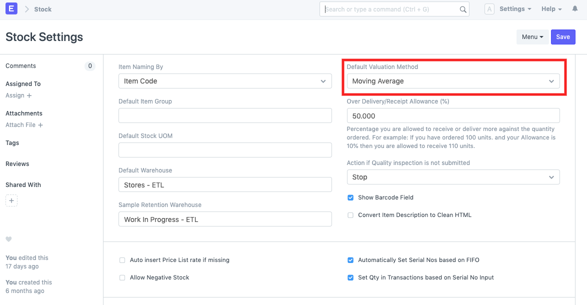
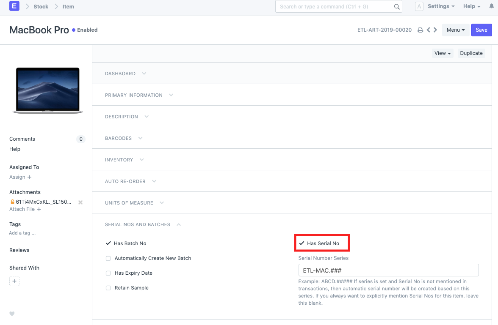
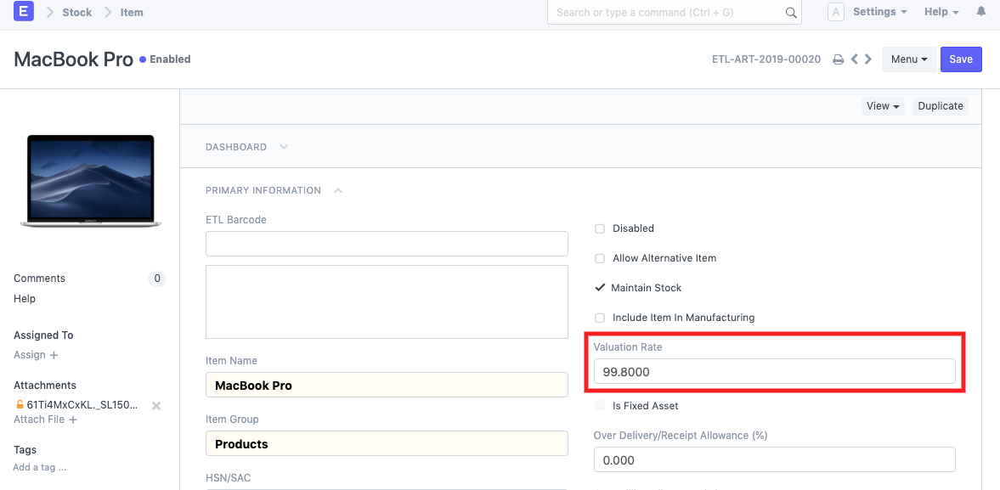
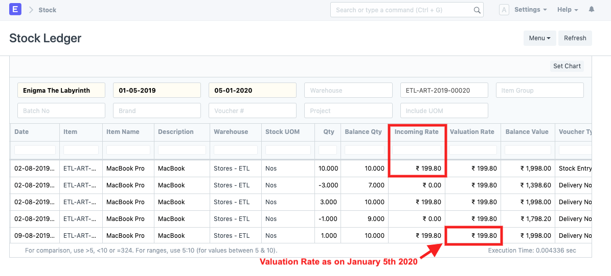

# Serialised Item Valuation Rate calculation

[ Edit ](https://docs.frappe.io/wiki/spaces/24hrpr6es9/page/0sil415qls)

Open in ChatGPT  Ask ChatGPT about this page Open in Claude  Ask Claude about this page

# Serialised Item Valuation Rate calculation

[ Edit ](https://docs.frappe.io/wiki/spaces/24hrpr6es9/page/0sil415qls)

Open in ChatGPT  Ask ChatGPT about this page Open in Claude  Ask Claude about this page

In ERPNext, Item's stock **valuation rate** is updated on creation of the following transaction:

  1. Purchase Receipt
  2. Stock Entry of type Material Receipt
  3. Stock Reconciliation made for updating stock opening balance

ERPNext supports 2 valuation types: FIFO & Moving Average.  
You can select valuation method based on which item's value will be calculated. It can be set as per individual item as well as globally for all the items from Stock Settings.  

Item valuation rates are calculated as per the valuation method set for them. However, in the case of **serialised Item** , these settings are _ignored_. The below Item, "Macbook Pro" is a serialised Item and it's valuation rate is not fetched from Item master. Instead, the valuation rate is updated from the _first incoming stock entry rate_ , RS 199.80. Consequently, it is updated as per the other transactions carried out on this Item.  
Item Master:  
  
  
Stock Ledger:  
  
To learn more about ERPNext Stocks module, click [here](https://erpnext.com/docs/user/manual/en/stock)

[ Previous Page FIFO and Moving Average calculation difference ](calculation-of-valuation-rate-in-fifo-and-moving-average.md) [ Next Page Perpetual Inventory for Non-stock Item ](perpetual-inventory-for-non-stock-item.md)

Last updated 1 week ago 

Was this helpful?
