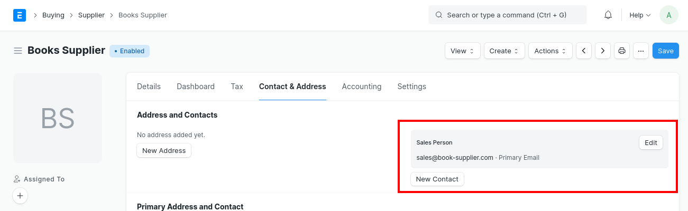
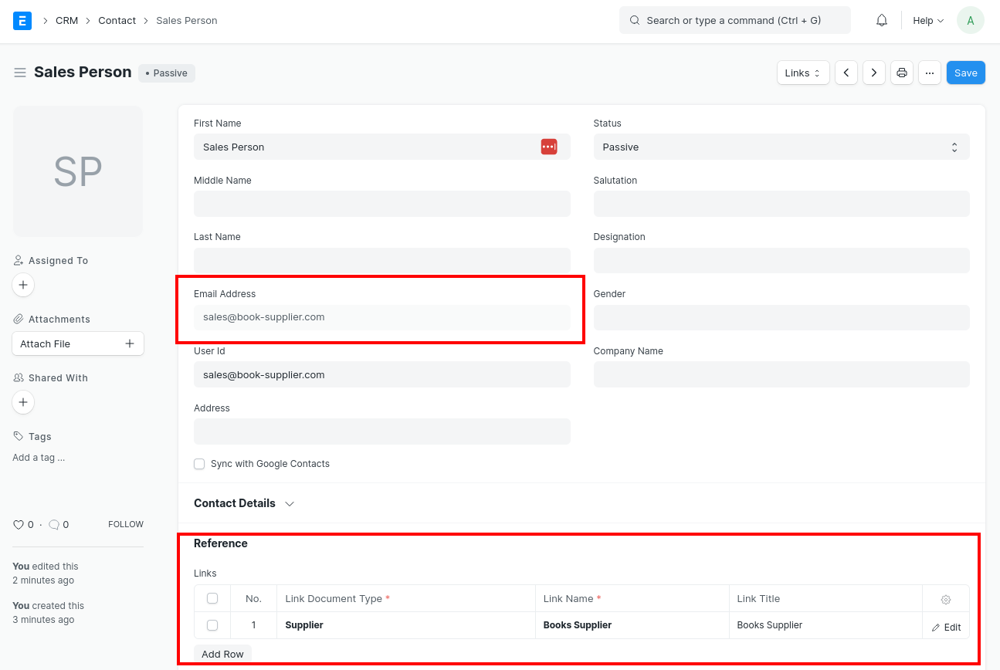
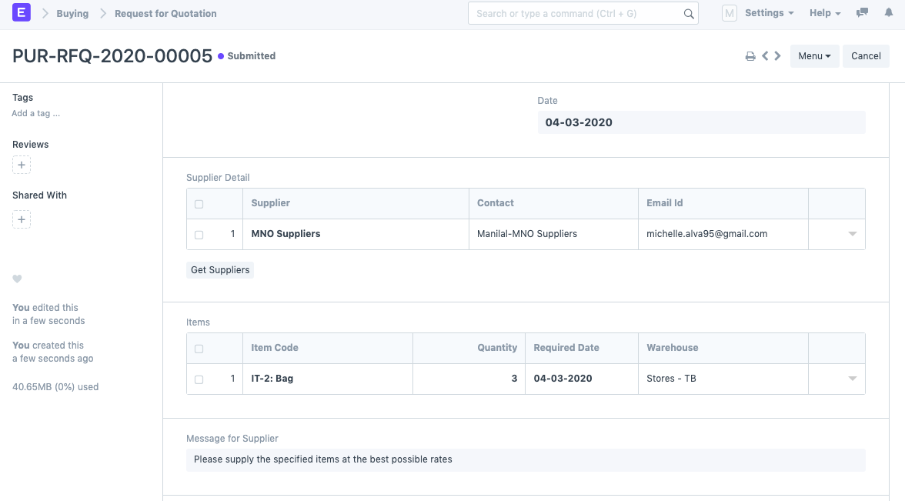
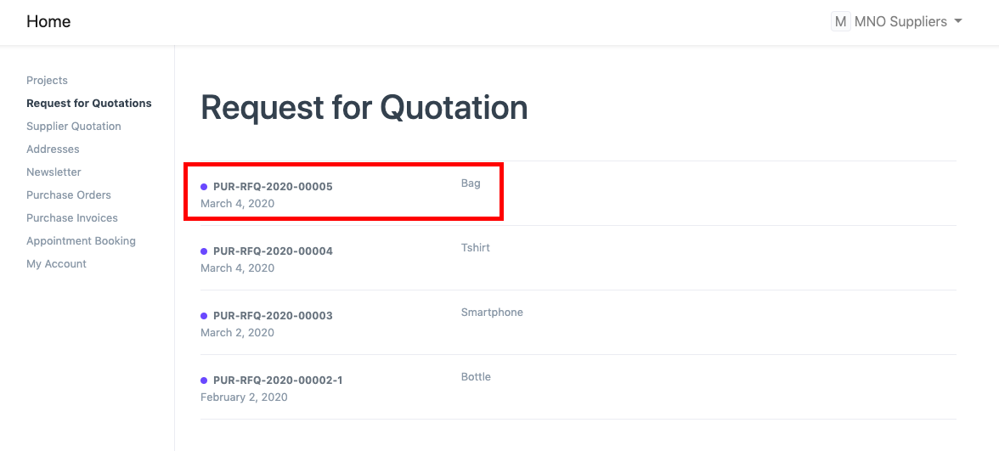
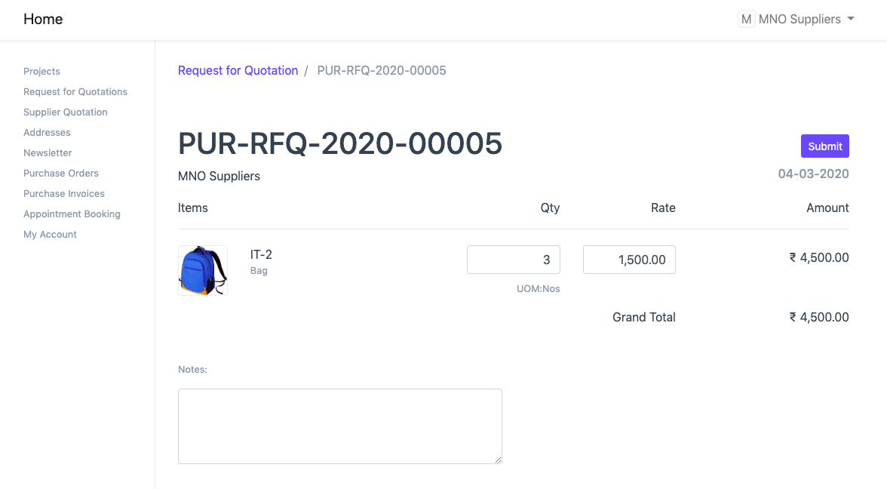
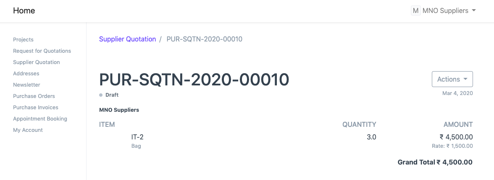
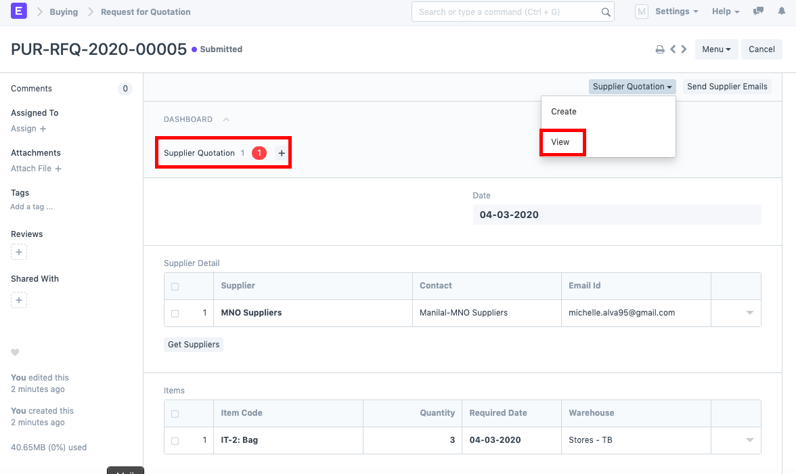
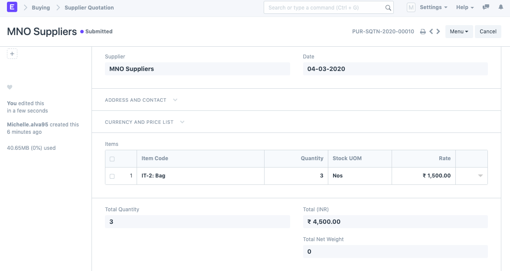
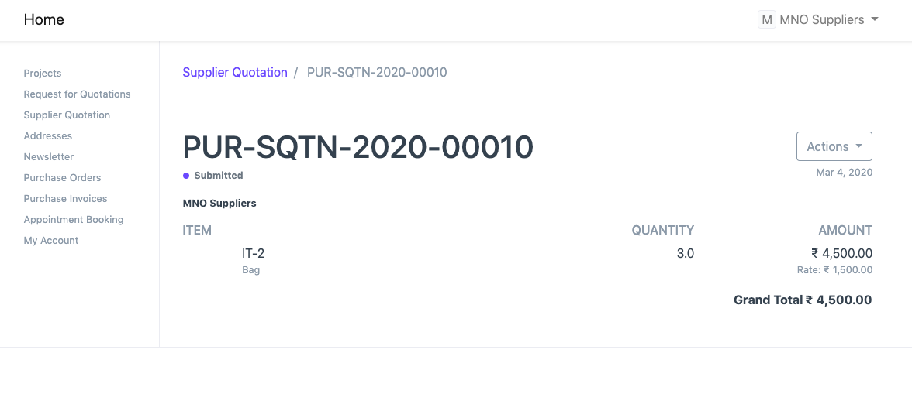

# Create Supplier Quotation through Supplier Portal

[ Edit ](https://docs.frappe.io/wiki/spaces/24hrpr6es9/page/0rg4le9u1b)

Open in ChatGPT  Ask ChatGPT about this page Open in Claude  Ask Claude about this page

# Create Supplier Quotation through Supplier Portal

[ Edit ](https://docs.frappe.io/wiki/spaces/24hrpr6es9/page/0rg4le9u1b)

Open in ChatGPT  Ask ChatGPT about this page Open in Claude  Ask Claude about this page

In ERPNext, Supplier Quotations can either be created manually or via the Supplier Portal. Suppliers can create Quotations via the Supplier Portal once they have logged into the system.

Pre-requisites:

  * The Supplier must be a registered Website User with "Supplier" role.
  * Supplier user account's Contact must be linked to the Supplier document.

For a Supplier to create a Quotation, there should be an existing Request for Quotation (RFQ) against them. To do this entire process, follow the following steps:

  1. Create a Request for Quotation for the Supplier in the system. For example, we are creating an RFQ for "MNO Suppliers".

  2. Now, the Supplier (MNO Suppliers in our case) has to log into the Supplier Portal using their login credentials. There, the Supplier will be able to view the RFQ

The Supplier has to enter the Item Rate and submit the RFQ.

Once the RFQ is submitted, a Supplier Quotation gets automatically created in the system against this RFQ. Click on the "View" option.

Observe that the Supplier Quotation is in the Draft state. After reviewing the Supplier Quotation, the user can submit it. This will also be reflected in the Supplier Portal.

[ Previous Page Purchase Order ](purchase-order.md) [ Next Page Supplier Scorecard  ](supplier-scorecard.md)

Last updated 2 weeks ago 

Was this helpful?
