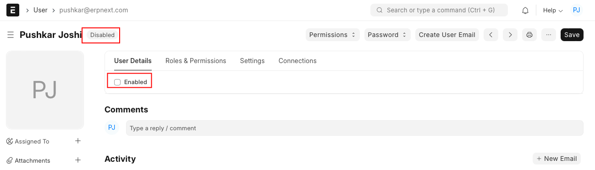

# Disable Any User

[ Edit ](https://docs.frappe.io/wiki/spaces/24hrpr6es9/page/0sc566cttj)

Open in ChatGPT  Ask ChatGPT about this page Open in Claude  Ask Claude about this page

# Disable Any User

[ Edit ](https://docs.frappe.io/wiki/spaces/24hrpr6es9/page/0sc566cttj)

Open in ChatGPT  Ask ChatGPT about this page Open in Claude  Ask Claude about this page

If you want to prohibit an ERPNext user from using the system then you can follow the below steps. This will be useful when your employees resign or in case you want to ban certain users from accessing the system.

## **How to disable a user?**

  1. Type ‘User List’ in the awesome bar
  2. Select the user you want to disable
  3. Uncheck the ‘Enabled’ checkbox for the selected user
  4. Save your changes

Once the changes are saved, the user will be marked as 'Disabled' in the list which can always be re-enabled as per the need. After re-enabling a user, all the configurations associated with it will be retrieved as is.

[ Previous Page Change User Password ](https://docs.frappe.io/erpnext/change-password) [ Next Page Role Based Permissions ](https://docs.frappe.io/erpnext/permissions)

Last updated 2 weeks ago 

Was this helpful?
