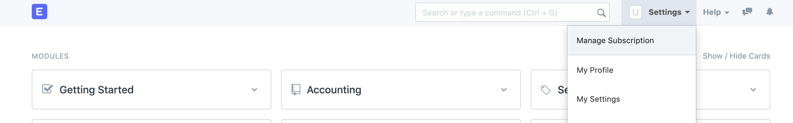
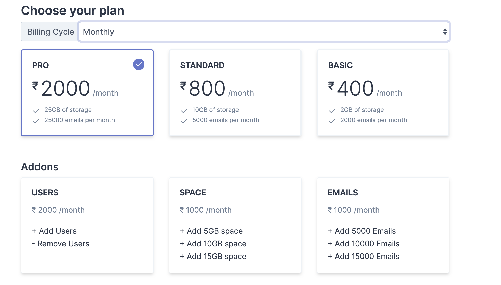
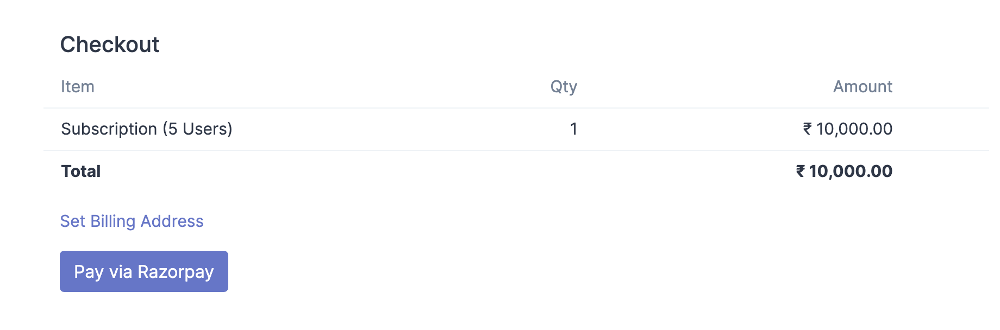

# Upgrade Subscription Plan and Buy Add-ons

[ Edit ](https://docs.frappe.io/wiki/spaces/24hrpr6es9/page/0rnbc4e5d8)

Open in ChatGPT  Ask ChatGPT about this page Open in Claude  Ask Claude about this page

# Upgrade Subscription Plan and Buy Add-ons

[ Edit ](https://docs.frappe.io/wiki/spaces/24hrpr6es9/page/0rnbc4e5d8)

Open in ChatGPT  Ask ChatGPT about this page Open in Claude  Ask Claude about this page

**Question:** What are the steps to change the plan to Enterprise?  
**Answer:**  
You can upgrade your account to higher plan from:

  1. My Settings > Manage Subscriptions
  2. Choose the plan you wish to upgrade
  3. Select Add-ons

### **Step 1: Go to Manage Subscription**

### **Step 2: Choose plan and add-ons**

### **Step 3: Checkout and Make Payment**

Once you have successfully selected the plan and add-ons, proceed with checkout by reviewing the Items subscribed and payment option.  

[ Previous Page Subscription Management ](https://docs.frappe.io/erpnext/subscription-management) [ Next Page Update Subscription Payment Method ](update-subscription-payment-method.md)

Last updated 2 weeks ago 

Was this helpful?
