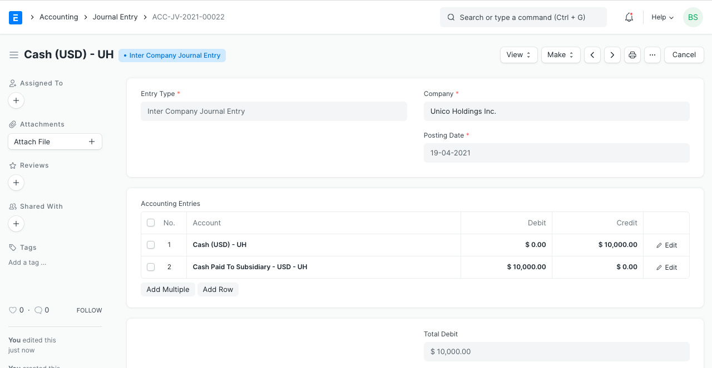
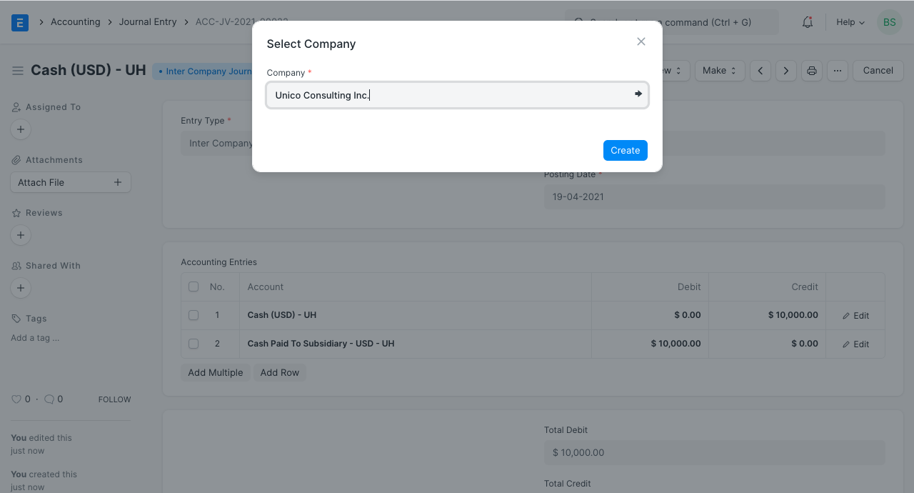
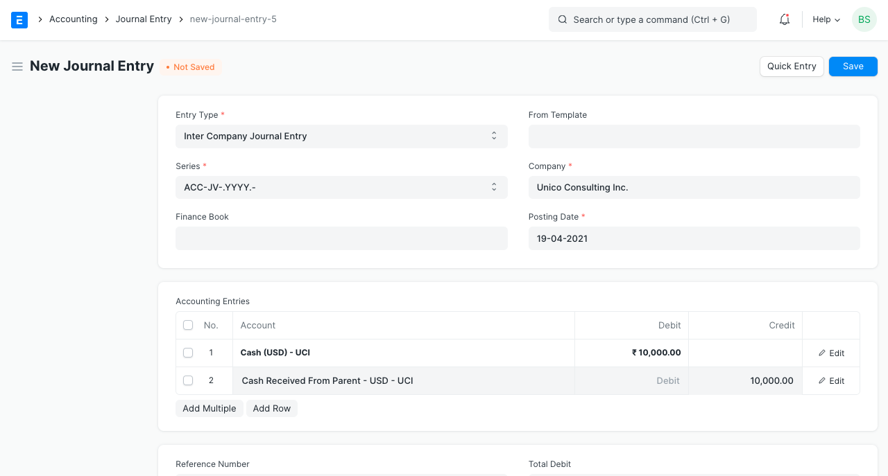

# Inter Company Journal Entry

[ Edit ](https://docs.frappe.io/wiki/spaces/24hrpr6es9/page/0sf4ck4qf3)

Open in ChatGPT  Ask ChatGPT about this page Open in Claude  Ask Claude about this page

# Inter Company Journal Entry 

[ Edit ](https://docs.frappe.io/wiki/spaces/24hrpr6es9/page/0sf4ck4qf3)

Open in ChatGPT  Ask ChatGPT about this page Open in Claude  Ask Claude about this page

**An Inter Company Journal Entry is done between organizations that belong to the same group.**

You can create Inter Company Journal Entry if you are making transactions with multiple Companies. You can select the Accounts which you wish to use in the Inter Company transactions. A possible use case would be a company buying goods on behalf of another company.

Inter company Journal Entries are created using the Journal Entry form in ERPNext. To access the Journal Entry list, go to:

> Home > Accounting > Company and Accounts > Journal Entry

## 1\. Prerequisites

Before creating an Inter Company Journal Entry, you need the following:

  * At least two [Companies](company-setup.md)

## 2\. How to create an Inter Company Journal Entry

  1. Go to the Journal Entry list, and click on New.
  2. Select Entry Type as 'Inter Company Journal Entry'.
  3. Set the Company that is buying Items on behalf of another company.
  4. Add rows for the individual accounting entries. Only inter company accounts can be fetched here.
  5. In each row, you must specify:

  * The Internal account that will be affected.
  * The amount to Debit or Credit.
  * The Cost Center (If it is an Income or Expense).

  1. On submitting the Journal Entry, you will find a button on the top right corner, **Make Inter Company Journal Entry**.

  1. Click on the button. Now, you will be asked to select the Company against which you wish to create the linked Journal Entry.

  1. On selecting the Company, you will be routed to another Journal Entry where the relevant fields will be mapped, i.e. Company, Voucher Type, Inter Company Journal Entry Reference etc.

  1. Select the Internal accounts for the second Company in the table.
  2. Submit the Journal Entry.
  3. Make sure the total Debit and Credit Amounts are same as the previously created Journal Entry's total Credit and Debit Amounts respectively but the debits and credits will be opposite.

**Note:** The accounts in second Journal Entry should be the opposite of what you did in the first Journal Entry. For example, Company A is buying something from Company B. This is how the payment cycle between the two companies will look like using Inter Company Journal Entry.

  1. Debit Bank Account by 500 and credit Debtors account of Company B by 500.
  2. Now, in the Inter Company Journal Entry, debit Creditors account of Company A by 500 and credit Bank Account by 500.
  3. You also need to select the parties for Creditors and Debtors account before proceeding with the Journal Entry.

You can also find the reference link at the bottom, which will be added in both the linked Journal Entries and will be removed if any of the Journal Entries are cancelled.

### 3\. Related Topics

  1. [Journal Entry](journal-entry.md)
  2. [Inter Company Invoices](inter-company-invoices.md)

[ Previous Page Journal Entry Template  ](journal-entry-template.md) [ Next Page Deferred Revenue  ](deferred-revenue.md)

Last updated 1 week ago 

Was this helpful?
