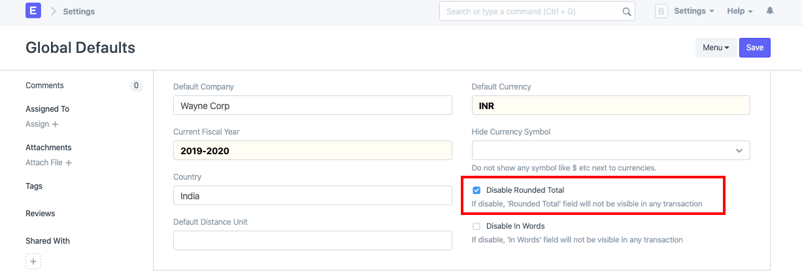
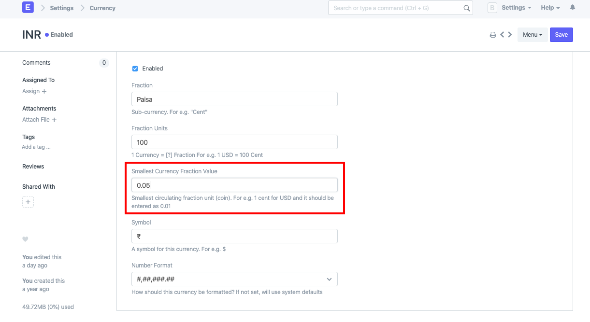

# Invoice rounding issue

[ Edit ](https://docs.frappe.io/wiki/spaces/24hrpr6es9/page/0skkqnceec)

Open in ChatGPT  Ask ChatGPT about this page Open in Claude  Ask Claude about this page

# Invoice rounding issue

[ Edit ](https://docs.frappe.io/wiki/spaces/24hrpr6es9/page/0skkqnceec)

Open in ChatGPT  Ask ChatGPT about this page Open in Claude  Ask Claude about this page

**Question:**

In Sales Invoice, in-words in being printed with the rounding off even though it is disabled via Global Defaults.In the Global Defaults one can always Disable Rounded Total via the following checkbox: 

**Answers:** If this configuration hasn't done the trick for you, you need to also check the currency master once. To do this, type **Currency** in the awesome bar (Ctrl/Cmd + G). In the currency master, open the currency for which you are facing the issue:

Here make sure that the rounding is set correctly. For example, the smallest fractional value for INR should be 0.01 and not 0.05. Update this value, and then update the transaction.

[ Previous Page Delete entries linked with GL entries ](delete-entries-linked-with-gl-entries.md) [ Next Page Customise Cash Flow Report ](customise-cash-flow-report.md)

Last updated 1 week ago 

Was this helpful?
