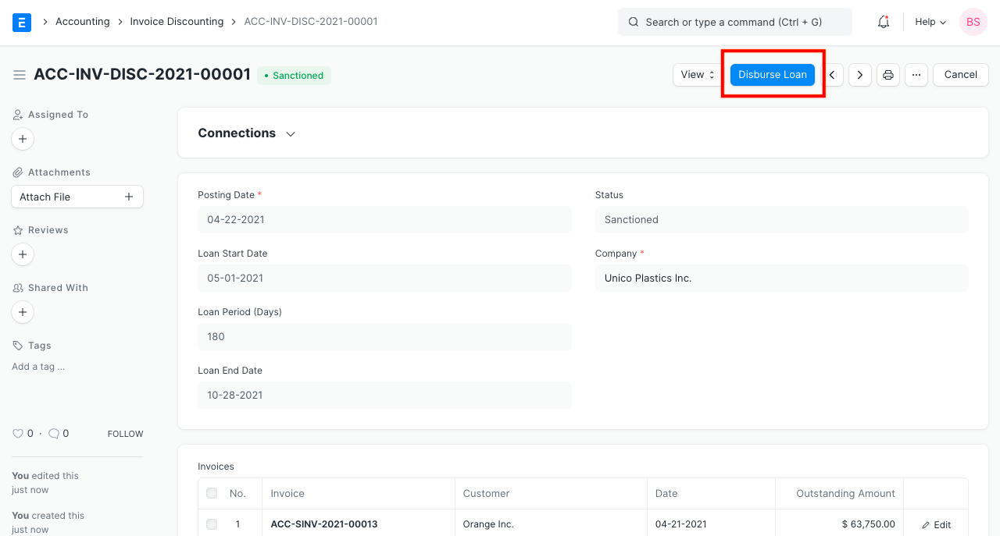
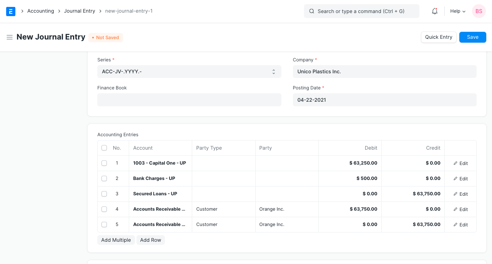
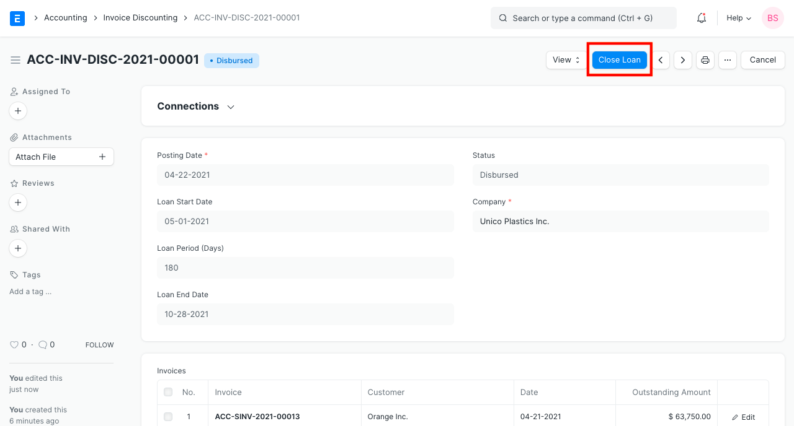

# Invoice Discounting

[ Edit ](https://docs.frappe.io/wiki/spaces/24hrpr6es9/page/0rmbae9sbe)

Open in ChatGPT  Ask ChatGPT about this page Open in Claude  Ask Claude about this page

# Invoice Discounting 

[ Edit ](https://docs.frappe.io/wiki/spaces/24hrpr6es9/page/0rmbae9sbe)

Open in ChatGPT  Ask ChatGPT about this page Open in Claude  Ask Claude about this page

**Invoice discounting is the practice of using a company's unpaid sales invoices as collateral for a short term loan, which is issued by a bank or a finance company.**

To access the Invoice discounting list, go to:

> Home > Accounting > Banking and Payments > Invoice Discounting

## 1\. Prerequisites

You need to create following ledgers in order to post invoice discounting transactions.

  * **Short Term Loan:** A ledger under the 'Current Liabilities' > 'Loans (Liabilities)' group for loan.
  * **Bank Account Charges:** An expense ledger for charges levied by the bank.
  * **Accounts Receivable Credit Account:** A control account of type receivable.
  * **Accounts Receivable Discounted Account:** A receivable account for invoices which have been discounted.
  * **Accounts Receivable Unpaid Account:** A receivable account for invoices which were discounted and remain unpaid even after the loan period is over.

## 2\. How to Post an Invoice Discounting Transaction

  1. Go to the Invoice Discounting list, click on New.
  2. Enter Posting Date and Loan Start Date. Enter the Loan Period in days.
  3. Select invoices either manually in the table or by clicking on the 'Get Invoices' button on the top right.
  4. Select Short Term Loan Account, Bank Account, and Bank Charges Account.
  5. Select Accounts Receivable Credit Account, Accounts Receivable Discounted Account and Accounts Receivable Unpaid Account.
  6. Click on Save then Submit.
  7. After submitting the Invoice Discounting form, click on the **Disburse Loan**.

  1. You'll be taken to a [Journal Entry](journal-entry.md) screen. Save and Submit the Journal Entry.

## 2\. Features

### 2.1 Import Invoices

Click on 'Get Invoices' button to import invoices. You can import invoices by filtering on certain criteria.

  * Invoices created against a specific Customer.
  * Date range between which the invoices were raised.
  * Minimum and maximum amount.

You can also specify multiple of the above filters.

### 2.2 Closing the Loan

When you repay the loan at the end of the loan period or before that, you can update the same by clicking on 'Close Loan' button.  System will prepare the Journal Entry. Review and Submit the it.

### 2.3 Auto Update of Ledgers at the end of Loan Period

If the loan is not repaid at the end of loan period, system will create a Journal Entry via a scheduled job to shift value from 'Accounts Receivable Discounted Account' to 'Accounts Receivable Unpaid Account'. This will make it easy to trace the invoices which were discounted and remained unpaid at the end of the loan period.

[ Previous Page Bank Account ](bank-account.md) [ Next Page Payment Request  ](payment-request.md)

Last updated 2 weeks ago 

Was this helpful?
