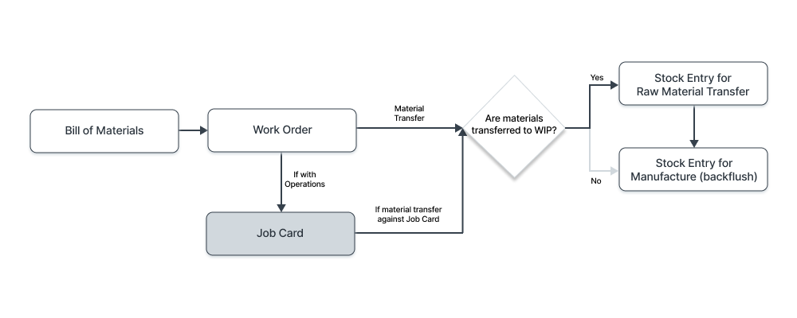
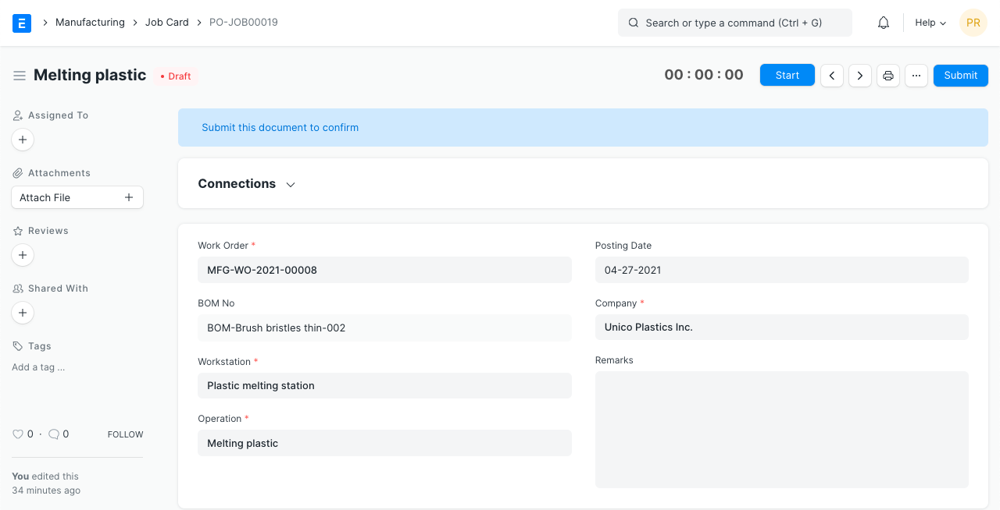
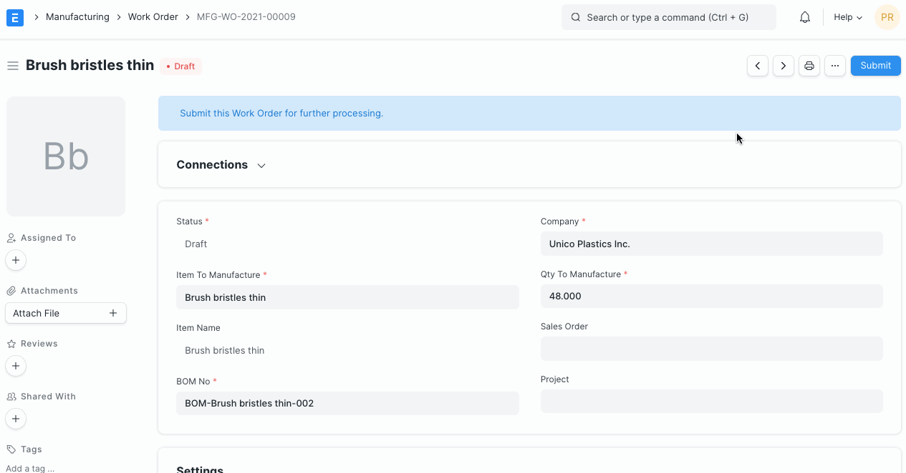
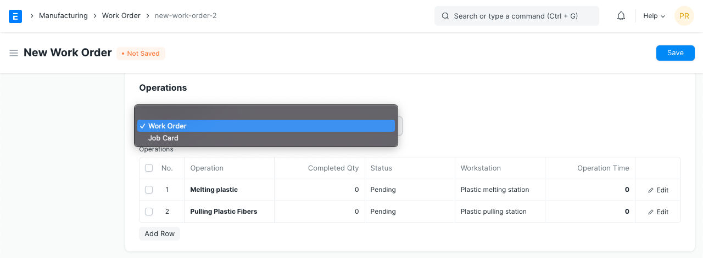
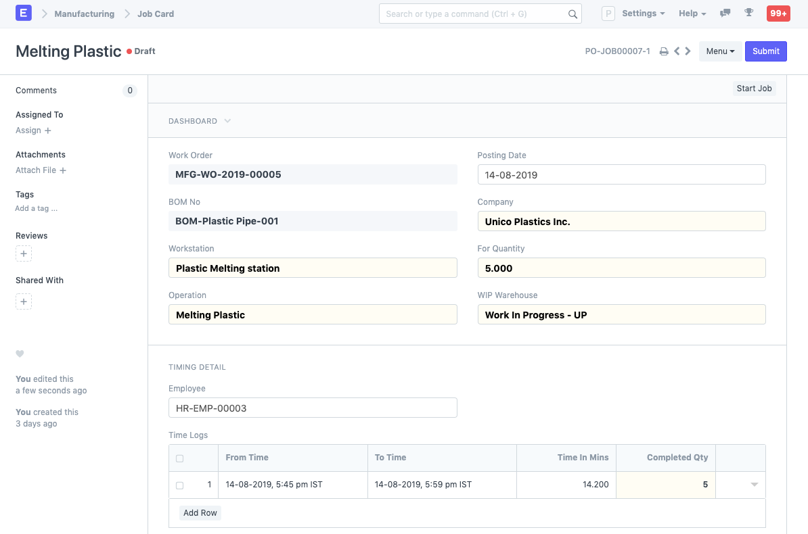
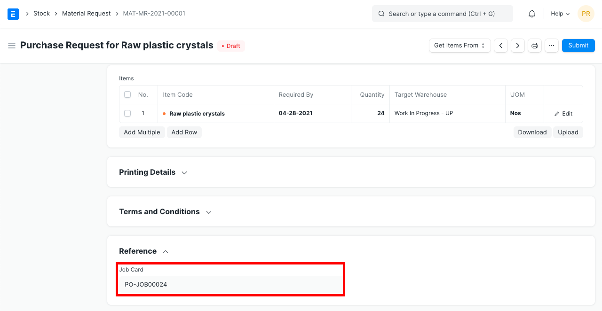
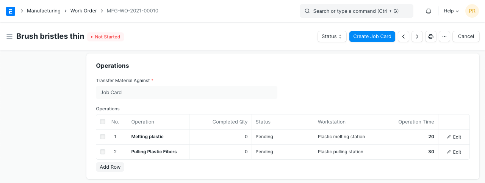
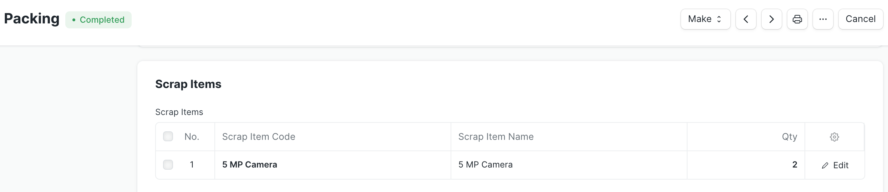
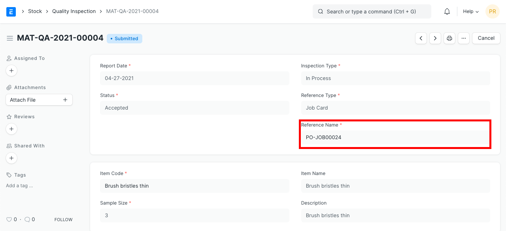
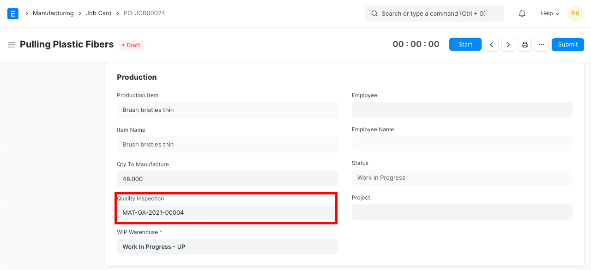

# Job Card

[ Edit ](https://docs.frappe.io/wiki/spaces/24hrpr6es9/page/0t5sl5giak)

Open in ChatGPT  Ask ChatGPT about this page Open in Claude  Ask Claude about this page

# Job Card 

[ Edit ](https://docs.frappe.io/wiki/spaces/24hrpr6es9/page/0t5sl5giak)

Open in ChatGPT  Ask ChatGPT about this page Open in Claude  Ask Claude about this page

**A Job Card stores actual production information about a particular Operation performed on a particular Workstation.**

A Job Card is created from the Work Order and given to each of the Workstations in the manufacturing floor to start the production of an item with a certain quantity in each of the operations defined in the Work Order.

Job Card allows each Operation's workstation to issue a “Material Request” and “Stock Transfer to Manufacture” for raw material required against a “Job Card”.

Job Card completion will change the production status in Work Order, we can track the completion of production progress for each of the Operations defined in the Work Order.

To access the Job Card list, go to:

> Home > Manufacturing > Production > Job Card

## 1\. Prerequisites

Before creating and using a Job Card, it is advised that you create the following first:

  * [Bill Of Materials](bill-of-materials.md)
  * [Operation](operation.md)
  * [Workstation](workstation.md)
  * [Work Order](work-order.md)

## 2\. How to Create a Job Card

Job Card for Operations is automatically created when a Work Order is submitted.

This is what a Job Card looks like:

To use a Job Card follow these steps:

  1. Click on the Start Job button, then on Complete Job when you're done.
  2. Alternatively, you can also fill the From Time and To Time in the Time Logs table.
  3. Select the Employee to whom the Job Card was assigned.
  4. Enter the Completed Quantity. This is the number of Items on which the Operation was performed for the selected time interval.
  5. Add more rows in the Time Logs table and record time using the Start/Completed buttons.
  6. Click on Submit.

In a Work Order, the Operations and Workstations are fetched from the BOM of an Item. For ease of use, you should ensure that the [Routing](routing.md) is configured in the BOM.

Each Job Card created will have Workstation & Operations assigned. The raw material required from each Source Warehouse will be calculated based on quantity required for production.

On submitting a Work Order, Job Cards will be auto-created based on the values in the Operations table.

### 2.1 Select Work Order with Item to Manufacture

You can select 'Transfer Material Against' as 'Job Card' on the Bill of Materials to transfer raw materials for Production against Job Cards.

In the Work Order, you can select the option:

### 2.3 Using a Job Card

Employee assignment and timing detail will also be defined in Job Card. The time taken to do a job can be recorded. If multiple employees are working on the same Operation, add new job cards by clicking on the 'Create Job' Card button.

### 2.4 Material Request against Job Card

A Material Request will be raised from the Job Card as a basis/order to prepare raw material required for the manufacturing process. The Material Request raised will have its reference to the original Job Card number.

Track the Manufacturing Progress in The Work Order by The Completion of Each Operations defined in Work Order.

Job Card completion allows you to track the manufacturing progress inside the Work Order by looking at the completion of each Operation related to the Work Order.

### 2.5 Scrap Items

While completing the operations, there might be chances that some scrap materials will be produced. This scrap materials are required to be added in the inventory. For that user needs to put the details of the scrap items in the job card. User can also set the defective materials / broken materials in the scrap items table.

## 3\. Features

### 3.1 Tracking Quality Inspection

> Introduced in Version 13

For production orders, the quality of in-process (semi-finished) goods also needs to be tracked. It is defined by the process (operation) performed on it which is in turn defined in the Job Card. In-process tests are different than incoming and outgoing material tests. Monitoring quality during manufacturing helps to make sure that the finished product produced is of the desired quality. You can create a Quality Inspection for the Production Item against the Job Card.

 

For more details, refer the [Quality Inspection](quality-inspection.md) page.

[ Previous Page Work Order ](work-order.md) [ Next Page Plant Floor ](plant-floor.md)

Last updated 2 weeks ago 

Was this helpful?
