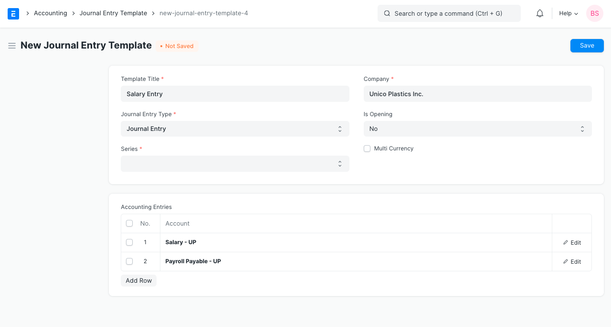
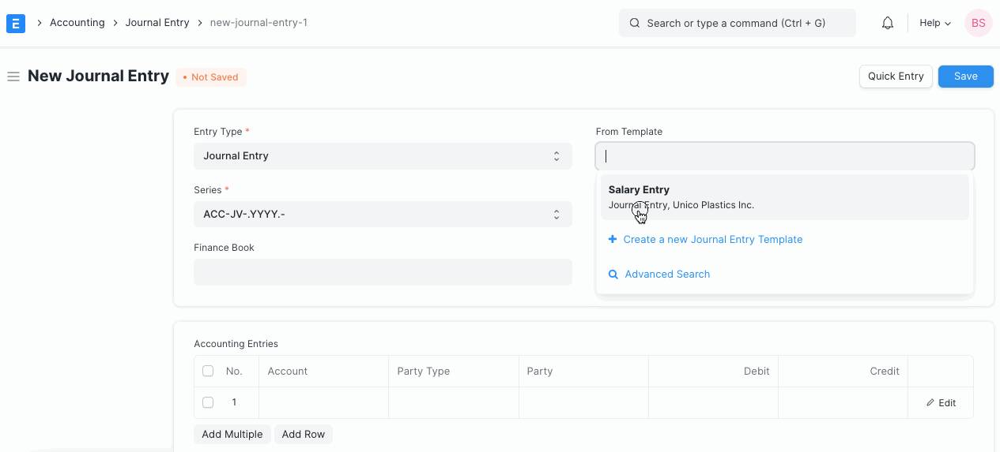

# Journal Entry Template

[ Edit ](https://docs.frappe.io/wiki/spaces/24hrpr6es9/page/0ro4ualip6)

Open in ChatGPT  Ask ChatGPT about this page Open in Claude  Ask Claude about this page

# Journal Entry Template 

[ Edit ](https://docs.frappe.io/wiki/spaces/24hrpr6es9/page/0ro4ualip6)

Open in ChatGPT  Ask ChatGPT about this page Open in Claude  Ask Claude about this page

**A Journal Entry Template lets you set and select a predetermined list of accounts and options while making a Journal Entry.**

To access the Journal Entry Template, go to:

> Home > Accounting > General Ledger > Journal Entry Template

## 1\. How to Create and use a Journal Entry Template:

  1. Go to the Journal Entry Template List and click on New.
  2. Add the following details:

  * **Template Title** : This will be used to select the template from Journal Entry.
  * **Company** : By default the company defined in Global Defaults is selected. You can select any another company too.
  * **Entry Type** : You can select from the [entry types available in Journal Entry](journal-entry.md) here. Default value is [Journal Entry](journal-entry.md).
  * There are 3 special 'Entry Types' in this:
  * [Opening Entry](journal-entry.md): This will get all the accounts and load them into the "Accounting Entries" table. To learn more visit [Opening Balance](opening-balance.md) page.
  * [Bank Entry](journal-entry.md): This will get and load the default Bank Account if set.
  * [Cash Entry](journal-entry.md): This will get and load the default Cash Account if set.
  * **Is Opening** : This will be autoset to 'Yes' if 'Opening Entry' is selected as Entry Type.
  * **Series** : You can select from a list of naming series available to Journal Entry.
  * **Accounting Entries** : Here you can select a list of accounts to add to the entry.

  3. Save and go to [Journal Entry](journal-entry.md) and click on new.
  4. In the 'From Template' field when you select the template, it will load the accounts and other options set in it. Please note it will clear the Accounting Entries table first, but you can add more accounts to the table apart from those fetched from the template.

## 3\. Related Topics

  1. [Journal Entry](journal-entry.md)

[ Previous Page Journal Entry  ](journal-entry.md) [ Next Page Inter Company Journal Entry  ](inter-company-journal-entry.md)

Last updated 2 weeks ago 

Was this helpful?
