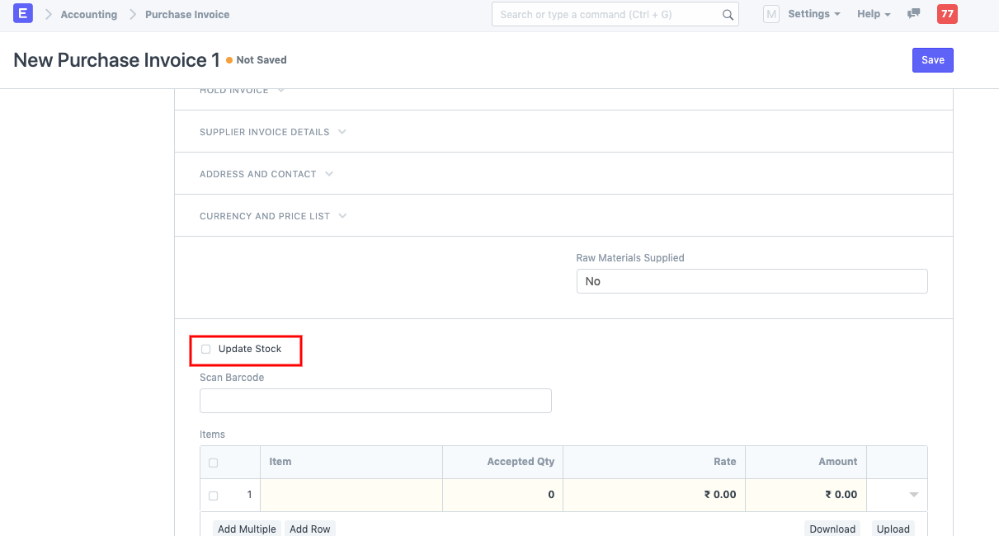
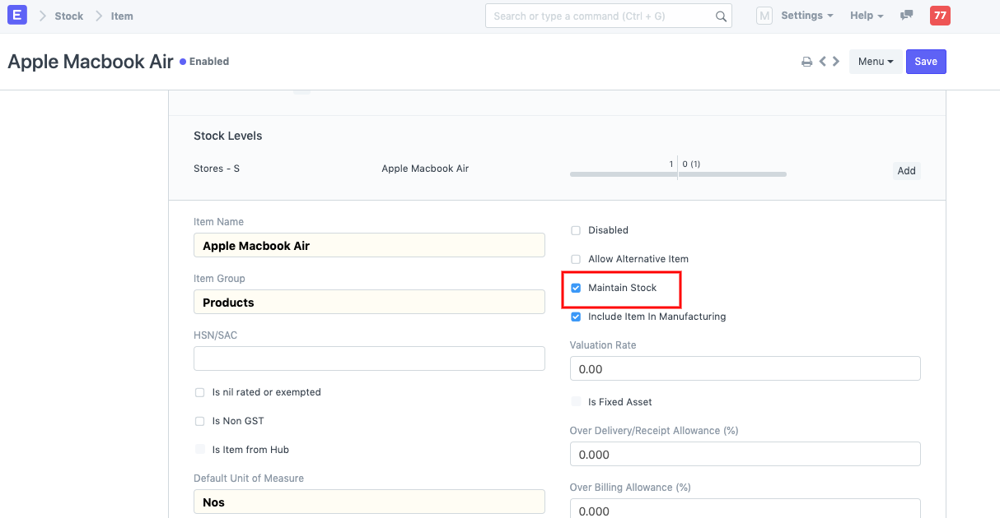

# Landed cost Voucher

[ Edit ](https://docs.frappe.io/wiki/spaces/24hrpr6es9/page/0rvgfc5f6t)

Open in ChatGPT  Ask ChatGPT about this page Open in Claude  Ask Claude about this page

# Landed cost Voucher

[ Edit ](https://docs.frappe.io/wiki/spaces/24hrpr6es9/page/0rvgfc5f6t)

Open in ChatGPT  Ask ChatGPT about this page Open in Claude  Ask Claude about this page

For creating a **Landed cost voucher** in ERPNext: You have to create it against a **Purchase Receipt** and **Purchase Invoice.**  
While creating against **Purchase Invoice** : In the Purchase Invoice --> **Update Stock** should be checked.  
  
If this field is unchecked, the Purchase Invoices will not be fetched in the Landed Cost Voucher  
While creating against **Purchase Receipt** : The Item selected should have **Maintain Stock** checked.  
  
If this field is not checked, the Items will not be displayed when you click **Get items from Purchase Receipt.**  
While creating a Landed cost Voucher, additional costs can be added for the items until they land in our Inventory.  
These additional charges once added, get added in the **Item Valuation rate** and update the Item Rate.  
You can trace this additional charge effect on the Accounting ledger in the **Purchase Receipt -- > View --> Accounting Ledger**  
If the additional charges have to be paid against the Landed Cost Voucher, you can:1. You can create a **Payment Entry** directly to complete the payment for additional expenses for the Item and then create a **Purchase Invoice** with **Is Paid** checked --> [In this case, Purchase Invoice is not mandatory unless you want the accounting effect to be seen. ] 2\. You can create a **Purchase Invoice** for a **Supplier** for which the **Additional Expenses** are incurred, this way you can see the Accounting effect for the expenses as per the Landed Cost Voucher, then create a Payment entry against it.

[ Previous Page Packing Slip  ](packing-slip.md) [ Next Page Rules ](rules.md)

Last updated 2 weeks ago 

Was this helpful?
