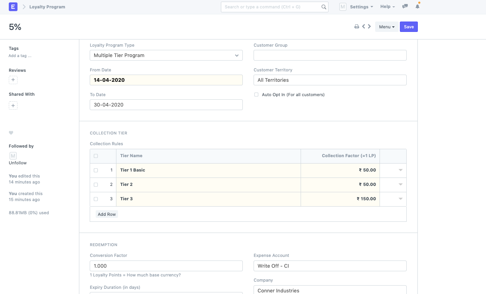
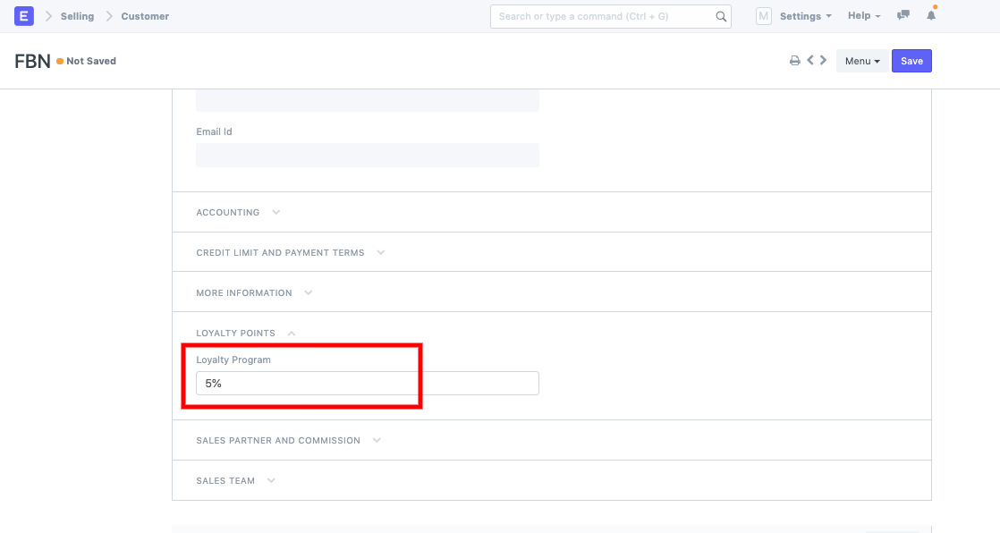
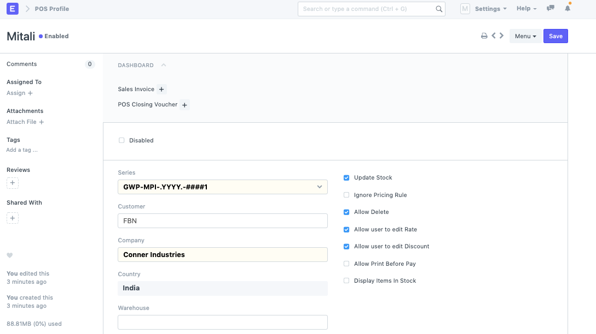
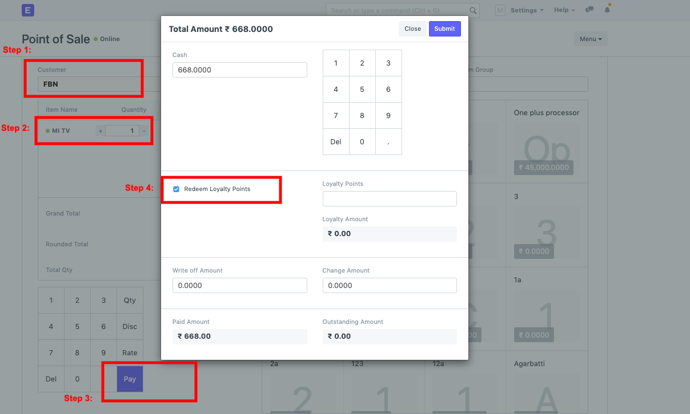

# Loyalty points redemption in POS

[ Edit ](https://docs.frappe.io/wiki/spaces/24hrpr6es9/page/0sj50tf3qe)

Open in ChatGPT  Ask ChatGPT about this page Open in Claude  Ask Claude about this page

# Loyalty points redemption in POS

[ Edit ](https://docs.frappe.io/wiki/spaces/24hrpr6es9/page/0sj50tf3qe)

Open in ChatGPT  Ask ChatGPT about this page Open in Claude  Ask Claude about this page

In ERPNext POS module, the invoices are auto generated. You can set your complete POS system right with the following configuration steps:

  * Create a Loyalty program in the doctype: You can set Single Tier or a Multiple Tier Program based on the slabs existing in the amount of Purchase that is done in ERPNext.

* Once the loyalty program is set, you can create a Customer and link the Loyalty program to it.

Once this Customer is linked to the Loyalty program, you can now setup your POS profile if it is not set yet:  
  
Now, you can go to POS transaction:* Select Customer

  * Add items
  * Pay
  * Check the field --> **Redeem Loyalty Points**

[ Previous Page POS Invoice Consolidation ](pos-invoice-consolidation.md) [ Next Page Manufacturing in ERPNext ](manufacturing.md)

Last updated 1 week ago 

Was this helpful?
