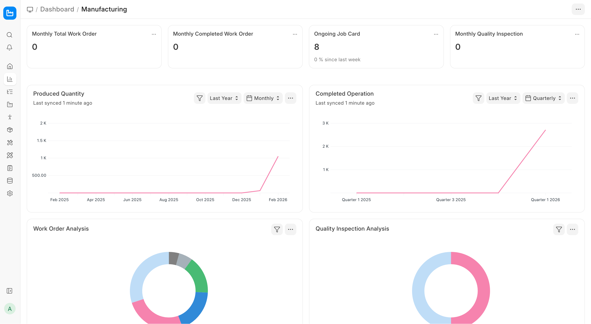
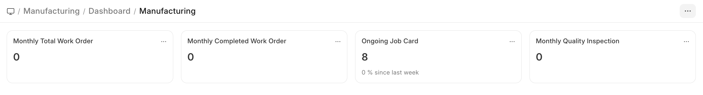
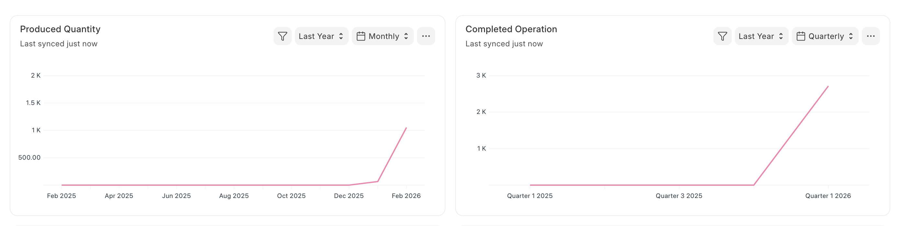
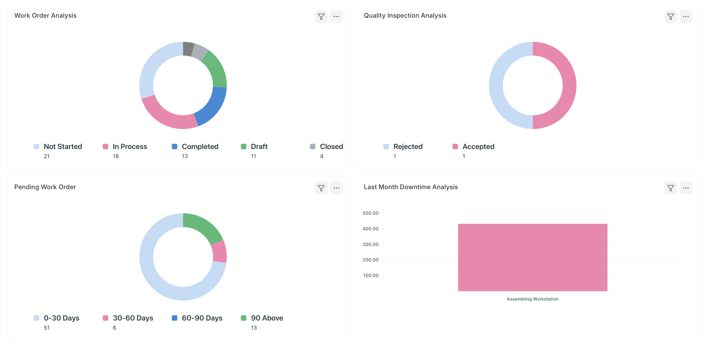
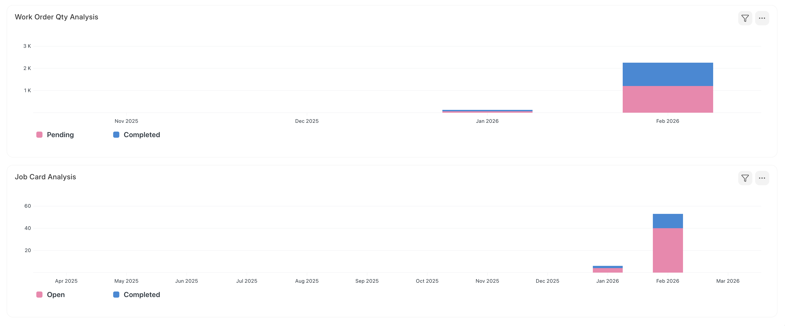

# Manufacturing Dashboard

[ Edit ](https://docs.frappe.io/wiki/spaces/24hrpr6es9/page/0rvptcn3j9)

Open in ChatGPT  Ask ChatGPT about this page Open in Claude  Ask Claude about this page

# Manufacturing Dashboard 

[ Edit ](https://docs.frappe.io/wiki/spaces/24hrpr6es9/page/0rvptcn3j9)

Open in ChatGPT  Ask ChatGPT about this page Open in Claude  Ask Claude about this page

* * *

## Number Cards

In ERPNext, Number Cards are a type of widget or visual component that displays key metrics or numerical data in a dashboard. They are typically used to show quick, high-level insights that help users keep track of important business performance indicators or operational statistics.

  1. **Monthly Total Work Order** :- You will get the total count of Work Orders which are in Open, In Progress, and Completed state. The Work Orders created one month before the current date will be displayed in the number card.
  2. **Monthly Completed Work Order** :- The user will get the total count of Work Orders which are in the Completed state. The Work Orders created one month before the current date will be displayed in the number card.
  3. **Ongoing Job Card** :- The user will get the total count of Job Cards that are not in the Completed state.
  4. **Monthly Quality Inspection** :- The user will get the total count of Quality Inspection records which are in the Submitted state. The Work Orders created one month before the current date will be displayed in the number card.

* * *

## Dashboard

You can see some predefined graph reports in the dashboard when you open the Manufacturing module. These reports are fully customizable, you can choose what to show or hide and also configure the metrics on which the reports are shown.

### Produced Quantity

The chart will give the information about the total quantity produced (using Work Order) in the last year on a Quarterly basis. Users can also view the chart data based on Daily, Weekly, Monthly, Yearly basis.

### Completed Operation

The chart will give information about the total number of operations completed in the last year on Quarterly basis. Users can also view the chart data based on Daily, Weekly, Monthly, Yearly basis.

* * *

### Work Order Analysis

This chart will give the information about the number of Work Orders based on Not Started, In Process, Stopped, Completed statuses. This Donut chart will provide the information based on the last year's Work Order data. Your can also change the date range by clicking on the **Filter** button.

### Quality Inspection Analysis

This chart will give information about the number of Quality Inspections based on Accepted and Rejected status. The chart type is a donut and it will provide the information based on the last year's quality inspection data. Your can change the date range by clicking on the **Filter** button.

### Pending Work Orders

The chart will give information about the number of Work Orders that are pending based on the aging days. The number of aging days is calculated based on the difference between the current date and planned start / actual start date days.

### Last Month Downtime Analysis

The chart will give information about the total number of minutes a machine was not working in the last month. This helps the operator to know which machine has not performed well and requires maintenance.

* * *

### Work Order Quantity Analysis

The chart will give information about the total number of quantities that are Pending and Completed based on the Work Orders every month for the last year.

### Job Card Analysis

The chart will give information about the total number of Job Cards which are in the Pending and Completed states every month for the last year.

[ Previous Page Manufacturing in ERPNext ](manufacturing.md) [ Next Page Bill Of Materials ](bill-of-materials.md)

Last updated 2 weeks ago 

Was this helpful?
