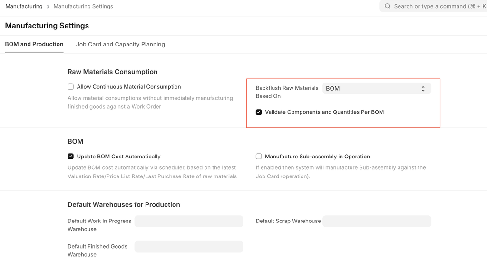
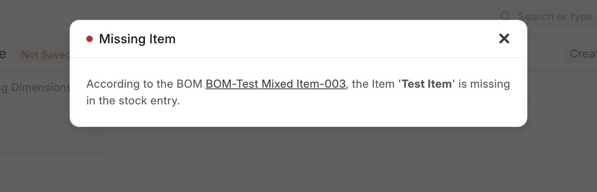
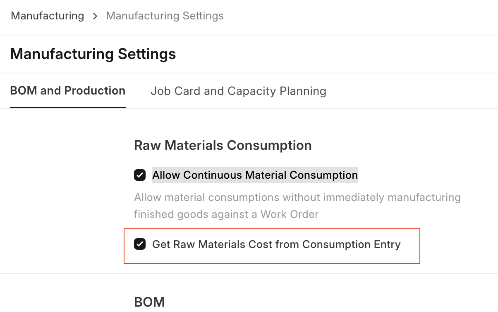

# Manufacturing Settings

[ Edit ](https://docs.frappe.io/wiki/spaces/24hrpr6es9/page/0rvs2mk97q)

Open in ChatGPT  Ask ChatGPT about this page Open in Claude  Ask Claude about this page

# Manufacturing Settings

[ Edit ](https://docs.frappe.io/wiki/spaces/24hrpr6es9/page/0rvs2mk97q)

Open in ChatGPT  Ask ChatGPT about this page Open in Claude  Ask Claude about this page

Manufacturing settings in ERPNext configure production workflows, manage bill of materials (BOM), track work orders, and oversee inventory to streamline operations and ensure efficient production management.

> Home > Manufacturing > Settings > Manufacturing Settings

## **Raw Materials Consumption**

### 1\. Allow Continuous Material Consumption

If enabled, materials can be consumed without immediately manufacturing finished goods in a single Work Order. This is useful if one or more time consuming products are being manufactured.

For example a single product takes a month to manufacture and the raw materials are consumed daily. In a regular scenario, this won't be feasible with stock entries. Enabling this option will allow you to create stock entries for **Material Consumption** without having to create an entry to backflush. End result is that you can see the stock being consumed in the Warehouses and can update the final manufacture entry for finished goods at a later stage.

### 2\. Backflush raw materials based on

The method selected here will be chosen for backflushing raw materials : 1. Material Transferred for Manufacture 2. BOM

### 3\. Validate Components and Quantities Per BOM

Note: This feature will be available from the version V15

If "Backflush Raw Materials Based On" as BOM, then users can validate component quantity according to BOM. To do that they have to enable "Validate Components Quantities Per BOM" checkbox in the "Manufacturing Settings".

If user has changed the quantity in the "Material Transfer for Manufacture" or "Manufacture" stock entry, then system will throw the below error

If user has removed the item in the "Material Transfer for Manufacture" or "Manufacture" stock entry, then system will throw the below error

### 4\. Get Raw Materials Cost from Consumption Entry

If the 'Allow Continuous Material Consumption' is enabled then user can see the option 'Get Raw Materials Cost from Consumption Entry'.

The 'Get Raw Materials Cost from Consumption Entry', determines whether the cost of raw materials used in production should be automatically derived from the consumption entries recorded during the manufacturing process. When enabled, ERPNext calculates the cost based on the actual materials consumed, ensuring accurate cost tracking and financial reporting.

## Capacity Planning

Capacity planning is the process in which an organisation decides whether or not to accept the new orders based on the resources and existing work orders.

### 1\. Disable Capacity Planning

If checked, capacity planning won't be done. Enabling it will help to decide whether or not to accept the new orders based on the resources and existing work orders.

### 2\. Allow Overtime

If enabled it'll allow creating work orders, job cards etc. outside workstation working hours.

### 3\. Allow Production on Holidays

If enabled, it'll allow production activities even on those days that are marked as holidays as per the Holiday List of the organisation.

### 4\. Capacity Planning For (Days)

The number of days specified here means the number of days in advance when the capacity planning activities will be initiated for production.

### 5\. Time Between Operations (Mins)

This specifies the time span that should be kept between two operations in minutes.

## Default Warehouses for Production

### 1\. Default Work In Progress Warehouse

This Warehouse will be auto-updated in the 'Work In Progress' Warehouse field of Work Orders.

### 2\. Default Finished Goods Warehouse

This Warehouse will be auto-updated in the 'Target Warehouse' field of Work Order.

### 3\. Default Scrap Warehouse

This Warehouse will be auto-updated in the 'Scrap Warehouse' field of Work Order.

## Over Production for Sales and Work Order

### 1\. Overproduction Percentage For Sales Order

It allows you to specify a percentage by which production can exceed the sales order quantity.

### 2\. Overproduction Percentage For Work Order

It defines the allowable percentage by which the actual production quantity can exceed the planned quantity specified in a work order.

## Job Card

### 1\. Add Corrective Operation Cost in Finished Good Valuation

If enabled then the cost for a corrective operation type will also be included while calculating finished goods valuation

### 2\. Allow Excess Material Transfer

If enabled, the **Material Transfer** button will be visible and will allow you to transfer raw materials even if after the raw material requirement is fulfilled against a Job Card.

This is particularly useful in cases where the transferred raw materials are damaged and additional raw materials need to be transferred to produce the same amount of finished goods as intended.

## Other Settings

### 1\. Update BOM Cost Automatically

If ticked, the BOM cost will be automatically updated based on Valuation Rate / Price List Rate / last purchase rate of raw materials.

### 2\. Set Operating Cost / Scrape Items From Sub-assemblies

In the case of 'Use Multi-Level BOM' in a work order, if the user wishes to add sub-assembly costs to Finished Goods items without using a job card as well the scrap items, then this option needs to be enable.

### 3\. Make Serial No/Batch from Work Order

If checked, system will automatically create the serial numbers / batches for finished goods on submission of Work Order

### 4\. Allow Editing of Items and Quantities in Work Order

If enabled, the system will allow users to edit the raw materials and their quantities in the Work Order. The system will not reset the quantities as per the BOM, if the user has changed them in the work order materials table.

[ Previous Page Production Scrap Management  ](scrap-management.md) [ Next Page Introduction ](https://docs.frappe.io/erpnext/quality-management)

Last updated 2 weeks ago 

Was this helpful?
