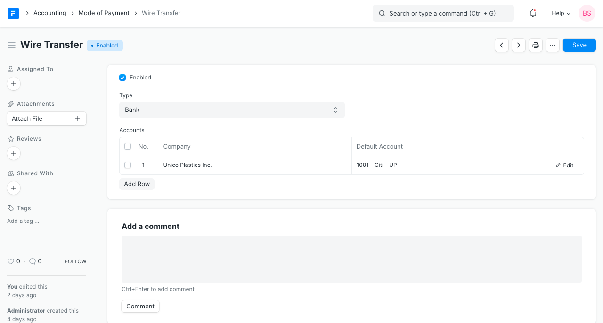
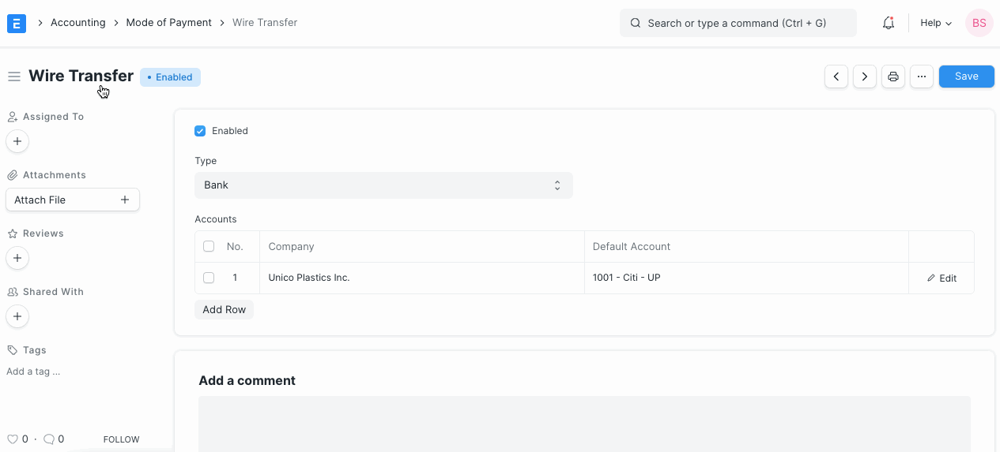

# Mode of Payment

[ Edit ](https://docs.frappe.io/wiki/spaces/24hrpr6es9/page/0rovgiof5k)

Open in ChatGPT  Ask ChatGPT about this page Open in Claude  Ask Claude about this page

# Mode of Payment 

[ Edit ](https://docs.frappe.io/wiki/spaces/24hrpr6es9/page/0rovgiof5k)

Open in ChatGPT  Ask ChatGPT about this page Open in Claude  Ask Claude about this page

**The Mode of Payment stores the medium through which payments are made or received.**

To access the Mode of Payment list, go to:

> Home > Accounting > Settings > Mode of Payment

## 1\. How to create a Mode of Payment

  1. Go to the Mode of Payment list and click on New.
  2. Enter a name for the Mode of Payment.
  3. Set a type whether Cash, Bank, or General. This is useful for knowing the mode of payment used in [Point Of Sale (PoS)](point-of-sale.md).
  4. Set a default payment Account for all the companies.
  5. Save.

> **Tip** : Setting the default Account will this account fetched into [Payment Entries](payment-entry.md).

> **Note** : When making Payment Entries, the default bank account will be fetched in the following order if set:

>   * Company form
>   * Mode of Payment default account
>   * Customer/Supplier default bank account
>   * Select manually in Payment Entry
> 

## 2\. Related Topics

  1. [Payment Entry](payment-entry.md)
  2. [Payment Request](payment-request.md)

[ Previous Page Accounting Entries  ](accounting-entries.md) [ Next Page Additional Charges in Payment ](additional-charges-in-payment.md)

Last updated 2 weeks ago 

Was this helpful?
