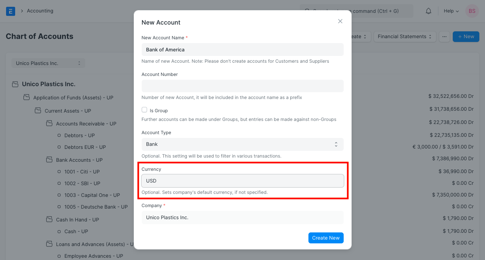
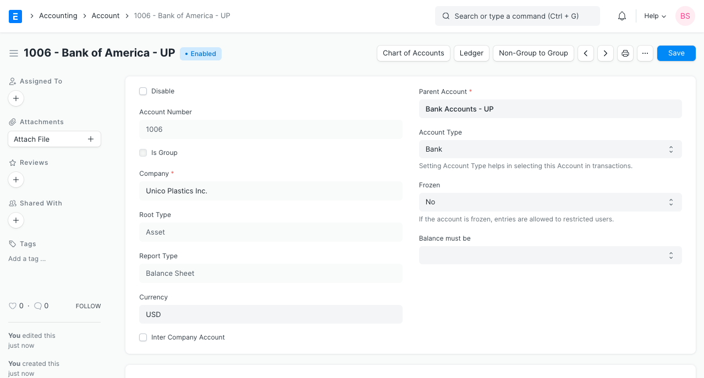
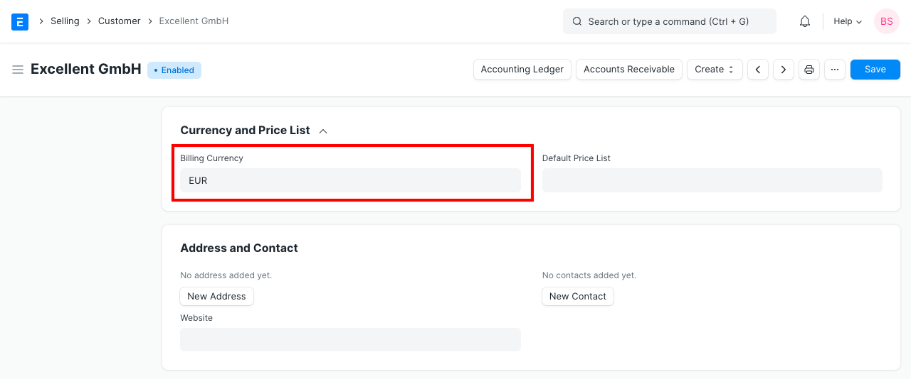
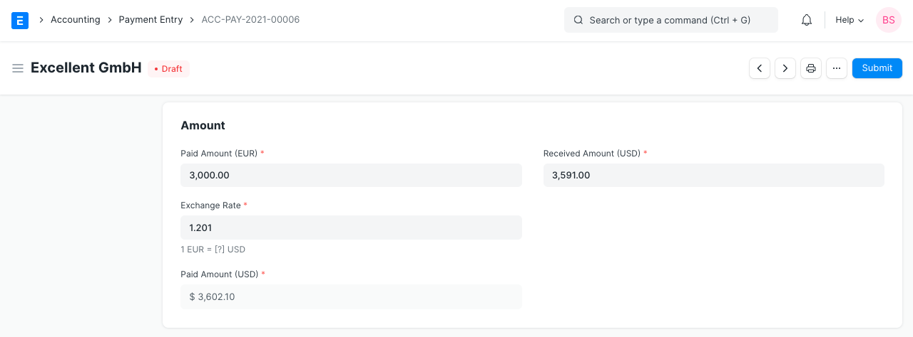
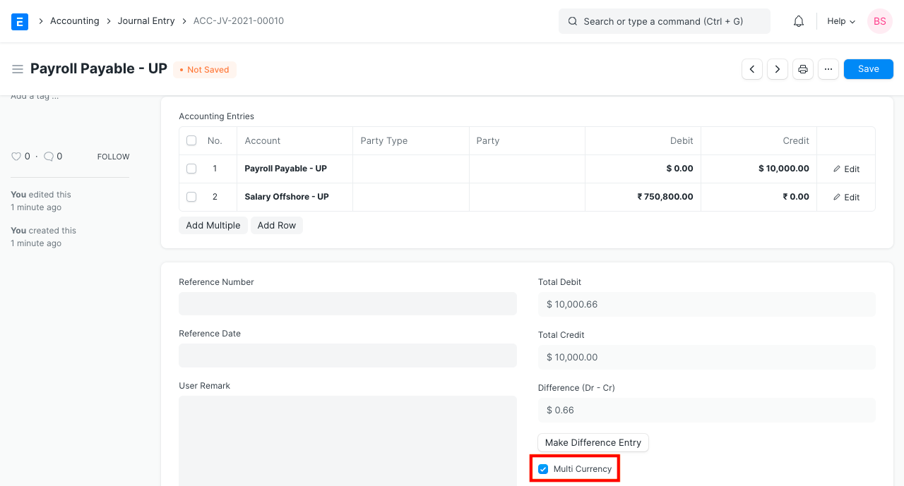
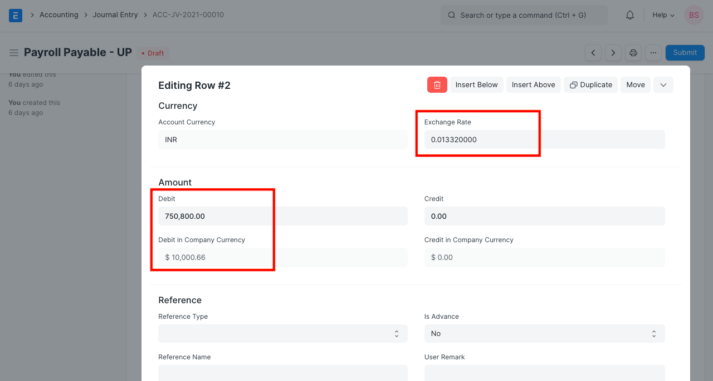
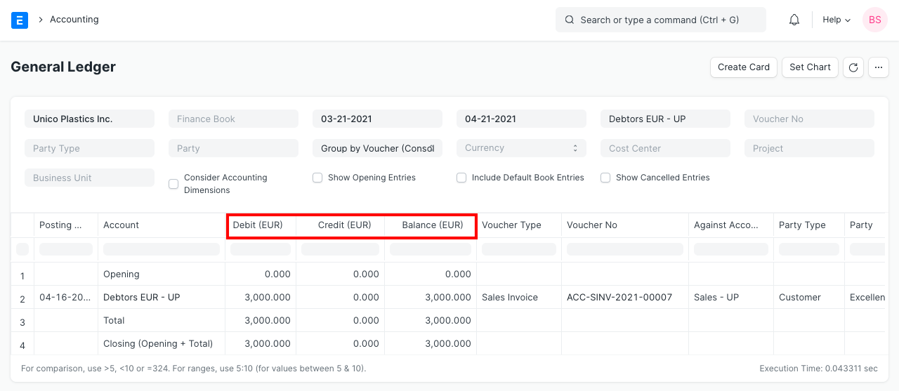
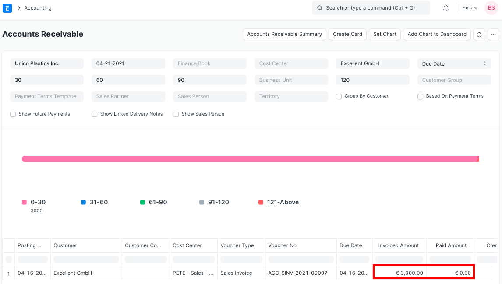

# Multi Currency Accounting

[ Edit ](https://docs.frappe.io/wiki/spaces/24hrpr6es9/page/0rq4gmrb45)

Open in ChatGPT  Ask ChatGPT about this page Open in Claude  Ask Claude about this page

# Multi Currency Accounting 

[ Edit ](https://docs.frappe.io/wiki/spaces/24hrpr6es9/page/0rq4gmrb45)

Open in ChatGPT  Ask ChatGPT about this page Open in Claude  Ask Claude about this page

**Transacting in two different currencies is known as Multi Currency Accounting.**

In ERPNext, you can make accounting entries in multiple currencies. For example, if you have a bank account in foreign currency, you can make transactions in that currency and the system will show bank balance in that specific currency only.

Bank accounts in foreign currencies can be for other branches of your own company or Debtors/Creditors account for foreign Customers/Suppliers.

## 1\. Setup

### 1.1 Set currency in Chart of Accounts

To get started with multi-currency accounting, you need to assign accounting currency in the Account record. You can define Currency from [Chart of Accounts](chart-of-accounts.md) while creating an Account.

### 1.2 New account with different currency

You can also assign/modify the currency by opening specific Account records for existing Accounts.

### 1.3 Currency for Customer/Supplier

For Customer/Supplier (Party), you can also define its billing currency in the party record. If the party's accounting currency is different from Company Currency, you should mention Default Receivable/Payable Account in that currency.

### 1.4 After setup

Once you define Currency in the required account(s) and select relevant accounts in the Party record, you are ready to make transactions against them. If party account currency is different from the Company currency, the system will restrict from making transactions with that party.

You need to change the currency to party currency in the transaction (Sales or Purchase Order/Invoice). If party account currency is the same as company currency, you can make transactions for that Party in any currency. But accounting entries (GL Entries) will always be in Party Account Currency.

> **Note** : Ensure that the correct account with currency is set in the 'Debit To' field when making invoices/payments.

You can change accounting currency in Party/Account record before you make any transactions against them. After making accounting entries, the system will not allow you to change the currency for both Party/Account records. In case of multi-company setup, the accounting currency of the party must be the same for all the companies.

## 2\. Exchange Rates

When dealing with multiple currencies, ERPNext has the Currency Exchange page for managing exchange rates. It allows you to save the exchange rate quotes you require. To know more, visit the [Currency Exchange](currency-exchange.md) page.

For foreign currency transactions, ERPNext checks exchange rates from:

  1. From the Currency Exchange for any matching record (if created by a User).
  2. If this fails, ERPNext will attempt to get the current market exchange rate from [Frankfurter](https://www.frankfurter.app/).
  3. **NOTE** : Starting from ERPNext version 13.10.0, Frankfurter is replaced by a new service called [exchangerate.host](https://exchangerate.host/).
  4. If this still fails, then the exchange rate will have to be entered manually.

The rates in the Currency Exchange master are fetched based on whether 'Allow Stale Exchange Rate' is enabled in Accounts Settings. To know more, visit the [Accounts Settings](accounts-settings.md) page.

## 3\. Transactions

### 3.1 Sales Invoice

In a Sales Invoice, transaction currency must be the same as the accounting currency of Customer if Customer's accounting currency is different from Company currency. Otherwise, you can select any currency in a Sales Invoice. On selection of Customer, system will fetch a Receivable account from Customer/Company. The Currency of the receivable account must be the same as the Customer's accounting currency.

Now, in Invoice, Paid Amount will be entered in transaction currency, instead of earlier Company Currency. Write Off Amount will also be entered in the transaction currency.

Outstanding Amount and Advance Amount will always be calculated and shown in Customer's Account Currency. The paid amounts will be reflected in the [Payment Entry](payment-entry.md):

### 3.2 Purchase Invoice

Similarly, in a Purchase Invoice, accounting entries will be made based on Supplier's accounting currency. Outstanding Amount and Advance Amount will also be shown in the supplier's accounting currency. Write Off Amount will now be entered in the transaction currency.

### 3.3 Journal Entry

In Journal Entry, you can make transactions in different currencies. There is a checkbox 'Multi Currency', to enable multi-currency entries. Only when 'Multi Currency' option selected, you will be able to select accounts which have different currencies.

In the Accounts table, on the selection of a foreign currency account, the system will show the Currency section and fetch Account Currency and Exchange Rate automatically. You can change/modify the Exchange Rate later manually. Debit/Credit amount should be entered in Account Currency, the system will calculate and show the Debit/Credit amount in Company Currency automatically.

## 4\. Reports

### 4.1 General Ledger

In General Ledger, the system shows debit/credit amount in party currency **if filtered** by an Account and that Account Currency is different from Company Currency.

### 4.2 Accounts Receivable/Payable

In Accounts Receivable/Payable report, the system shows all the amounts in Party/Account Currency.

### 5\. Related Topics

  1. [Exchange Rate Revaluation](exchange-rate-revaluation.md)
  2. [Currency Exchange](currency-exchange.md)
  3. [Currency](currency.md)
  4. [Sales Invoice](sales-invoice.md)
  5. [Purchase Invoice](purchase-invoice.md)

[ Previous Page Currency Exchange ](currency-exchange.md) [ Next Page Multi Currency Setup ](multi-currency-setup.md)

Last updated 2 weeks ago 

Was this helpful?
