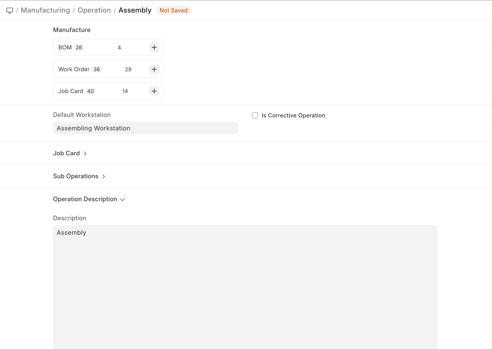
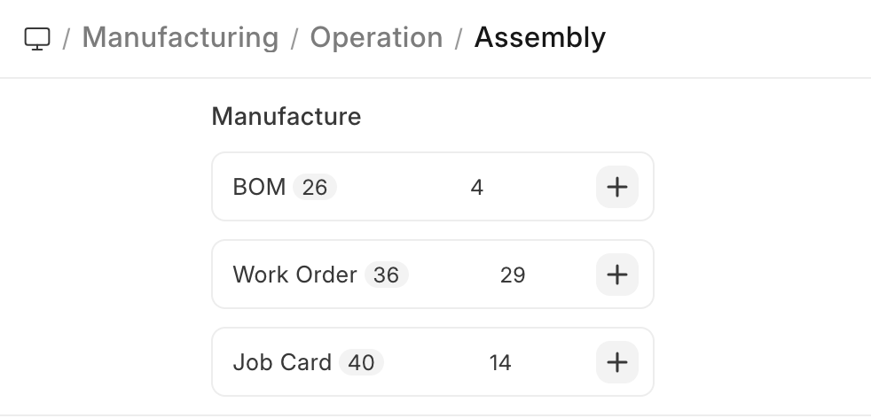

# Operation

[ Edit ](https://docs.frappe.io/wiki/spaces/24hrpr6es9/page/0s0djogpmf)

Open in ChatGPT  Ask ChatGPT about this page Open in Claude  Ask Claude about this page

# Operation 

[ Edit ](https://docs.frappe.io/wiki/spaces/24hrpr6es9/page/0s0djogpmf)

Open in ChatGPT  Ask ChatGPT about this page Open in Claude  Ask Claude about this page

**An Operation refers to any manufacturing operation performed on the raw materials to process it further in the manufacturing path.**

The Operation master stores a single manufacturing operation, its description and the Default Workstation for the Operation.

* * *

## Prerequisites

Before creating and using an Operation, it is advised that you create a [Workstation](https://docs.frappe.io/erpnext/user/manual/en/workstation.md) first.

* * *

## How to create an Operation

  1. Go to the Operation list, click on New.
  2. Enter a name for the Operation, for example, cutting.
  3. Select the Default Workstation where the Operation will be performed. This will be fetched in BOMs and Work Orders.
  4. Select a Quality Inspection Template for the operation in the Job Card section. It will be fetched on the Job Card for that particular operation when Work Order is created. When a new Quality Inspection is created from the Job card, then the same Quality Inspection Template is set for the Quality Inspection.
  5. Optionally, add a description to describe what the Operation involves.
  6. Save.

* * *

Once saved, the following can be created against an Operation:

[ Previous Page Workstation Type ](workstation_type.md) [ Next Page Workstation ](workstation.md)

Last updated 2 weeks ago 

Was this helpful?
