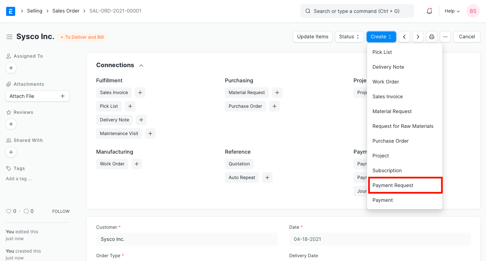
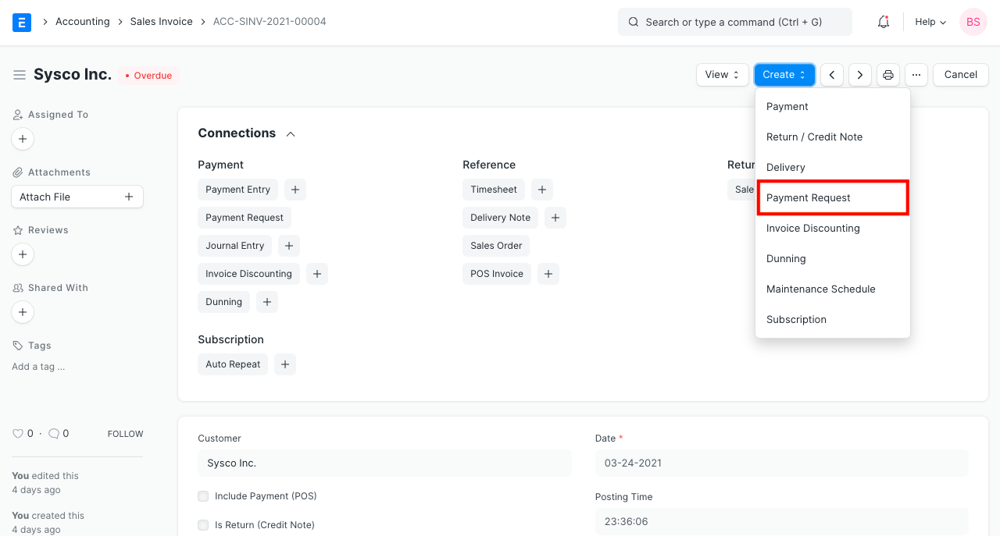
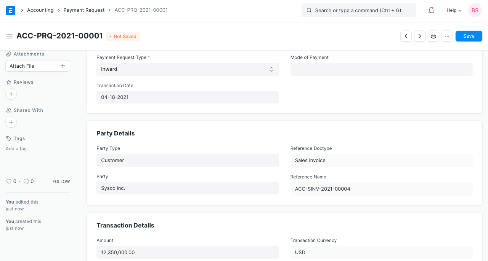
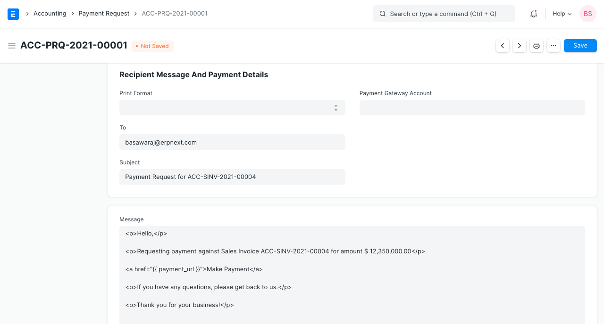
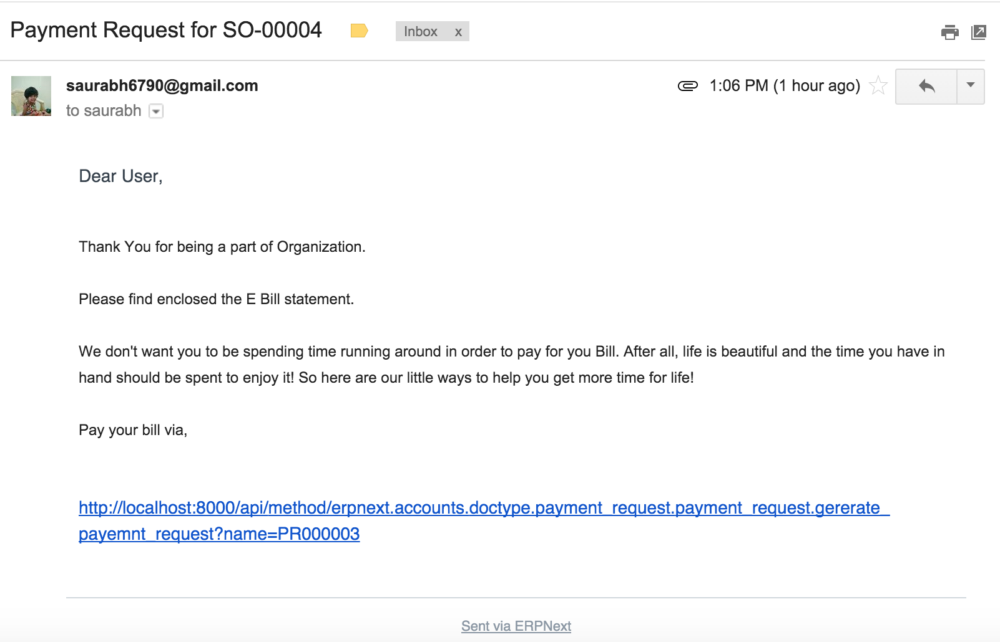

# Payment Request

[ Edit ](https://docs.frappe.io/wiki/spaces/24hrpr6es9/page/0rnb900fj4)

Open in ChatGPT  Ask ChatGPT about this page Open in Claude  Ask Claude about this page

# Payment Request 

[ Edit ](https://docs.frappe.io/wiki/spaces/24hrpr6es9/page/0rnb900fj4)

Open in ChatGPT  Ask ChatGPT about this page Open in Claude  Ask Claude about this page

**A Payment Request is used to request payment from a Customer for a Sales Order or Invoice.**

Payment Request is sent via email and will contain a link to a Payment Gateway if set up. You can create a payment request via a Sales Order or a Sales Invoice. A Payment Request can also be set up against a Purchase Order or a Purchase Invoice for internal records. Then, payments can be processed in bulk using a [Payment Order](payment-order.md).

To access Payment Request go to:

> Home > Accounting > Accounts Receivable > Payment Request

## 1 Prerequisites

Before creating and using Payment Request, it is advisable to create the following first:

  1. [Sales Invoice](sales-invoice.md)
  2. [Purchase Invoice](purchase-invoice.md)
  3. [Sales Order](sales-order.md)
  4. [Purchase Order](purchase-order.md)

## 2 How to create a Payment Request

A Payment Request cannot be created manually, it is created from a Sales/Purchase Order or Invoice.

### 2.1 Creating Payment Request via Sales Order

In a Sales Order, click on Create and then click on Payment to make an advance payment. To know more about advance payment, visit the [Advance Payment Entry](advance-payment-entry.md) page.

### 2.2 Creating Payment Request via Sales Invoice

In a Sales Invoice, click on Create and then click on Payment to make payment against the invoice.

Select appropriate Payment Gateway Account on Payment Request for accounts posting. Account head specified on payment gateway will be considered to create a Journal Entry.

> Note: Invoice/Order currency and 'Payment Gateway Account' currency should be the same.

### 2.3 Notifying the Customer

You can notify customer from Payment Request using [Print Format](print-format.md). If the customer contact email is set, it will be fetched automatically. If not so you can set an email address in Payment Request.

### 2.4 Request Mail

Here is an example request email. The URL is generated automatically if you've set up the respective payment integration. To know more about integrations, [visit this page](erpnext_integration.md).

### 2.5 Payment Request without using any Gateway

In case you don't want to use any integration or payment gateway and only want to send a notification, simply set the Bank Account. You'll have to compose the message accordingly with bank details. The party can then transfer the amount to the mentioned bank account.

[ Previous Page Invoice Discounting  ](invoice_discounting.md) [ Next Page Payment Order  ](payment-order.md)

Last updated 2 weeks ago 

Was this helpful?
