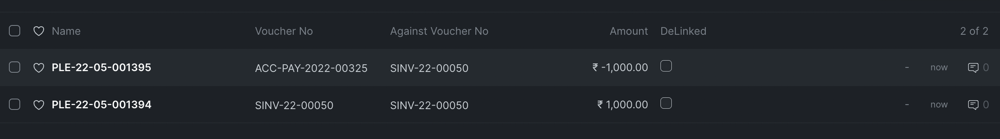

# Payment Ledger

[ Edit ](https://docs.frappe.io/wiki/spaces/24hrpr6es9/page/0rmort68sa)

Open in ChatGPT  Ask ChatGPT about this page Open in Claude  Ask Claude about this page

# Payment Ledger

[ Edit ](https://docs.frappe.io/wiki/spaces/24hrpr6es9/page/0rmort68sa)

Open in ChatGPT  Ask ChatGPT about this page Open in Claude  Ask Claude about this page

A Separate Ledger that only records transactions on **Receivable** and **Payable** accounts. Account type should be set to `Receivable` or `Payable` for transactions to be recorded in Payment Ledger.

#### **Ex:**

A Sales Invoice of ₹1000 and a Payment Entry against that invoice will look like below. 

### Usage

#### Reports

Accounts Receivable, Account Receivable Summary, Account Payable and Account Payable Summary uses Payment Ledger as its source.

#### Tools

[Payment Reconciliation](https://docs.erpnext.com/docs/user/manual/en/payment-reconciliation) and its extension [Semi-Auto Payment Reconciliation](https://docs.erpnext.com/docs/user/manual/en/semi-auto-payment-reconciliation) tools uses Payment Ledger to calculate outstanding Invoices. Reconciliation process only updates Payment Ledger.

[ Previous Page General Ledger ](general-ledger.md) [ Next Page Accounts Receivable and Payable ](https://docs.frappe.io/erpnext/accounts-receivable-and-payable)

Last updated 2 weeks ago 

Was this helpful?
